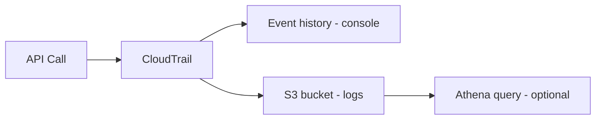

# CloudTrail: API 활동의 근거 자료

## Deep Dive

- What it captures(개념)
  - 관리 이벤트(Management events): 대부분의 제어 plane API 호출
  - (필요 시) 데이터 이벤트(Data events): 예: S3 object-level API (요구사항/비용/범위가 다름)
- Event history vs Trail
  - Event history: 콘솔에서 최근 이벤트를 빠르게 확인(기본 제공 범위)
  - Trail: S3로 장기 보관/검색/감사 체계 구축(조직 표준)
- 시험 포인트
  - “누가 삭제했는지/누가 정책을 바꿨는지”는 CloudTrail
  - “S3 데이터 이벤트를 켤지 말지”는 비용/요구사항 트레이드오프
- Exam must-know (포인트 + Why + 대안)
  - Key point: “누가 이 변경을 했나”는 CloudTrail, “현재/과거 구성 상태가 어땠나”는 Config다.
  - Why: CloudTrail은 API 호출(행위)의 증거이고, Config는 리소스 구성(상태)의 스냅샷/이력이다. 둘은 질문의 축이 다르다.
  - Alternative: “탐지/알림” 요구가 명시되면 GuardDuty/Security Hub 같은 탐지/집계 계층을 붙인다(CloudTrail 자체는 탐지 엔진이 아니다).

## TL;DR (한 줄 정리)

- “누가/언제/무엇을 했나”는 CloudTrail로 푼다.

## Back

- `../01-theory.md`
