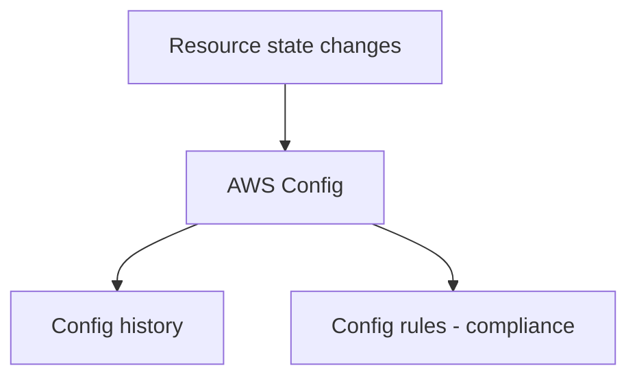

# AWS Config: 구성 변화와 준수(Compliance) 관점

## Deep Dive

- What it captures(개념)
  - 리소스 구성(configuration items) 변경 이력
  - 규칙 기반 준수 평가(Config rules)
- CloudTrail과의 차이(시험형 문장)
  - CloudTrail: “행위(Who did what)”
  - Config: “상태(What is the current/was the configuration)”
- Exam must-know (포인트 + Why + 대안)
  - Key point: “준수/규칙 위반” 문장이 있으면 Config(규칙/준수)가 정답 후보로 올라간다.
  - Why: 준수는 이벤트(행위)보다 리소스의 속성/구성 기준으로 판단된다(예: public S3, 0.0.0.0/0 인바운드 등).
  - Alternative: “누가 그 설정을 바꿨는지”까지 묻는다면 CloudTrail을 함께 써야 한다(둘 중 하나로만 해결하려는 답은 함정일 수 있음).

## TL;DR (한 줄 정리)

- “현재/과거 구성 상태가 어땠나”와 “준수/규칙 위반”은 Config 축이다.

## Back

- `../01-theory.md`
