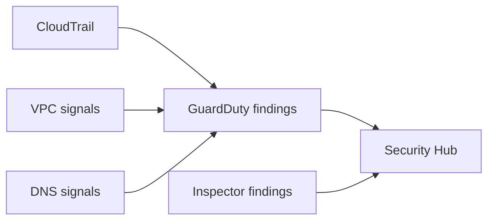

# Detection services: GuardDuty / Security Hub / Inspector

## 개념 연결(시험용)

- GuardDuty: 위협 탐지(여러 로그 소스 기반) 후 findings 생성
- Security Hub: 다양한 보안 결과를 집계/표준화/점수화(허브)
- Inspector: 취약점/구성 평가(서비스/에이전트 기반 패턴이 선택지로 출제될 수 있음)

## TL;DR (한 줄 정리)

- “탐지/알림/집계”는 CloudTrail 자체가 아니라 **GuardDuty → Security Hub(집계)** 같은 계층을 붙여서 푼다.

## Back

- `../01-theory.md`
