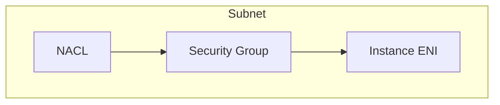
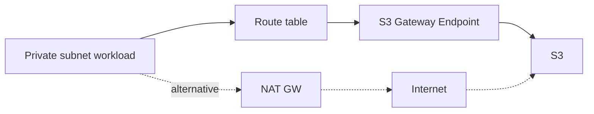

# VPC 보안 경계 + VPC Endpoints/PrivateLink

## 소개 (이게 뭔가요?)

- SG/NACL은 “네트워크 문지기”이고, VPC Endpoints/PrivateLink는 “인터넷을 거치지 않는 사설 길”이다.
- 시험에서는 NAT를 당연하게 쓰지 말고, **사설 경로/비용/보안** 신호가 있으면 Endpoints가 먼저다.

## Impact 범위 (어디에 영향을 주나?)

- Security: 프라이빗 서브넷 설계, 데이터 유출 경로(인터넷 경유) 차단과 직결된다.
- Cost: NAT Gateway 비용을 줄이는 대표 카드가 VPC Endpoints다.

## Exam Guide (Badges)

Exam guide mapping (details)

- Domain: Domain 1: Design Secure Architectures
- Task focus:
  - 1.1 Design secure access to AWS resources (프라이빗 접근/경계)
  - 1.2 Design secure workloads and applications (네트워크 경계)

## Why This Matters (시험/실무에서 걸리는 지점)

- “Private subnet에서 S3 접근” 문제는 거의 항상 **NAT vs VPC Endpoint** 선택 문제다.

## Core Concepts

- 네트워크 경계는 2겹으로 생각한다
  - Instance/ENI 단위: Security Group(상태 저장)
  - Subnet 단위: NACL(무상태, 양방향 규칙 필요)
- “사설 경로”는 시험에서 자주 정답으로 이어진다
  - 인터넷 경유를 피하고(보안), NAT 비용/운영을 줄인다(비용)

## Deep Dive

### Security Group vs NACL (시험형 비교)

| Topic | Security Group | NACL |
|---|---|---|
| Scope | ENI/인스턴스(논리적) | Subnet |
| State | Stateful | Stateless |
| Rule type | Allow only | Allow + Deny |
| Return traffic | 자동 허용(상태 저장) | 명시적 허용 필요 |

### VPC Endpoints: NAT 없이 “사설로 AWS 서비스 접근”

- Gateway endpoint
  - S3, DynamoDB
  - 라우팅 테이블에 경로가 추가되는 형태(개념)
  - 비용/운영 측면에서 “NAT 비용 절감” 선택지로 빈출
- Interface endpoint(PrivateLink)
  - ENI 형태로 VPC 안에 엔드포인트가 생긴다(개념)
  - 다양한 AWS 서비스/사설 연결에 사용
- Endpoint policy(개념)
  - 엔드포인트를 통해 허용되는 요청을 추가로 제한
- Exam must-know (포인트 + Why + 대안)
  - Key point: S3/DynamoDB 는 gateway endpoint, 대부분의 다른 서비스는 interface endpoint(PrivateLink)다.
  - Why: gateway는 라우팅 테이블 경로로 “목적지”를 바꾸는 모델이고(S3/DDB 전용), interface는 VPC 안 ENI로 사설 엔드포인트를 제공하는 모델(서비스 범용)이다.
  - Alternative: endpoint가 지원되지 않거나 요구가 “인터넷 아웃바운드 일반”이면 NAT가 후보가 되지만, “사설 경로/비용 절감”이면 endpoint가 우선이다.

## Exam Traps

- “S3는 보안 그룹으로 막는다”는 오답 유도: S3는 SG 대상이 아니다(대신 bucket policy/VPC endpoint policy).
- “NACL은 상태 저장”이라는 착각: NACL은 무상태라 리턴 트래픽 포트까지 고려해야 한다.
- NAT를 무조건 정답으로 고르는 실수: 요구사항이 “사설 경로/비용”이면 endpoint가 정답 후보가 된다.

## TL;DR (한 줄 정리)

- **SG(인스턴스) + NACL(서브넷)로 경계를 세우고**, “인터넷 없이/비용 줄여”가 보이면 **VPC Endpoints(필요 시 PrivateLink)**로 사설 경로를 만든다.
