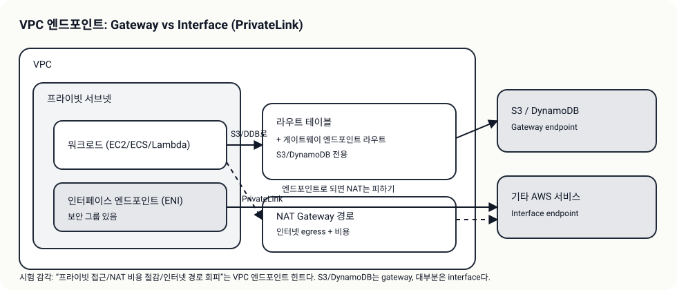
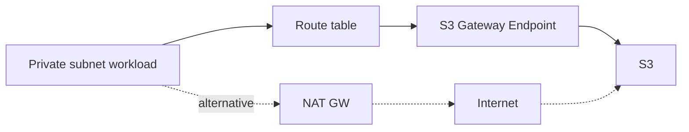

# VPC Endpoints/PrivateLink (사설 경로 + NAT 비용/보안)

## 소개 (이게 뭔가요?)

- VPC Endpoints는 VPC 안에서 AWS 서비스로 가는 “사설 길”을 만든다.
- Gateway endpoint(S3/DynamoDB)와 Interface endpoint(PrivateLink)의 선택이 시험 단골이다.

## 고객 사례 (스토리, 600~1000자)

보안팀이 말했다. “프라이빗 서브넷 워크로드는 인터넷으로 나가면 안 됩니다.” 그런데 서비스는 S3에서 파일을 읽고 써야 한다. 일단 NAT Gateway를 달면 동작은 되지만, 비용이 매달 꾸준히 나온다. 그리고 “인터넷을 경유했다”는 사실 자체가 찜찜하다. 팀은 고민한다. “인터넷 없이 S3에 접근할 방법이 없나?”

여기서 VPC Endpoints가 정답 후보로 올라간다. S3/DynamoDB는 Gateway endpoint로 라우팅 테이블에 경로가 붙는 모델이고, 그 외 대부분의 AWS 서비스는 Interface endpoint(PrivateLink)로 ENI 형태의 사설 엔드포인트가 생긴다. 시험은 이 차이를 이용해 NAT를 ‘기본값’처럼 보이게 만든다. 하지만 요구사항 문장에 “사설 경로”, “인터넷 없이”, “NAT 비용 최소화” 같은 신호가 있으면 엔드포인트가 우선이다. 그리고 엔드포인트 정책으로 “이 경로로 허용되는 요청”을 더 제한할 수 있다. 즉, Endpoints는 비용 절감 카드이면서 동시에 보안 카드다.

특히 “프라이빗 서브넷을 유지하라”는 문장이 나오면, 인터넷 게이트웨이/공인 IP보다 엔드포인트가 더 자연스러운 방향이라는 걸 떠올리면 된다.

지금 요구가 “인터넷 없이 S3 접근”이라면, NAT와 Endpoints 중 무엇이 더 자연스럽나요?

## Impact 범위 (어디에 영향을 주나?)

- Security: 인터넷 경유를 줄여 데이터 유출 경로를 축소
- Cost: NAT Gateway 비용을 줄이는 대표 선택지

## Exam Guide (Badges)

Exam guide mapping (details)

- Domain: Domain 1: Design Secure Architectures
- Task focus: 프라이빗 접근/사설 경로/비용(Endpoints vs NAT)

## Why This Matters (시험/실무에서 걸리는 지점)

- NAT를 무조건 정답으로 고르는 실수를 줄여준다.
- “S3는 SG로 막는다” 같은 오답을 피하게 만든다(정책/엔드포인트 관점).

## VAKOG Anchors

- V(Visual): endpoint 타입(gateway vs interface)을 그림으로 고정한다.
- A(Auditory): “S3/DDB는 gateway, 그 외는 interface(PrivateLink)”를 말로 고정한다.
- O(Olfactory, smell test): “사설 경로 요구인데 NAT로 해결”은 냄새가 난다.
- G(Gustatory, taste test): 30초 내에 NAT vs Endpoint를 고른다.

## Core Concepts

## Deep Dive

- Gateway endpoint
  - S3, DynamoDB
  - 라우팅 테이블에 경로가 추가되는 형태(개념)
  - 비용/운영 측면에서 “NAT 비용 절감” 선택지로 빈출
- Interface endpoint(PrivateLink)
  - ENI 형태로 VPC 안에 엔드포인트가 생긴다(개념)
  - 다양한 AWS 서비스/사설 연결에 사용
- Endpoint policy(개념)
  - 엔드포인트를 통해 허용되는 요청을 추가로 제한
- Exam must-know (포인트 + Why + 대안)
  - Key point: S3/DynamoDB 는 gateway endpoint, 대부분의 다른 서비스는 interface endpoint(PrivateLink)다.
  - Why: gateway는 라우팅 테이블 경로로 “목적지”를 바꾸는 모델이고, interface는 VPC 안 ENI로 사설 엔드포인트를 제공하는 모델이다.
  - Alternative: endpoint가 지원되지 않거나 요구가 “인터넷 아웃바운드 일반”이면 NAT가 후보지만, “사설/비용”이면 endpoint가 우선이다.

## Quick Comparison Table

| Need | Best choice | Notes |
|---|---|---|
| S3/DDB 사설 접근 | Gateway endpoint | 라우팅 테이블 기반 |
| 기타 서비스 사설 접근 | Interface endpoint | PrivateLink(ENI) |

## Exam Traps (5-8)

- “S3는 SG로 막는다”는 오답 유도
- NAT를 무조건 정답으로 고르는 오답

## Taste Test (1~3분)

- “프라이빗 서브넷에서 S3 접근, NAT 비용 최소화” → 무엇이 1순위?

## TL;DR (한 줄 정리)

- “사설 경로/비용 절감”이면 **VPC Endpoints(필요 시 PrivateLink)**가 NAT보다 먼저다.

## Back

- `./00-theory-index.md`
