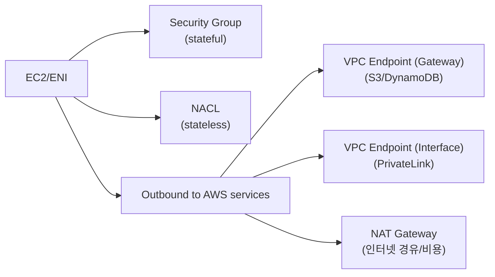

# Day 04 - VPC security (네트워크 경계: SG/NACL/Endpoints)

## Quick Links

- [오늘의 이야기](#오늘의-이야기)
- [Timeline](#timeline-오늘-학습-타임라인)
- [Flow](#flow-서비스-연결-흐름)
- [Reading](#reading-서비스별-theory)
- [Quiz](#quiz)
- [References](../../references/README.md)

## 오늘의 이야기

개발팀이 “프라이빗 서브넷에 있는 서버에서 S3로 백업을 올리게 해달라”고 합니다. 그런데 보안팀은 “인터넷으로는 나가지 말고, 비용도 아끼자”고 하죠. 이 순간부터 네트워크 경계가 두 겹으로 보이기 시작합니다. 인스턴스/ENI 앞단에는 **Security Group**이 있고, 서브넷 경계에는 **NACL**이 있습니다. SG는 stateful이라 들어오는/나가는 흐름을 ‘연결 단위’로 기억하지만, NACL은 stateless라 인바운드/아웃바운드를 둘 다 명시해야 하는 게 포인트예요. “문지기”를 잘 세워도, 길이 잘못되면 결국 NAT Gateway로 돌아가게 됩니다.

그래서 오늘의 핵심은 “사설 경로”를 만드는 방법입니다. S3/DynamoDB처럼 Gateway endpoint가 가능한 서비스는 **VPC Endpoint(Gateway)**로 NAT 없이도 내부에서 바로 나가게 설계할 수 있고, 그 외의 다수 서비스는 **Interface endpoint(PrivateLink)**로 사설 통로를 뚫습니다. 시험에서도 실무에서도 “인터넷을 안 타고, NAT 비용/운영을 줄이고, 접근 정책을 더 촘촘히 하자”는 문장이 나오면 엔드포인트가 정답 후보가 됩니다. 오늘은 결국 이렇게 외우면 됩니다. **문지기(SG/NACL)로 ‘누가 들어오고 나가나’를 정리하고, 길(Endpoints)로 ‘어디로 나가나’를 바꾼다.**

여기서 디테일이 한 번 더 필요합니다. SG는 “허용한 것만 통과”시키는 문지기라서 인스턴스 단위로 붙이고, NACL은 서브넷 단위로 크게 막는 방화벽 느낌이라서 ‘양방향 규칙’까지 챙겨야 합니다. 엔드포인트도 종류가 갈리죠. Gateway endpoint는 라우팅 테이블 관점이고(대표: S3), Interface endpoint(PrivateLink)는 ENI/보안 그룹 관점이라서 “어떤 서브넷에 붙이고, 어떤 SG를 적용하나”가 다시 문제로 나옵니다. 오늘 Day는 이 차이를 한 번만 정확히 구분해두면, NAT/보안/비용이 섞인 문제에서 빠르게 정답 방향으로 갈 수 있습니다.

## Timeline (오늘 학습 타임라인)

```mermaid
gantt
  title Learning Timeline
  dateFormat  HH:mm
  axisFormat  %H:%M
  section Day
  워밍업 - SG vs NACL 한 줄 :t1, 00:00, 10m
  Reading :t2, after t1, 100m
  미니 정리 - Gateway vs Interface :t3, after t2, 40m
  Trap drill - NAT/Endpoint 착각 :t4, after t3, 60m
  Quiz :t5, after t4, 30m
```

## Flow (서비스 연결 흐름)

## Reading (서비스별 theory)

- [Security Group vs NACL (네트워크 문지기 2종)](01-sg-vs-nacl.md)
- [VPC Endpoints/PrivateLink (사설 경로 + NAT 비용/보안)](02-vpc-endpoints-privatelink.md)

> 네트워크 경계는 “문지기(SG/NACL)”와 “길(Endpoints)”을 분리해서 읽는 게 제일 덜 헷갈린다.

## Quiz

- [Day 04 Quiz](03-quiz.md)

## Back

- `../README.md`
