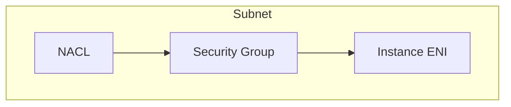

# Security Group vs NACL (시험형 비교)

| Topic | Security Group | NACL |
|---|---|---|
| Scope | ENI/인스턴스(논리적) | Subnet |
| State | Stateful | Stateless |
| Rule type | Allow only | Allow + Deny |
| Return traffic | 자동 허용(상태 저장) | 명시적 허용 필요 |

## TL;DR (한 줄 정리)

- **SG는 상태 저장(ENI 단위)**, **NACL은 무상태(서브넷 단위)**다.

## Back

- `../01-theory.md`
