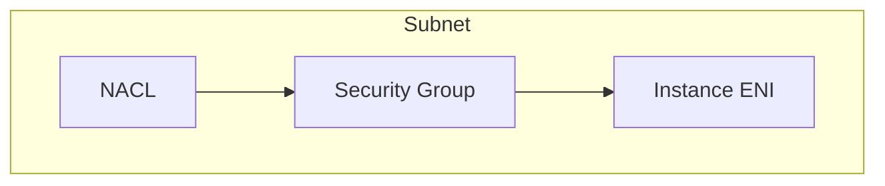

# Security Group vs NACL (네트워크 문지기 2종)

## 소개 (이게 뭔가요?)

- Security Group(SG)은 인스턴스/ENI 단위의 상태 저장 방화벽이고, NACL은 서브넷 단위의 무상태 필터다.
- 시험에서는 “둘을 섞어서 말하는 선택지”가 단골 함정이다.

## 고객 사례 (스토리, 600~1000자)

백엔드를 프라이빗 서브넷에 올리자 갑자기 연결이 안 된다. 개발자는 SG 인바운드를 열고 다시 테스트한다. 그래도 안 된다. 누군가 “NACL도 열어야 한다”고 한다. 그런데 무엇을 어디까지 열어야 하는지 감이 없다. 운영자는 “열어두면 되는 것 아닌가”라고 하지만, 보안팀은 “최소 권한”을 요구한다. 이때 SG와 NACL의 차이를 모르고 열어버리면, 문제는 해결되지만 위험만 남는다.

핵심은 축이 다르다는 것이다. SG는 인스턴스(ENI)에 붙고 상태 저장이라 리턴 트래픽을 자동으로 허용한다. 반대로 NACL은 서브넷 레벨이고 무상태라, 인바운드만 열면 끝이 아니라 아웃바운드/리턴 포트까지 고려해야 한다. 시험에서도 “NACL은 allow only” 같은 문장이나 “SG는 deny 가능” 같은 문장이 나오면 오답을 유도하는 신호다. 즉, SG는 ‘애플리케이션 포트 문’이고, NACL은 ‘서브넷 경계의 출입 통제’다. 둘의 역할을 분리하면, 무엇을 열어야 하는지(그리고 무엇을 열면 안 되는지)가 명확해진다.

실무 트러블슈팅에서도 같은 패턴이 반복된다. “인바운드는 열었는데 연결이 안 된다”면, SG가 아니라 NACL의 리턴 트래픽/에페메랄 포트가 막힌 경우가 자주 나온다. 그래서 NACL은 ‘추가 방어선’으로 쓰되, 기본 방어는 SG로 잡는 설계가 더 흔하다.

지금 연결 문제를 보고, SG 문제일까요? NACL 문제일까요? 구분 기준은 무엇인가요?

## Impact 범위 (어디에 영향을 주나?)

- Security: 네트워크 경계에서 최소 노출을 만드는 기본기
- Operations: 연결 장애(타임아웃) 트러블슈팅 속도를 좌우

## Exam Guide (Badges)

Exam guide mapping (details)

- Domain: Domain 1: Design Secure Architectures
- Task focus: 네트워크 경계(SG/NACL) 개념 구분

## Why This Matters (시험/실무에서 걸리는 지점)

- SG/NACL 혼동은 오답으로 직결된다.
- NACL은 무상태라 리턴 트래픽을 “명시적으로” 고려해야 한다.

## VAKOG Anchors

- V(Visual): 아래 표 한 장으로 차이를 고정한다.
- A(Auditory): “SG=stateful, NACL=stateless”를 말로 고정한다.
- O(Olfactory, smell test): “NACL은 상태 저장” 같은 문장은 냄새가 난다.
- G(Gustatory, taste test): 1분 안에 ‘리턴 트래픽’ 질문에 답한다.

## Core Concepts

| Topic | Security Group | NACL |
|---|---|---|
| Scope | ENI/인스턴스(논리적) | Subnet |
| State | Stateful | Stateless |
| Rule type | Allow only | Allow + Deny |
| Return traffic | 자동 허용(상태 저장) | 명시적 허용 필요 |

## Deep Dive

- SG는 “인스턴스 단위”에서 최소 노출을 만들 때 핵심이다.
- NACL은 “서브넷 단위”에서 추가 방어선을 만들지만, 무상태라 운영 시 실수가 잦다.

## Quick Comparison Table

| Symptom | Likely cause | First check |
|---|---|---|
| 인바운드 열었는데 응답 없음 | NACL 리턴 포트 미허용 | NACL 아웃바운드/리턴 |

## Exam Traps (5-8)

- “SG에 Deny 규칙 추가” 같은 선택지
- “NACL은 stateful” 같은 선택지

## Taste Test (1~3분)

- “리턴 트래픽을 자동 허용”하는 쪽은 SG일까, NACL일까?

## TL;DR (한 줄 정리)

- **SG는 상태 저장(ENI 단위)**, **NACL은 무상태(서브넷 단위)**다.

## Back

- `../01-theory.md`
