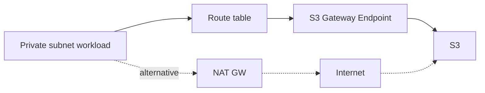

# VPC Endpoints/PrivateLink: NAT 없이 “사설로 AWS 서비스 접근”

## Deep Dive

- Gateway endpoint
  - S3, DynamoDB
  - 라우팅 테이블에 경로가 추가되는 형태(개념)
  - 비용/운영 측면에서 “NAT 비용 절감” 선택지로 빈출
- Interface endpoint(PrivateLink)
  - ENI 형태로 VPC 안에 엔드포인트가 생긴다(개념)
  - 다양한 AWS 서비스/사설 연결에 사용
- Endpoint policy(개념)
  - 엔드포인트를 통해 허용되는 요청을 추가로 제한
- Exam must-know (포인트 + Why + 대안)
  - Key point: S3/DynamoDB 는 gateway endpoint, 대부분의 다른 서비스는 interface endpoint(PrivateLink)다.
  - Why: gateway는 라우팅 테이블 경로로 “목적지”를 바꾸는 모델이고(S3/DDB 전용), interface는 VPC 안 ENI로 사설 엔드포인트를 제공하는 모델(서비스 범용)이다.
  - Alternative: endpoint가 지원되지 않거나 요구가 “인터넷 아웃바운드 일반”이면 NAT가 후보가 되지만, “사설 경로/비용 절감”이면 endpoint가 우선이다.

## TL;DR (한 줄 정리)

- “사설 경로/비용 절감”이면 **VPC Endpoints(필요 시 PrivateLink)**가 NAT보다 먼저다.

## Back

- `../01-theory.md`
