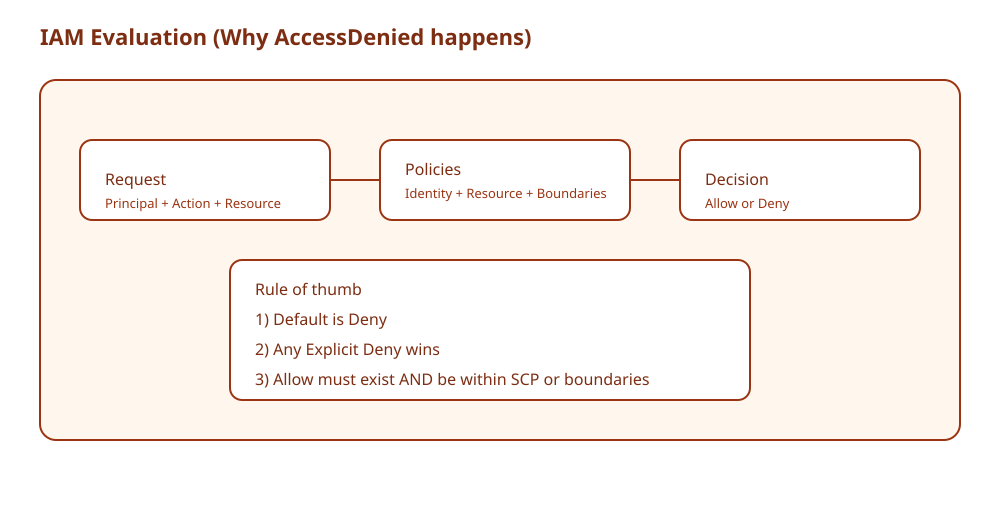
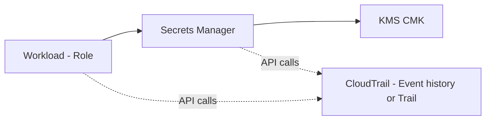

# Special Lecture + Week Summary (Domain 1)

## 소개 (이게 뭔가요?)

- Week 1(Domain 1)에서 다룬 핵심 서비스를 “비교/함정/대안”으로 한 번에 회수하는 정리 세션이다.
- 시험형 문장(요구사항)에서 어떤 서비스/패턴이 정답인지 “규칙”으로 고정한다.

## Impact 범위 (어디에 영향을 주나?)

- Exam: 같은 서비스라도 “질문 축”이 다르면 정답이 바뀐다(CloudTrail vs Config 같은 유형).
- 실무: 사고/장애의 상당수가 권한/키/네트워크 경계에서 시작한다. 여기서 자주 터지는 함정을 미리 제거한다.

## Exam Guide (Badges)

Exam guide mapping (details)

- Domain: Domain 1: Design Secure Architectures
- Task focus:
  - 1.1 Design secure access to AWS resources
  - 1.2 Design secure workloads and applications
  - 1.3 Determine appropriate data security controls

## Agenda (2h 30m)

1. Top 서비스 “선택 기준” 15분
2. 헷갈리는 비교(Choose-this-not-that) 40분
3. 설계 패턴 4종(시험 빈출) 55분
4. 함정/오답 제거 규칙 20분
5. Day05 미니 랩 브리핑 20분

## Week 1 Decision Rules (암기 대신 규칙)

- 키 공유가 보이면 AssumeRole(=STS)이 정답 후보 1순위다.
- “누가 Assume?”은 trust policy, “Assume 후 무엇?”은 permission policy다.
- 상한선이 있는지 먼저 확인한다: SCP/Permissions boundary가 있으면 IAM Allow로 뚫을 수 없다.
- 데이터 보호 요구가 있으면 “암호화(키 관리) + 접근 제어 + 감사”를 같이 묻는 문제다.

## Core Concepts

- Domain 1은 “보안 설계”를 3개의 축으로 반복해서 묻는다.
  - Access control: IAM/리소스 정책/경계(SCP, permissions boundary)
  - Data protection: KMS/암호화/시크릿 관리
  - Audit: CloudTrail/Config/탐지(GuardDuty 등)

## Confusing Similar Cases

| Scenario | Best choice | Why | Common wrong choice | Why it's wrong |
|---|---|---|---|---|
| 교차 계정 운영 | Role + STS AssumeRole | 임시/회수/감사 | 액세스 키 공유 | 유출 시 회수/추적 어려움 |
| 상위 거버넌스 | SCP | 계정/OU 상한선 | IAM Allow만 추가 | SCP Deny는 항상 이김 |
| 시크릿 관리 | Secrets Manager | rotation/통합 기능 | Parameter Store(일반) | rotation/관리 기능 약함 |
| 감사/구성 추적 | CloudTrail + Config | API 호출 vs 구성 변화 | CloudTrail만 | 구성/준수 관점 누락 |
| DDoS/웹 보호 | Shield/WAF | L3/4 vs L7 | SG/NACL | 엣지 공격/봇 대응 불가 |

## Exam-Heavy Patterns (4)

### Pattern 1: Cross-account access without key sharing

- Role trust policy로 “누가 Assume 가능한지” 정의
- 필요 시 ExternalId 조건(3rd party)
- 세션 정책(session policy)으로 “추가 제한” 가능

### Pattern 2: Centralized encryption control (KMS)

- KMS는 “키 사용 권한”이 핵심이다.
- key policy는 KMS에서 특히 중요(리소스 정책 성격).
- 애플리케이션 암호화는 보통 envelope encryption(개념)로 설명한다.

### Pattern 3: Secret retrieval for workloads

- 앱은 장기 키 대신 role 기반으로 시크릿을 읽는다.
- 시크릿은 KMS로 보호되고, CloudTrail로 “누가/언제 읽었는지” 감사한다.

### Pattern 4: Audit + Detection linkage

- CloudTrail: “API 호출” 로그(누가 무엇을 했나)
- Config: “리소스 구성” 변화(어떤 상태였나)
- GuardDuty/Security Hub는 “탐지/집계” 층에서 활용(개념)

## Traps (오답 제거)

- “SCP로 Allow를 줬다”는 문장 자체가 함정이다: SCP는 상한선(Allow의 의미가 다름)
- “KMS는 IAM policy만으로 제어한다”는 오답 유도: key policy가 핵심
- “시크릿을 S3에 저장” 같은 안티패턴은 거의 오답

## Exam must-know (요약)

- Key point: Domain 1은 “권한(경계 포함) + 암호화(KMS) + 감사(CloudTrail/Config)”의 조합으로 반복 출제된다.
- Why: 실제 사고/장애는 단일 원인이 아니라 “권한/설정/키/감사”가 연결된 경로에서 난다. 문제도 이 연결을 읽는지를 테스트한다.
- Alternative: 답이 하나로 끝나지 않으면(요구사항이 복합) 2~3개 서비스를 조합하는 선택지가 정답인 경우가 많다(예: role + KMS + CloudTrail).

## Reference Pack

- `aws-saa/special-lectures/domain01-secure-top-services.md`

## TL;DR (한 줄 정리)

- Domain 1은 결국 **권한 경계(IAM/SCP) + 데이터 보호(KMS/Secrets) + 감사(CloudTrail/Config) + 사설 경로(Endpoints)**를 요구사항 신호에 맞춰 조합하는 게임이다.
