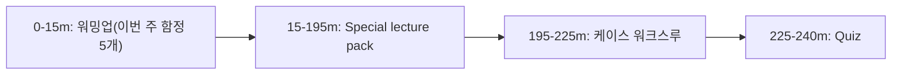
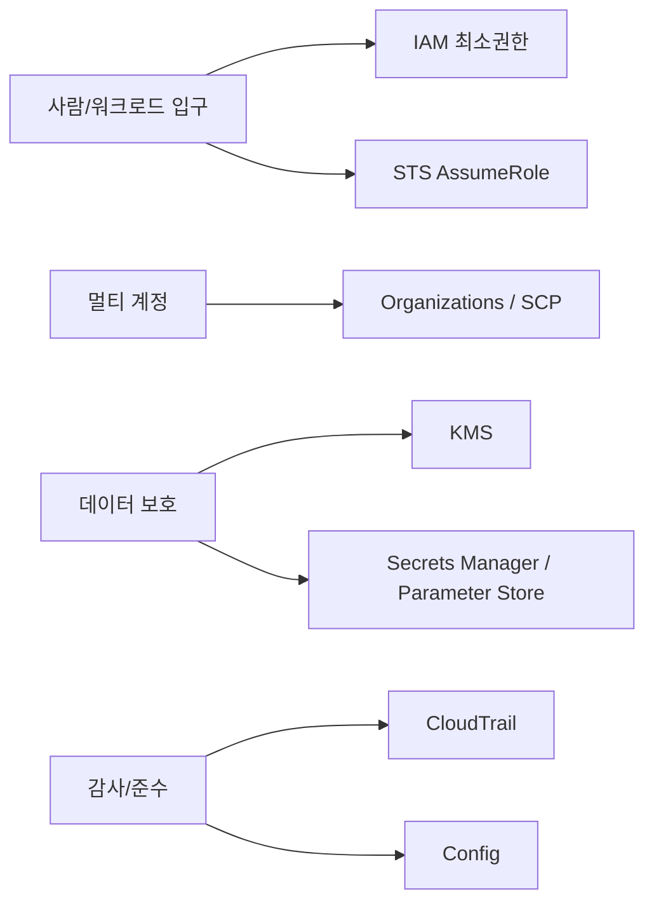

# Day 05 - Special Lecture + Week Summary (Domain 1)

## Quick Links

- [오늘의 이야기](#오늘의-이야기)
- [Timeline](#timeline-오늘-학습-타임라인)
- [Flow](#flow-서비스-연결-흐름)
- [Reading](#reading)
- [Quiz](#quiz)
- [References](../../references/README.md)

## 오늘의 이야기

금요일 오후는 늘 “정리하는 시간”입니다. 이번 주에 IAM, STS, Organizations(SCP), KMS, Secrets Manager/Parameter Store, CloudTrail/Config 같은 보안·거버넌스 축을 배웠는데, 막상 문제를 풀면 서비스 이름이 아니라 **선택 기준**에서 틀리거든요. 오늘은 그래서 서비스별 암기 대신, “회사에서 실제로 부딪히는 상황”으로 한 번에 엮습니다. 신규 프로젝트가 생기면 계정이 늘고(Organizations), 팀별로 할 수 있는 일의 상한선을 걸고(SCP), 사람은 SSO로 들어오게 하고(IAM Identity Center), 워크로드는 Role로 움직이게 하고(IAM/STS), 키는 중앙에서 통제하고(KMS), 시크릿은 운영 가능한 곳에 두고(Secrets Manager/Parameter Store), 누가 뭘 했는지는 남겨야 합니다(CloudTrail/Config). 이 흐름을 말로 풀 수 있으면, 시험에서도 “키 공유” 같은 함정이나 “SCP가 권한을 준다” 같은 착시를 훨씬 빨리 피하게 돼요.

오늘의 목표는 딱 하나입니다. 각 서비스의 기능을 길게 읊는 게 아니라, 케이스를 보고 “아, 이 문장은 STS AssumeRole 신호네 / 이건 KMS key policy를 봐야 하네 / 이건 CloudTrail vs Config를 나눠야 하네”처럼 **문장 신호 → 선택 기준**을 자동으로 연결하는 겁니다. 그 감각을 회수하면 Domain 1은 생각보다 빠르게 정리됩니다.

예를 들어 “외부 파트너가 접근한다”는 문장이 나오면 IAM 사용자 키 발급이 아니라 Role/STS 쪽으로 방향을 틀고, “암호화는 했는데 접근이 안 된다”면 KMS key policy와 대행 호출(SSE-KMS/Secrets) 경로를 의심하는 식입니다. “감사 로그가 필요하다”는 요구가 나오면 CloudTrail, “준수/규칙 위반을 잡아라”는 요구가 나오면 Config로 갈라지고요. 오늘은 이런 케이스를 짧게 여러 번 반복해서, 머릿속에서 서비스가 ‘이름’이 아니라 ‘신호에 반응하는 레버’로 느껴지게 만드는 시간을 가집니다.

## Timeline (오늘 학습 타임라인)

## Flow (서비스 연결 흐름)

## Reading

- Pack: `aws-saa/special-lectures/domain01-secure-top-services.md`

## Quiz

- [Day 05 Quiz](03-quiz.md)

## Back

- `../README.md`
