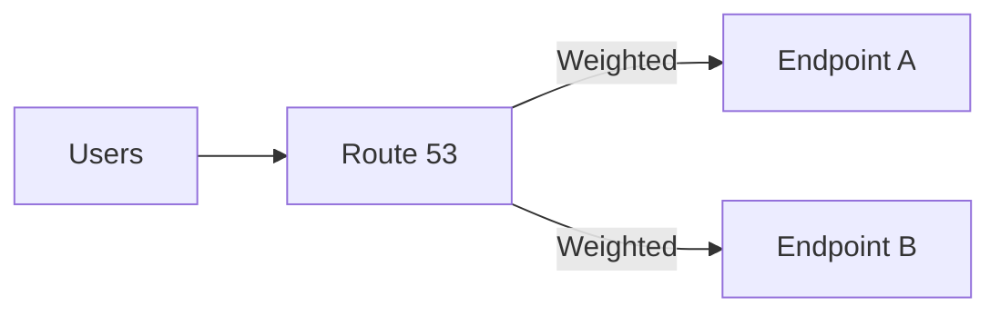
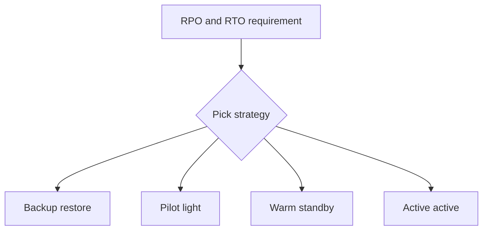

# Theory

## Exam Guide Mapping

- Domain: Domain 2: Design Resilient Architectures
- Task focus:
  - 2.1 Design scalable and loosely coupled architectures
  - 2.2 Design highly available and/or fault-tolerant architectures

## Core Concepts

- Resilience = “장애를 전제로” 유지되는 시스템 특성
  - HA(High Availability): 장애가 나도 서비스 지속(또는 빠른 자동 복구)
  - Fault tolerance: 장애 시에도 기능 유지(더 강한 요구, 비용↑)
- RPO/RTO
  - RPO: 허용 가능한 데이터 손실 시점(Recovery Point)
  - RTO: 허용 가능한 복구 시간(Recovery Time)
- SPOF 제거 패턴
  - AZ 분산(Multi-AZ)
  - stateless + Auto Scaling
  - decouple(큐/이벤트)

## Route 53 Routing Policies (시험 빈출)

- Simple: 단순 라우팅(대개 정답 후보가 아님)
- Weighted: 점진 배포/AB 테스트/트래픽 분산
- Failover: 헬스체크 기반 primary/secondary 장애 조치
- Latency: 지연 시간 기준으로 가까운 리전에 라우팅(글로벌)
- Geolocation/Geoproximity: 위치 기반 요구가 있을 때

## DR Strategy Menu (개념)

- Backup/Restore: 비용 낮음, RTO 큼
- Pilot light: 핵심만 상시 유지, RTO 중간
- Warm standby: 축소된 운영 환경 유지, RTO 작음
- Multi-site active/active: 비용 큼, RTO 매우 작음

## Exam must-know (요약)

- Key point: “Failover/헬스체크/자동 전환” 문장이 있으면 Route 53 Failover(+ health check)가 후보로 올라간다.
- Why: 가용성 요구는 “장애 탐지(health) + 트래픽 전환(라우팅)”의 결합으로 풀리는 경우가 많다.
- Alternative: “점진 배포/비율 조정”이면 Weighted, “가까운 리전”이면 Latency 기반이 더 자연스럽다.

## Exam Traps

- “Failover가 필요”한데 Weighted를 고르는 실수(요구 문장에 health check/장애 조치가 있으면 Failover 후보).
- “Latency 기반” 요구인데 단일 리전 배포로 끝내는 실수.
- RPO/RTO를 “성능 지표”로 착각하는 선택지.
