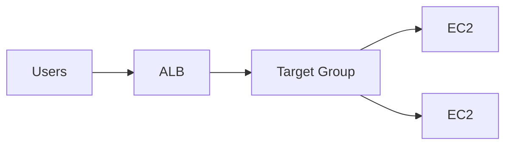

# Theory

## Exam Guide Mapping

- Domain: Domain 2: Design Resilient Architectures
- Task focus:
  - 2.1 Scalable and loosely coupled architectures
  - 2.2 Highly available and/or fault-tolerant architectures

## Deep Dive

### ALB vs NLB (시험형 구분)

| Topic | ALB | NLB |
|---|---|---|
| Layer | L7 | L4 |
| Routing | host/path 기반 | 주로 포트/프로토콜 |
| Use case | 웹/API, 라우팅 규칙 | TCP/UDP, 고성능, 고정 IP 요구(케이스) |

### Auto Scaling = “확장 + 복구”의 엔진

- 구성요소
  - Launch template/config: 인스턴스 표준(AMI/타입/보안그룹/user data)
  - Auto Scaling group: min/desired/max, AZ 분산
  - Health checks: EC2 + (옵션) ELB health check
- 시험 함정
  - “원하는 가용성”이 있으면 Multi-AZ + ASG가 기본 정답 후보
  - 헬스체크 실패 시 “교체/제외”를 통해 자가 치유가 일어난다

## Exam Traps

- “L7 기능이 필요한데 NLB를 선택”하는 오답
- “단일 AZ ASG”로 HA를 달성할 수 있다고 착각
- 보안 그룹/타겟 그룹 포트 불일치로 헬스체크 실패(실습에서도 자주)

