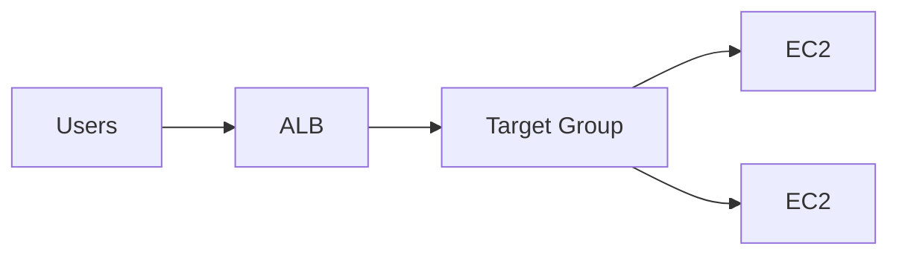

# Theory

## Exam Guide Mapping

- Domain: Domain 2: Design Resilient Architectures
- Task focus:
  - 2.1 Scalable and loosely coupled architectures
  - 2.2 Highly available and/or fault-tolerant architectures

## Core Concepts

- “가용성”은 대개 한 서비스로 끝나지 않는다
  - 진입점: Load Balancer (헬스체크/라우팅)
  - 복구/확장: Auto Scaling (교체/스케일)
  - 상태 분리: stateless + 외부 저장소(DB/캐시)
- 시험에서 가장 많이 섞이는 축 2개
  - L7 기능 필요 여부(라우팅 규칙/HTTP): ALB
  - L4/정적 IP/초고성능: NLB

## Deep Dive

### ALB vs NLB (시험형 구분)

| Topic | ALB | NLB |
|---|---|---|
| Layer | L7 | L4 |
| Routing | host/path 기반 | 주로 포트/프로토콜 |
| Use case | 웹/API, 라우팅 규칙 | TCP/UDP, 고성능, 고정 IP 요구(케이스) |

#### Exam must-know (포인트 + Why + 대안)

- Key point: “host/path 라우팅, HTTP 헤더, WAF 연동” 문장이 있으면 ALB가 정답 후보로 올라간다.
- Why: ALB는 L7에서 요청 내용을 해석해 규칙 기반 라우팅을 제공한다.
- Alternative: “정적 IP, TCP/UDP, 매우 높은 처리량”이 요구면 NLB가 자연스럽다.

### Auto Scaling = “확장 + 복구”의 엔진

- 구성요소
  - Launch template/config: 인스턴스 표준(AMI/타입/보안그룹/user data)
  - Auto Scaling group: min/desired/max, AZ 분산
  - Health checks: EC2 + (옵션) ELB health check
- 시험 함정
  - “원하는 가용성”이 있으면 Multi-AZ + ASG가 기본 정답 후보
  - 헬스체크 실패 시 “교체/제외”를 통해 자가 치유가 일어난다

#### Exam must-know (포인트 + Why + 대안)

- Key point: “장애 자동 복구” 문장은 ASG + health check(EC2/ELB) 조합으로 푸는 경우가 많다.
- Why: 실패한 인스턴스를 자동으로 감지하고 교체할 수 있는 메커니즘이 있어야 ‘운영자가 수동으로 재기동’ 패턴을 제거할 수 있다.
- Alternative: 워크로드가 서버리스면(예: Lambda) 인스턴스 복구가 아니라 “동시성/재시도/큐”로 복원력을 설계한다.

## Exam Traps

- “L7 기능이 필요한데 NLB를 선택”하는 오답
- “단일 AZ ASG”로 HA를 달성할 수 있다고 착각
- 보안 그룹/타겟 그룹 포트 불일치로 헬스체크 실패(실습에서도 자주)
