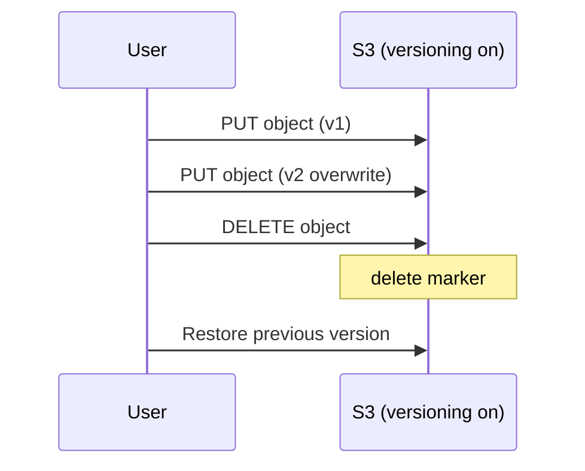

# Theory

## Exam Guide Mapping

- Domain: Domain 2: Design Resilient Architectures
- Task focus:
  - 2.2 Highly available and/or fault-tolerant architectures

## Deep Dive

### S3 Versioning: “실수 복구”의 기본기

- What it gives you
  - 덮어쓰기/삭제가 발생해도 이전 버전을 되돌릴 수 있음
- 시험형 힌트
  - “accidental deletion/overwrite”가 문장에 있으면 versioning이 정답 후보

### Replication (SRR/CRR): 데이터 복제 요구 대응

- Preconditions(핵심)
  - 소스/대상 버킷 모두 versioning이 켜져 있어야 한다.
- When to use
  - DR/규제/리전 장애 대비/근접 복제 요구
- Traps
  - versioning을 안 켠 채 복제를 “설정했다”는 선택지

### EBS Snapshot (개념)

- 스냅샷은 백업/복구의 기본 단위로 등장
- “장애 대비”에서 AMI/스냅샷/백업 전략이 섞여 출제될 수 있음

## Exam Traps

- 복제를 원하는데 versioning을 언급하지 않는 답안
- 단일 버킷에만 의존하는 DR(요구사항이 리전 장애라면 추가 설계 필요)

