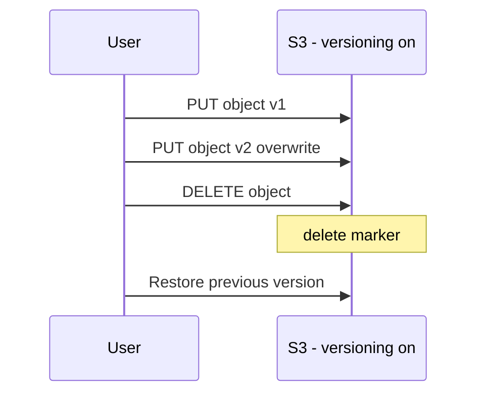

# Theory

## Exam Guide Mapping

- Domain: Domain 2: Design Resilient Architectures
- Task focus:
  - 2.2 Highly available and/or fault-tolerant architectures

## Core Concepts

- “실수 복구”와 “재해 복구(DR)”는 다르다
  - 실수 복구: 덮어쓰기/삭제/운영 실수 -> Versioning/PITR 같은 롤백 기능
  - DR: 리전/계정 수준 장애/규제 -> Replication/백업/다중 리전 설계
- S3에서 자주 나오는 규칙 1개
  - Replication(SRR/CRR)의 전제조건: 소스/대상 버킷 모두 Versioning ON

## Deep Dive

### S3 Versioning: “실수 복구”의 기본기

- What it gives you
  - 덮어쓰기/삭제가 발생해도 이전 버전을 되돌릴 수 있음
- 시험형 힌트
  - “accidental deletion/overwrite”가 문장에 있으면 versioning이 정답 후보

#### Exam must-know (포인트 + Why + 대안)

- Key point: “실수로 삭제/덮어쓰기”를 복구해야 한다면 S3 Versioning이 가장 직접적인 해법이다.
- Why: delete는 실제 삭제가 아니라 delete marker가 붙는 모델이라, 이전 버전을 복구할 수 있다.
- Alternative: 더 강한 요구(감사/승인/장기 보관/immutability)가 있으면 Object Lock/보관 정책까지 같이 검토한다(문장에 WORM/규제 힌트가 있으면 신호).

### Replication (SRR/CRR): 데이터 복제 요구 대응

- Preconditions(핵심)
  - 소스/대상 버킷 모두 versioning이 켜져 있어야 한다.
- When to use
  - DR/규제/리전 장애 대비/근접 복제 요구
- Traps
  - versioning을 안 켠 채 복제를 “설정했다”는 선택지

#### Exam must-know (포인트 + Why + 대안)

- Key point: “리전 장애 대비/규제 준수/원격 복제” 문장이 있으면 CRR/SRR이 정답 후보가 된다.
- Why: 복제는 ‘데이터가 다른 곳에도 존재’해야 의미가 있으며, 버전 기반 복제가 전제라 versioning이 필수다.
- Alternative: 단순 백업 요구면(복제까지는 불필요) Backup/Restore(EBS snapshot, AWS Backup 등) 전략이 더 비용 효율적일 수 있다.

### EBS Snapshot (개념)

- 스냅샷은 백업/복구의 기본 단위로 등장
- “장애 대비”에서 AMI/스냅샷/백업 전략이 섞여 출제될 수 있음

## Exam Traps

- 복제를 원하는데 versioning을 언급하지 않는 답안
- 단일 버킷에만 의존하는 DR(요구사항이 리전 장애라면 추가 설계 필요)
