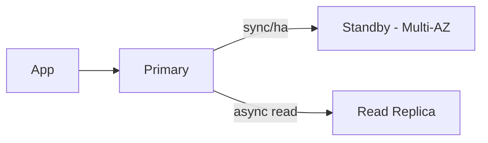

# Theory

## Exam Guide Mapping

- Domain: Domain 2: Design Resilient Architectures
- Task focus:
  - 2.2 Highly available and/or fault-tolerant architectures

## Deep Dive

### RDS/Aurora: Multi-AZ vs Read Replica (시험 단골)

| Goal | Best feature | Why | Common trap |
|---|---|---|---|
| HA/자동 장애 조치 | Multi-AZ | failover 중심 | Read replica로 HA 해결하려 함 |
| 읽기 확장 | Read replica | read scaling | Multi-AZ가 읽기 확장이라고 착각 |

### DynamoDB Resilience (개념)

- 관리형 서비스로 AZ 내구가 기본 전제(시험 문장에 자주 등장)
- 백업/복구 관점 옵션
  - On-demand backup(수동)
  - PITR(Point-in-time recovery): 시점 복구(요구사항에 “실수 복구/롤백”이 있으면 힌트)

## Exam Traps

- “Multi-AZ = 읽기 확장” 착각
- 관계형/NoSQL 요구를 구분하지 못하고 아무 DB나 고르는 실수
