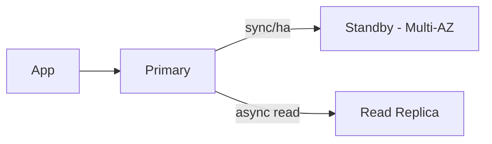

# Theory

## Exam Guide Mapping

- Domain: Domain 2: Design Resilient Architectures
- Task focus:
  - 2.2 Highly available and/or fault-tolerant architectures

## Core Concepts

- DB 문제는 보통 “가용성”과 “확장”을 분리해서 묻는다
  - HA/자동 장애 조치: Multi-AZ
  - 읽기 확장: Read replica
  - “둘 다 필요”면 둘을 같이 쓴다
- 시험의 핵심은 목적 매칭
  - “failover”가 문장에 있으면 Multi-AZ
  - “read-heavy”가 문장에 있으면 Read replica

## Deep Dive

### RDS/Aurora: Multi-AZ vs Read Replica (시험 단골)

| Goal | Best feature | Why | Common trap |
|---|---|---|---|
| HA/자동 장애 조치 | Multi-AZ | failover 중심 | Read replica로 HA 해결하려 함 |
| 읽기 확장 | Read replica | read scaling | Multi-AZ가 읽기 확장이라고 착각 |

#### Exam must-know (포인트 + Why + 대안)

- Key point: Read replica는 “읽기 확장”이고, HA의 standby로 착각하면 오답으로 빠진다.
- Why: 복제는 보통 비동기이며(지연 가능), 자동 failover/엔드포인트 전환은 Multi-AZ의 역할이다.
- Alternative: “글로벌 읽기/리전 DR” 요구가 강하면 Aurora Global Database 같은 다중 리전 옵션(요구사항/비용)을 함께 검토한다.

### DynamoDB Resilience (개념)

- 관리형 서비스로 AZ 내구가 기본 전제(시험 문장에 자주 등장)
- 백업/복구 관점 옵션
  - On-demand backup(수동)
  - PITR(Point-in-time recovery): 시점 복구(요구사항에 “실수 복구/롤백”이 있으면 힌트)

#### Exam must-know (포인트 + Why + 대안)

- Key point: “실수로 데이터가 잘못 업데이트/삭제” 힌트가 있으면 DynamoDB PITR이 정답 후보로 올라간다.
- Why: PITR은 특정 시점으로 복구할 수 있는 롤백 메커니즘이며 ‘운영 실수’ 유형에 직접 대응한다.
- Alternative: “규제/장기 보관/감사” 요구가 핵심이면 백업 보관 정책/아카이브(S3 등)까지 포함한 설계를 선택한다.

## Exam Traps

- “Multi-AZ = 읽기 확장” 착각
- 관계형/NoSQL 요구를 구분하지 못하고 아무 DB나 고르는 실수
