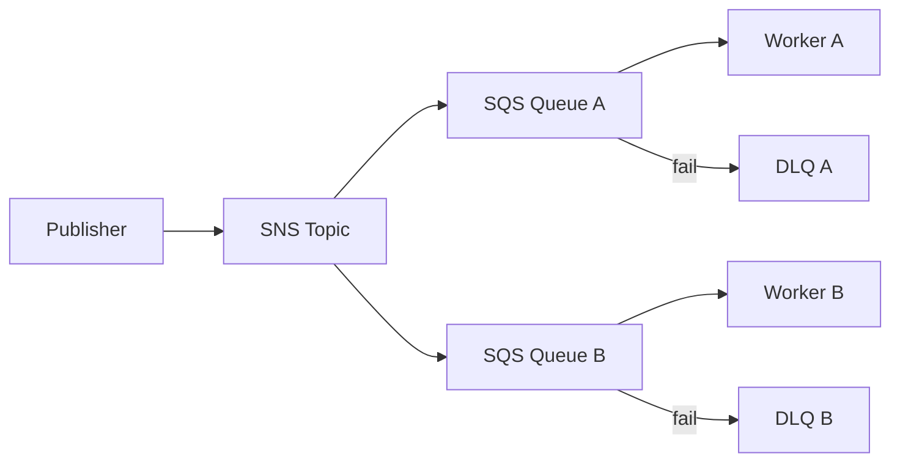

# Special Lecture + Week Summary (Domain 2)

## Exam Guide Mapping

- Domain: Domain 2: Design Resilient Architectures
- Task focus:
  - 2.1 Design scalable and loosely coupled architectures
  - 2.2 Design highly available and/or fault-tolerant architectures

## Week 2 Decision Rules

- “스파이크/부하 변동”은 ASG/큐/서버리스로 흡수한다.
- “느슨한 결합”은 메시징(SQS/SNS/EventBridge) + idempotency + 재시도/백오프가 같이 나온다.
- DB는 “가용성”과 “읽기 확장”을 분리해서 생각한다.

## Confusing Similar Cases

| Scenario | Best choice | Why | Common wrong choice | Why it's wrong |
|---|---|---|---|---|
| 내구 큐/재시도 | SQS | pull 기반, DLQ, 가시성 | SNS | push/팬아웃, 버퍼링 목적 아님 |
| 이벤트 버스/라우팅 | EventBridge | 규칙 기반 라우팅/통합 | SQS | 라우팅/필터링 제한 |
| L7 기능 필요 | ALB | host/path 라우팅 | NLB | L4 중심 |
| DB HA | RDS Multi-AZ | 자동 failover | Read replica | 주로 읽기 확장/비동기 |

## Exam-Heavy Patterns

### Pattern: Fan-out + DLQ + retry

- 메시지 중복은 정상(적어도 한 번 전달). 처리측에서 idempotency로 방어.
- DLQ는 장애 격리와 재처리 경로를 만든다.

### Pattern: RPO/RTO 기반 DR 선택

- Backup/Restore: 비용 낮음, RTO 큼
- Pilot light: 핵심만 상시, 나머지 복구
- Warm standby: 축소된 운영 환경 유지
- Multi-site active/active: 비용 큼, RTO 작음

## Reference Pack

- `aws-saa/special-lectures/domain02-resilient-top-services.md`

