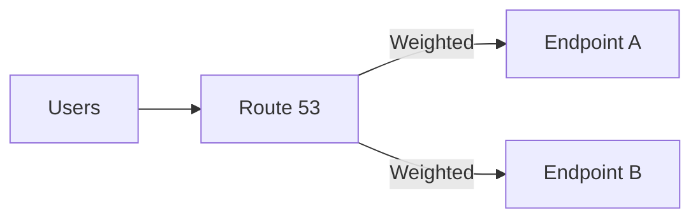

# Route 53 Routing Policies (Failover/Weighted/Latency)

## 소개 (이게 뭔가요?)

- Route 53은 DNS 라우팅 계층이고, 라우팅 정책은 “요구사항 신호에 맞는 트래픽 분배/전환”을 고르는 문제다.

## 고객 사례 (스토리, 600~1000자)

서비스가 단일 리전/단일 엔드포인트로 운영되던 시절엔 DNS는 신경 쓸 일이 없었다. 그런데 고객이 늘자 상황이 바뀐다. 새벽 장애가 한 번만 나도 계약이 흔들린다. 운영팀은 “장애가 나면 자동으로 다른 곳으로 넘어가야 한다”고 하고, 개발팀은 “점진 배포(카나리)로 위험을 줄이고 싶다”고 한다. 또 글로벌 사용자 비중이 늘면서 “가까운 리전으로 보내달라”는 요구도 나온다. 결국 DNS는 ‘이름 해석’이 아니라 ‘트래픽 제어’가 된다.

여기서 Route 53 라우팅 정책을 요구사항에 맞춰 고른다. “헬스체크 기반 장애 조치”가 보이면 Failover가 자연스럽다. “비율 조정/점진 배포/AB 테스트”면 Weighted가 맞다. “가까운 리전/지연 시간”이면 Latency 기반 라우팅이 신호다. 시험은 종종 Simple을 섞어 놓지만, Simple은 ‘아무 요구가 없을 때’에 가까워 정답이 되는 경우가 적다. 결국 문장 속 키워드(health check, failover, percentage, latency)를 잡으면 선택이 선명해진다.

한 번 익숙해지면, 라우팅 정책은 “외우는 것”이 아니라 “문장 신호를 해석하는 것”이 된다.

지금 문제 문장에는 “장애 조치”가 더 강한가요, “점진 배포”가 더 강한가요?

## Impact 범위 (어디에 영향을 주나?)

- Reliability: 장애 감지/전환(DNS failover) 설계
- Operations: 점진 배포/테스트(Weighted) 같은 운영 전략

## Exam Guide (Badges)

Exam guide mapping (details)

- Domain: Domain 2: Design Resilient Architectures
- Task focus: 라우팅/헬스체크 기반 장애 조치, 트래픽 분산

## Why This Matters (시험/실무에서 걸리는 지점)

- “Failover vs Weighted vs Latency”는 Domain 2의 대표 비교 문제다.

## Core Concepts

- Simple: 단순 라우팅(대개 정답 후보가 아님)
- Weighted: 점진 배포/AB 테스트/트래픽 분산
- Failover: 헬스체크 기반 primary/secondary 장애 조치
- Latency: 지연 시간 기준으로 가까운 리전에 라우팅(글로벌)
- Geolocation/Geoproximity: 위치 기반 요구가 있을 때

## Deep Dive

### 시험형 “키워드 매칭” (기본기)

- health check/failover → **Failover**
- percentage/gradual/canary/AB test → **Weighted**
- lowest latency/closest → **Latency**

### Best Practices: DNS 정책을 고를 때 같이 보는 것들

- Failover는 “DNS 레벨 전환”이므로, 보통 **헬스 체크**와 함께 언급된다. (문장에 health check가 없는데 Failover를 고르게 만드는 보기가 나오면 함정일 수 있다.)
- Weighted는 점진 배포에 좋지만, 장애 조치(HA)를 “자동으로” 해결해주진 않는다. 문장에 “장애 시 자동 전환”이 강하면 Failover 축으로 읽는다.
- Latency는 “가까운 곳” 신호에 강하지만, 규제/국가 고정 같은 요구가 있으면 Geolocation/Geoproximity 축이 더 자연스러울 수 있다.

### 시험에 자주 나오는 개념(소거 포인트)

- Route 53은 “트래픽을 보내는 서비스”가 아니라 **DNS 응답을 다르게 주는 서비스**다. 그래서 TTL/캐시 영향이 뒤따를 수 있다.
- “AWS 서비스(ALB/CloudFront 등)를 DNS로 붙인다”는 문장이 나오면, 보통 **Alias 레코드**가 보기로 섞여 나온다.

### 핵심 정리 (Deep Dive)

- 라우팅 정책 문제는 대부분 “요구 신호”를 하나로 잡으면 빠르게 풀린다(장애 조치/비율/지연).

### 라우팅 정책 요약표(시험에 자주 나오는 것들)

| 정책 | 대표 신호 | 한 줄 포인트 |
|---|---|---|
| Failover | health check, primary/secondary | 장애 조치가 목적 |
| Weighted | percentage, canary, AB test | 비율로 분배/점진 배포 |
| Latency | closest, lowest latency | 지연 시간 기준 |
| Geolocation | country/region 제한 | “어디서 접속했나”가 핵심 |
| Geoproximity | “거리 기반 + bias” | 지리/거리 최적화(세밀) |
| Multi-value | “여러 IP 반환” | 단순 분산(HA 만능 아님) |

> DNS는 “전환 속도”가 아니라 “응답을 바꾸는 것”이므로 TTL/캐시 영향이 따라올 수 있다.

## Quick Comparison Table

| Keyword | Best policy |
|---|---|
| failover + health check | Failover |
| traffic split | Weighted |
| lowest latency | Latency |

## Exam Traps (확장)

- 더 많은 연계/고급 함정: `../../exam-trap-bank.md`
- “Failover 요구”인데 Weighted를 고르는 선택지

## Exam Trap Drill (O/X, 1~3분)

- “점진 배포로 일부 트래픽만 신규로 보내고 싶다” → 어떤 정책?

## TL;DR (한 줄 정리)

- “장애 조치/헬스체크”면 **Failover**, “비율 조정/점진 배포”면 **Weighted**, “가까운 리전”이면 **Latency**가 신호다.

## References

- Internal references:
  - [References index](../../references/README.md)
  - [Exam guide (SAA-C03)](../../references/exam-guide.md)
  - [Glossary](../../references/glossary.md)
  - [AWS services list](../../references/aws-services.md)
  - [Exam keypoints](../../exam-keypoints.md)
  - [Exam trap bank](../../exam-trap-bank.md)

- Official AWS documentation:
  - [Amazon Route 53 Developer Guide](https://docs.aws.amazon.com/Route53/latest/DeveloperGuide/Welcome.html)

## Back

- `./README.md`
