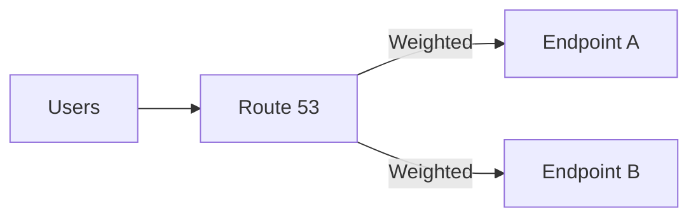

# Route 53 Routing Policies (Failover/Weighted/Latency)

## 소개 (이게 뭔가요?)

- Route 53은 DNS 라우팅 계층이고, 라우팅 정책은 “요구사항 신호에 맞는 트래픽 분배/전환”을 고르는 문제다.

## 고객 사례 (스토리, 600~1000자)

서비스가 단일 리전/단일 엔드포인트로 운영되던 시절엔 DNS는 신경 쓸 일이 없었다. 그런데 고객이 늘자 상황이 바뀐다. 새벽 장애가 한 번만 나도 계약이 흔들린다. 운영팀은 “장애가 나면 자동으로 다른 곳으로 넘어가야 한다”고 하고, 개발팀은 “점진 배포(카나리)로 위험을 줄이고 싶다”고 한다. 또 글로벌 사용자 비중이 늘면서 “가까운 리전으로 보내달라”는 요구도 나온다. 결국 DNS는 ‘이름 해석’이 아니라 ‘트래픽 제어’가 된다.

여기서 Route 53 라우팅 정책을 요구사항에 맞춰 고른다. “헬스체크 기반 장애 조치”가 보이면 Failover가 자연스럽다. “비율 조정/점진 배포/AB 테스트”면 Weighted가 맞다. “가까운 리전/지연 시간”이면 Latency 기반 라우팅이 신호다. 시험은 종종 Simple을 섞어 놓지만, Simple은 ‘아무 요구가 없을 때’에 가까워 정답이 되는 경우가 적다. 결국 문장 속 키워드(health check, failover, percentage, latency)를 잡으면 선택이 선명해진다.

한 번 익숙해지면, 라우팅 정책은 “외우는 것”이 아니라 “문장 신호를 해석하는 것”이 된다.

지금 문제 문장에는 “장애 조치”가 더 강한가요, “점진 배포”가 더 강한가요?

## Impact 범위 (어디에 영향을 주나?)

- Reliability: 장애 감지/전환(DNS failover) 설계
- Operations: 점진 배포/테스트(Weighted) 같은 운영 전략

## Exam Guide (Badges)

Exam guide mapping (details)

- Domain: Domain 2: Design Resilient Architectures
- Task focus: 라우팅/헬스체크 기반 장애 조치, 트래픽 분산

## Why This Matters (시험/실무에서 걸리는 지점)

- “Failover vs Weighted vs Latency”는 Domain 2의 대표 비교 문제다.

## VAKOG Anchors

- V(Visual): 아래 다이어그램으로 트래픽 분산을 본다.
- A(Auditory): “failover=장애 조치, weighted=비율, latency=가까운 곳”을 말로 고정한다.
- O(Olfactory, smell test): 장애 조치 요구인데 weighted만 고르는 답은 냄새가 난다.
- G(Gustatory, taste test): 문장 1개 보고 정책을 고른다.

## Core Concepts

- Simple: 단순 라우팅(대개 정답 후보가 아님)
- Weighted: 점진 배포/AB 테스트/트래픽 분산
- Failover: 헬스체크 기반 primary/secondary 장애 조치
- Latency: 지연 시간 기준으로 가까운 리전에 라우팅(글로벌)
- Geolocation/Geoproximity: 위치 기반 요구가 있을 때

## Deep Dive

- 시험형으로는 “키워드 매칭”이 가장 강하다:
  - health check/failover → Failover
  - percentage/gradual/canary → Weighted
  - lowest latency/closest → Latency

## Quick Comparison Table

| Keyword | Best policy |
|---|---|
| failover + health check | Failover |
| traffic split | Weighted |
| lowest latency | Latency |

## Exam Traps (5-8)

- “Failover 요구”인데 Weighted를 고르는 선택지

## Taste Test (1~3분)

- “점진 배포로 일부 트래픽만 신규로 보내고 싶다” → 어떤 정책?

## TL;DR (한 줄 정리)

- “장애 조치/헬스체크”면 **Failover**, “비율 조정/점진 배포”면 **Weighted**, “가까운 리전”이면 **Latency**가 신호다.

## Back

- `./00-theory-index.md`
