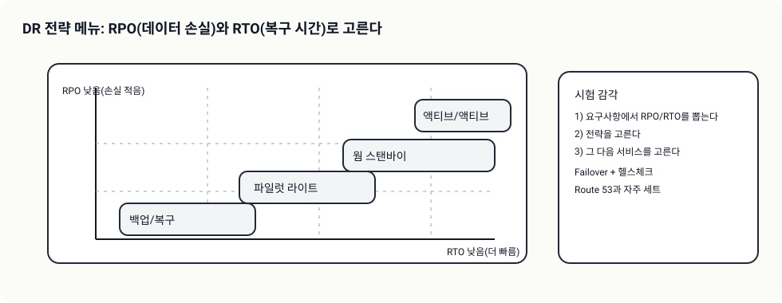
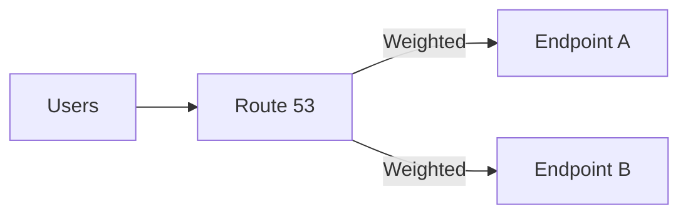
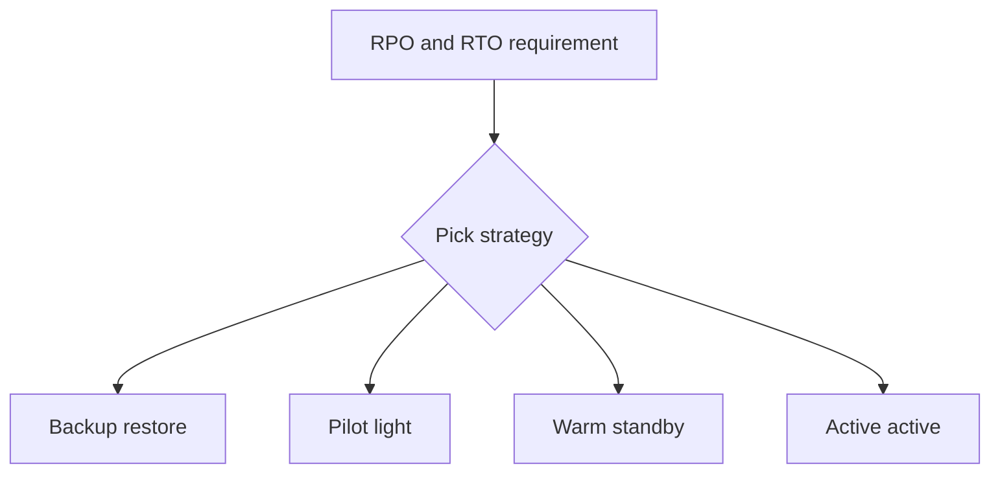

# 복원력(Resilience) 기초 + Route 53 라우팅

## 소개 (이게 뭔가요?)

- Domain 2는 “장애를 전제로도 서비스가 버티게” 만드는 설계 규칙을 묻는다.
- Route 53은 그중 “장애를 감지하고 트래픽을 다른 곳으로 돌리는” 대표 선택지다.

## 고객 사례 (스토리)

신규 서비스가 런칭 첫 주에 터졌다. 트래픽은 적당한데, 새벽마다 한 번씩 API가 먹통이 된다. 원인은 딱 한 번의 AZ 장애였지만, 고객은 “서비스가 멈췄다”로 기억한다. 개발자는 2명뿐이라, 장애가 날 때마다 새벽에 깨서 DNS를 바꾸고 인스턴스를 갈아 끼우는 방식은 오래 못 간다. 보안/운영팀은 “장애가 나도 자동으로 넘어가고, 복구 시나리오를 문서로 설명할 수 있어야 한다”고 한다.

게다가 “사용자가 전 세계에 있으니 가까운 리전으로 보내 달라”는 요구도 나온다. 한 번의 장애 대응이 ‘설계 선택’으로 번지기 시작한다.

여기서부터 RPO/RTO가 ‘숫자’가 아니라 ‘선택 기준’이 된다. RPO는 “얼마나 최신 데이터까지 복구해야 하나”, RTO는 “얼마나 빨리 다시 살아나야 하나”다. 요구가 빡세질수록 DR 전략은 Backup/Restore에서 Warm standby, Active/Active로 올라간다. 그리고 “자동 전환”이 들어가는 순간, Route 53의 Failover 라우팅 + 헬스체크가 자연스러운 카드가 된다. 네비게이션이 막힌 길을 피해서 우회 경로로 보내듯, 헬스체크가 실패하면 트래픽을 다른 엔드포인트로 돌려준다.

지금 상황에서 더 먼저 정리해야 할 건, “서버를 더 키우기”일까요, 아니면 “장애 시 자동 전환”일까요?

## Impact 범위 (어디에 영향을 주나?)

- Reliability: 장애 탐지/전환(라우팅)과 DR 전략 선택에 직결
- Operations: 새벽 수동 대응을 자동화로 바꾸는 출발점
- Cost: RPO/RTO 요구가 강할수록(Active/Active 등) 비용이 크게 증가

## Exam Guide (Badges)

Exam guide mapping (details)

- Domain: Domain 2: Design Resilient Architectures
- Task focus:
  - 2.1 Design scalable and loosely coupled architectures
  - 2.2 Design highly available and/or fault-tolerant architectures

## Why This Matters (시험/실무에서 걸리는 지점)

- “Failover/헬스체크/자동 전환” 신호가 보이면, Route 53 라우팅 정책 선택이 정답을 가른다.

## Core Concepts

- Resilience = “장애를 전제로” 유지되는 시스템 특성
  - HA(High Availability): 장애가 나도 서비스 지속(또는 빠른 자동 복구)
  - Fault tolerance: 장애 시에도 기능 유지(더 강한 요구, 비용↑)
- RPO/RTO
  - RPO: 허용 가능한 데이터 손실 시점(Recovery Point)
  - RTO: 허용 가능한 복구 시간(Recovery Time)
- SPOF 제거 패턴
  - AZ 분산(Multi-AZ)
  - stateless + Auto Scaling
  - decouple(큐/이벤트)

## Route 53 Routing Policies (시험 빈출)

- Simple: 단순 라우팅(대개 정답 후보가 아님)
- Weighted: 점진 배포/AB 테스트/트래픽 분산
- Failover: 헬스체크 기반 primary/secondary 장애 조치
- Latency: 지연 시간 기준으로 가까운 리전에 라우팅(글로벌)
- Geolocation/Geoproximity: 위치 기반 요구가 있을 때

## DR Strategy Menu (개념)

- Backup/Restore: 비용 낮음, RTO 큼
- Pilot light: 핵심만 상시 유지, RTO 중간
- Warm standby: 축소된 운영 환경 유지, RTO 작음
- Multi-site active/active: 비용 큼, RTO 매우 작음

## Exam must-know (요약)

- Key point: “Failover/헬스체크/자동 전환” 문장이 있으면 Route 53 Failover(+ health check)가 후보로 올라간다.
- Why: 가용성 요구는 “장애 탐지(health) + 트래픽 전환(라우팅)”의 결합으로 풀리는 경우가 많다.
- Alternative: “점진 배포/비율 조정”이면 Weighted, “가까운 리전”이면 Latency 기반이 더 자연스럽다.

## Exam Traps

- “Failover가 필요”한데 Weighted를 고르는 실수(요구 문장에 health check/장애 조치가 있으면 Failover 후보).
- “Latency 기반” 요구인데 단일 리전 배포로 끝내는 실수.
- RPO/RTO를 “성능 지표”로 착각하는 선택지.

## TL;DR (한 줄 정리)

- “자동 전환/헬스체크/장애 조치”가 보이면 **Route 53 Failover(+ Health check)**, DR은 **RPO/RTO에 맞춰 전략을 고른다**.
