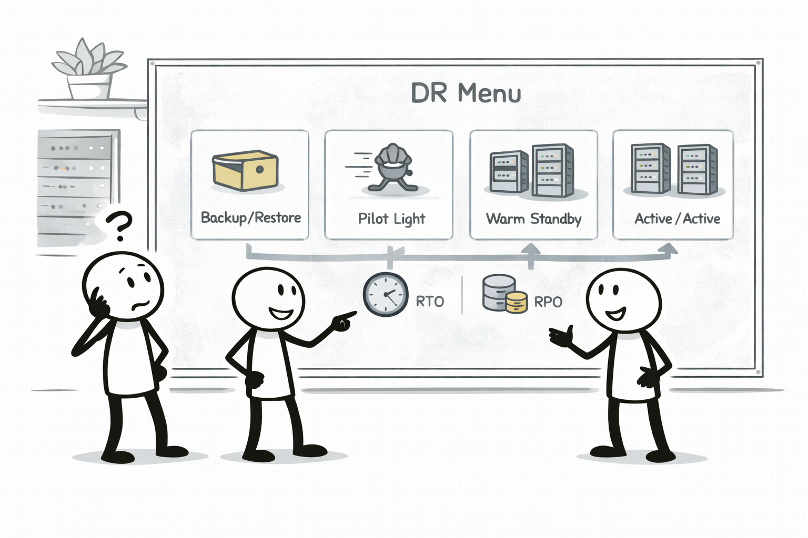
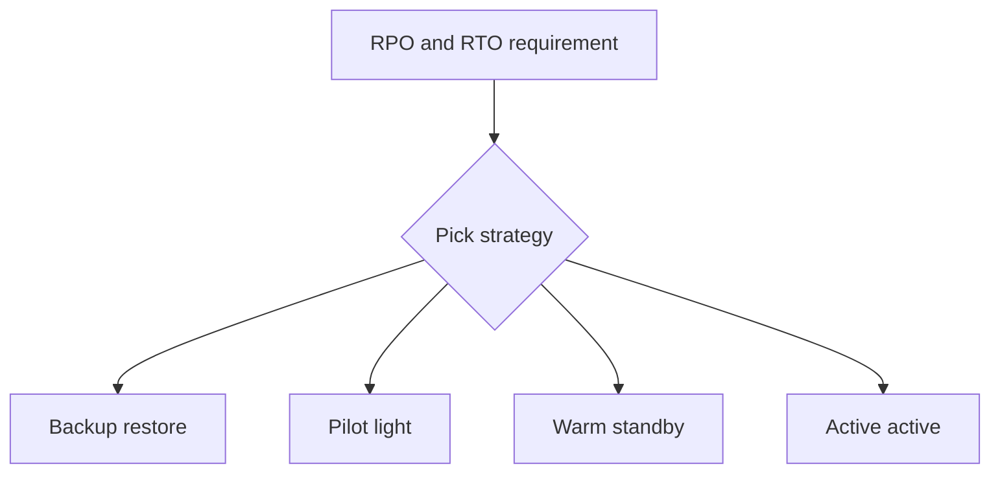

# DR Strategy Menu (RPO/RTO로 고르는 복구 전략)

## 소개 (이게 뭔가요?)

- DR은 “재해(리전/대규모 장애)까지 포함한 복구 전략”이고, 선택 기준은 RPO/RTO다.

## 고객 사례 (스토리, 600~1000자)

경영진이 질문한다. “리전 장애가 나면 얼마나 빨리 복구돼야 하나요?” 팀은 대답이 막힌다. 평소 장애 대응은 인스턴스 재기동이나 롤백 정도였는데, 리전 단위 장애는 차원이 다르다. 고객 데이터가 얼마나 유실돼도 되는지(RPO), 서비스가 얼마나 빨리 살아나야 하는지(RTO)가 계약/규제와 연결된다. 그런데 이 요구는 기술만의 문제가 아니라 비용 문제다. “항상 두 곳에서 완전히 돌아가게(Active/Active)” 하면 빠르지만 비싸다. “백업만” 두면 싸지만 느리다.

그래서 DR은 메뉴처럼 고른다. Backup/Restore는 비용이 낮지만 RTO가 크다. Pilot light는 핵심만 상시 유지해 중간 정도다. Warm standby는 축소된 운영 환경을 유지해 RTO를 더 줄인다. Active/Active는 가장 빠르지만 비용이 가장 크다. 시험은 이 ‘트레이드오프’를 읽는 문제다. 문장에 RPO/RTO 숫자나 “몇 분 내 복구” 같은 강한 신호가 나오면, 백업만으로 끝나는 답은 오답이 되기 쉽다.

또 하나의 포인트는 “DR은 운영 계획”이라는 점이다. 단순히 리소스를 만들어두는 게 아니라, 장애 시나리오에서 어떤 순서로 전환/복구할지, 그리고 그걸 정기적으로 연습할지까지 포함한다. 시험에서도 ‘계획’과 ‘요구’의 일치 여부를 보는 문장이 섞여 나온다.

당신 서비스의 RPO/RTO 요구를 한 문장으로 말해본다면, 어떤 전략이 자연스러울까요?

## Impact 범위 (어디에 영향을 주나?)

- Reliability: 재해 상황에서 서비스/데이터 복구의 정답을 가른다
- Cost: 요구가 강할수록(Active/Active) 비용이 크게 증가한다

## Exam Guide (Badges)

Exam guide mapping (details)

- Domain: Domain 2: Design Resilient Architectures
- Task focus: RPO/RTO 기반 DR 전략 선택(개념)

## Why This Matters (시험/실무에서 걸리는 지점)

- DR 문제는 “정답 서비스”가 아니라 “요구 강도(RPO/RTO) ↔ 비용” 매칭 문제다.

## Core Concepts

- Backup/Restore: 비용 낮음, RTO 큼
- Pilot light: 핵심만 상시 유지, RTO 중간
- Warm standby: 축소된 운영 환경 유지, RTO 작음
- Multi-site active/active: 비용 큼, RTO 매우 작음

## Deep Dive

### RPO/RTO를 “신호”로 읽기

DR 문제에서 먼저 해야 할 일은 RPO/RTO를 외우는 게 아니라, **문장이 무엇을 더 민감하게 말하는지**를 잡는 것이다.

- **RPO(Recovery Point Objective)**: “데이터를 얼마나 잃어도 되나?”  
  - 신호: “거의 0”, “분 단위”, “결제/주문 데이터 유실 불가”
- **RTO(Recovery Time Objective)**: “얼마나 빨리 서비스가 살아나야 하나?”  
  - 신호: “몇 분 내 복구”, “다운타임 불가”, “자동 전환”

시험은 이 신호를 보고 “비용 ↔ 복구 수준”을 매칭하는 문제를 자주 낸다. 그래서 **요구가 강할수록 비용이 올라간다**가 기본 규칙이다.

### 자주 나오는 오해: Multi-AZ는 “리전 DR”이 아니다

문장에 “리전 장애”가 명시되면, 단순히 Multi-AZ(동일 리전 내)만으로 끝내는 답은 함정이 될 수 있다.  
반대로 “AZ 장애/인스턴스 장애” 수준이면, 멀티리전 DR 전략을 과하게 고르는 것도 오답 후보가 된다.

### 전략별 Best Practice: 언제 이렇게/저렇게

- **Backup/Restore**: “비용은 최소, 복구는 느려도 된다”일 때 자연스럽다. 다만 운영 우수성 관점에서 *runbook + 복구 연습*이 없으면 실전에서 잘 깨진다.
- **Pilot light**: 핵심 컴포넌트만 최소로 유지해, 복구를 “완전 새로 만들기”에서 “확장”으로 바꾼다. (RTO를 줄이되 비용은 완전 상시 운영보다 낮게)
- **Warm standby**: 축소된 운영 환경을 상시 유지해 더 빠르게 복구한다. “몇 분~수십 분” 같은 더 강한 RTO 신호에서 자주 등장한다.
- **Active/Active**: 거의 상시 운영 수준으로 비용이 크지만, “다운타임 거의 0”에 가까운 요구에서 후보가 된다.

### 시험에 자주 나오는 운영 요소

DR은 리소스를 만들어두는 것만이 아니라, **전환/복구 절차(runbook)**와 **정기 연습(Game day)**까지 포함하는 ‘운영 설계’다.  
따라서 보기에서 “계획만 있고 연습이 없다”, “RPO/RTO 정의가 없다” 같은 문장은 소거 포인트가 되곤 한다.

## Quick Comparison Table

| Strategy | 평시 비용 | RTO(복구 시간) | 전형적 신호 |
|---|---|---|---|
| **Backup/Restore** | 낮음 | 큼 | “비용 최소”, “수 시간 복구 허용” |
| Pilot light | 낮음~중간 | 중간 | “핵심만 유지”, “필요 시 확장” |
| Warm standby | 중간~높음 | 작음 | “빠른 복구”, “축소 운영 유지” |
| Active/Active | 가장 높음 | 매우 작음 | “다운타임 거의 0” |

## Exam Traps (확장)

- 더 많은 연계/고급 함정: `../../exam-trap-bank.md`
- RTO가 매우 짧은데 Backup/Restore만 고르는 답

## Exam Trap Drill (O/X, 1~3분)

- “몇 분 내 복구, 데이터 손실 거의 0” → 어떤 전략 쪽이 더 자연스러운가?

## TL;DR (한 줄 정리)

- RPO/RTO 요구가 강할수록 **Warm standby → Active/Active**로 올라가며, 비용도 같이 올라간다.

## References

- References index: `../../references/README.md`
- Exam guide (SAA-C03): `../../references/exam-guide.md`
- Glossary: `../../references/glossary.md`
- AWS services list: `../../references/aws-services.md`
- Exam keypoints: `../../exam-keypoints.md`
- Exam trap bank: `../../exam-trap-bank.md`

## Back

- `./README.md`
