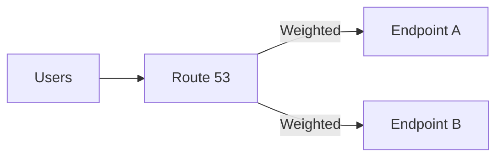

# Route 53 Routing Policies (시험 빈출)

- Simple: 단순 라우팅(대개 정답 후보가 아님)
- Weighted: 점진 배포/AB 테스트/트래픽 분산
- Failover: 헬스체크 기반 primary/secondary 장애 조치
- Latency: 지연 시간 기준으로 가까운 리전에 라우팅(글로벌)
- Geolocation/Geoproximity: 위치 기반 요구가 있을 때

## TL;DR (한 줄 정리)

- “장애 조치/헬스체크”면 **Failover**, “비율 조정/점진 배포”면 **Weighted**, “가까운 리전”이면 **Latency**가 신호다.

## Back

- `../01-theory.md`
