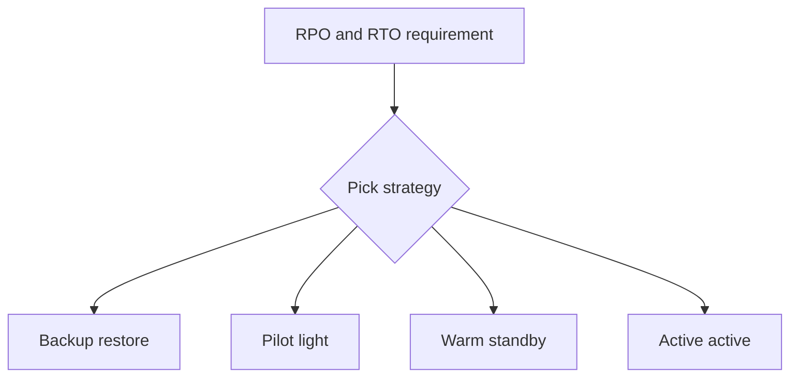

# DR Strategy Menu (개념)

- Backup/Restore: 비용 낮음, RTO 큼
- Pilot light: 핵심만 상시 유지, RTO 중간
- Warm standby: 축소된 운영 환경 유지, RTO 작음
- Multi-site active/active: 비용 큼, RTO 매우 작음

## TL;DR (한 줄 정리)

- RPO/RTO 요구가 강할수록 **Warm standby → Active/Active**로 올라가며, 비용도 같이 올라간다.

## Back

- `../01-theory.md`
