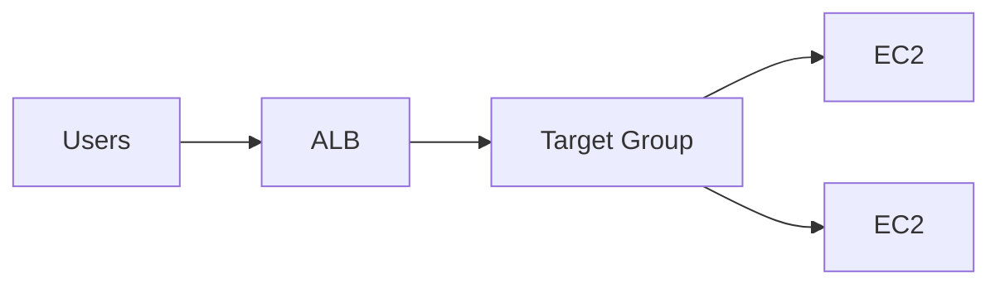

# ALB vs NLB (L7 라우팅 vs L4 성능/프로토콜)

## 소개 (이게 뭔가요?)

- 둘 다 “트래픽을 여러 대상에 분산”하지만, 시험에서는 **요구 기능(L7) vs 요구 신호(L4/정적 IP)**로 고른다.

## 고객 사례 (스토리, 600~1000자)

서비스가 커지면서 단일 인스턴스는 한계가 왔다. 로드밸런서를 붙이자고 했는데, 팀이 멈칫한다. “ALB랑 NLB 중 뭐가 맞지?” 요구사항을 보면 힌트가 섞여 있다. “/api는 A로 보내고 /static은 B로 보내고 싶다” 같은 라우팅 규칙이 있고, 동시에 “특정 고객은 TCP 기반 연결을 유지해야 한다” 같은 문장도 있다. 운영팀은 “고정 IP가 필요하다”는 이야기도 한다.

이때 핵심은 기술명이 아니라 문장 신호다. HTTP의 host/path, 헤더 기반 라우팅, WAF 연동 같은 L7 기능이 필요하면 ALB가 자연스럽다. 반대로 TCP/UDP, 초고성능, 정적 IP, 소스 IP 보존 같은 신호가 강하면 NLB 쪽이 맞다. 시험은 “아무 로드밸런서나” 고르는 실수를 유도하니, 요구사항을 기능 축(L7)과 성능/프로토콜 축(L4)으로 분리해서 읽어야 한다.

또 자주 나오는 케이스가 “TLS 종료(termination)를 어디서 하느냐”다. 문제 문장에 ‘HTTP 헤더/쿠키/경로’ 같은 표현이 있으면 L7 레벨의 처리가 필요하다는 뜻이라 ALB 쪽으로 기운다. 반대로 ‘초저지연, 정적 IP, TCP’가 강하면 NLB가 더 자연스럽다.

지금 문장에서 더 강한 신호는 “HTTP 라우팅 규칙”인가요, “TCP/정적 IP”인가요?

## Impact 범위 (어디에 영향을 주나?)

- Reliability/Operations: 헬스체크/라우팅/분산의 핵심 구성요소
- Performance: L7/L4 선택이 지연/처리량과 연결된다

## Exam Guide (Badges)

Exam guide mapping (details)

- Domain: Domain 2: Design Resilient Architectures
- Task focus: 요구사항 신호로 ALB/NLB 선택

## Why This Matters (시험/실무에서 걸리는 지점)

- ALB/NLB는 “기능 신호”로 고르는 비교 문제다.

## Core Concepts

| Topic | ALB | NLB |
|---|---|---|
| Layer | L7 | L4 |
| Routing | host/path 기반 | 주로 포트/프로토콜 |
| Use case | 웹/API, 라우팅 규칙 | TCP/UDP, 고성능, 고정 IP 요구(케이스) |

## Deep Dive

### “요구사항 신호”로 쪼개서 고르기

로드밸런서를 고를 때 실무/시험 모두에서 가장 흔한 실패는 “그럴싸해 보이는 키워드”에 끌려 계층(L7/L4)을 뒤섞는 것이다. 문장을 아래 신호로 쪼개면 선택이 빨라진다.

- **L7(애플리케이션 레벨) 신호**: `host/path 기반 라우팅`, `HTTP 헤더 기반`, `쿠키 기반 stickiness`, `WAF 연동` 같은 문장이 등장한다.
- **L4(전송 레벨) 신호**: `TCP/UDP`, `초저지연/대량 처리`, `고정 IP(화이트리스트)`, `클라이언트 IP 보존` 같은 문장이 등장한다.

### ALB vs NLB “시험형” 비교표

| 비교 축 | ALB | NLB | 시험에서 자주 걸리는 함정 |
|---|---|---|---|
| 계층 | L7 | L4 | “LB니까 다 비슷하다”라고 뭉개기 |
| 핵심 가치 | 라우팅/정책(규칙) | 성능/연결(전송) | L7 요구에 NLB를 고르는 실수 |
| 대표 신호 | `host/path`, `WAF`, `HTTP 헤더` | `TCP/UDP`, `고정 IP` | “고정 IP”를 ALB로 해결하려고 함 |
| 정적 콘텐츠 | (직접 해법 아님) | (직접 해법 아님) | “정적=LB”로 착각 (정답은 대개 CloudFront) |

### Best Practices (언제 이렇게/저렇게)

- **HTTP 규칙이 많아질수록**(경로 분기, 마이크로서비스 라우팅, 헤더 분기) ALB로 “규칙을 코드처럼” 관리하는 쪽이 운영이 편해진다.
- **고객사/파트너 제약이 강할수록**(고정 IP 화이트리스트, L4 프로토콜, 초저지연) NLB가 자연스럽다.
- 문장에 `정적/캐시/오리진 요청/전송량`이 보이면 “로드밸런서 증설”이 아니라 **CloudFront(캐시)** 축을 먼저 의심한다.

### 핵심 정리 (Deep Dive)

- `host/path/WAF` → **ALB**, `TCP/UDP/고정 IP` → **NLB**로 먼저 분류한다.
- “정적=CloudFront(캐시)”와 “경로/고정 IP=GA/NLB”는 같은 엣지 키워드처럼 보여도 답이 다르다.

## Exam must-know (포인트 + Why + 대안)

- Key point: “host/path 라우팅, HTTP 헤더, WAF 연동” 문장이 있으면 ALB가 정답 후보로 올라간다.
- Why: ALB는 L7에서 요청 내용을 해석해 규칙 기반 라우팅을 제공한다.
- Alternative: “정적 IP, TCP/UDP, 매우 높은 처리량”이 요구면 NLB가 자연스럽다.

## Quick Comparison Table

| Signal | Best choice |
|---|---|
| host/path 기반 라우팅 | ALB |
| TCP/UDP + 정적 IP | NLB |

## Exam Traps (5-8)

- L7 기능이 필요한데 NLB를 선택

## Taste Test (1~3분)

- “HTTP path 기반 라우팅” → ALB? NLB?

## TL;DR (한 줄 정리)

- “HTTP 라우팅 규칙”이면 **ALB**, “TCP/UDP/고성능/고정 IP”이면 **NLB**가 신호다.

## Back

- `./00-theory-index.md`
