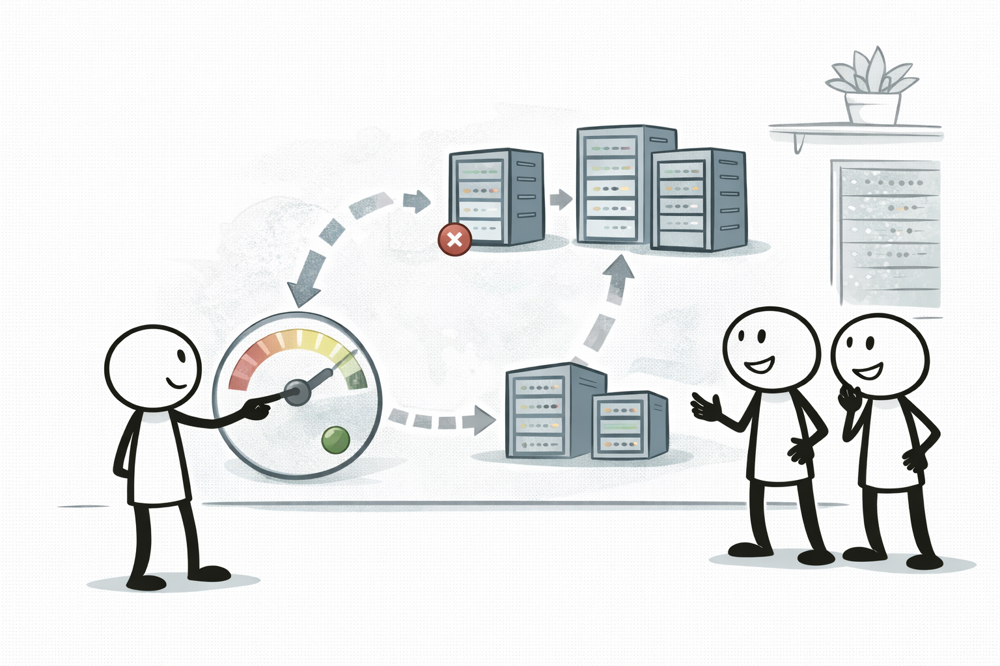

# Auto Scaling (확장 + 자가 치유)

## 소개 (이게 뭔가요?)

- Auto Scaling은 인스턴스를 “그룹”으로 관리하면서, 부하에 따라 늘리고 장애 시 자동으로 교체하는 엔진이다.

## 고객 사례 (스토리, 600~1000자)

트래픽이 몰릴 때마다 운영자가 콘솔에서 인스턴스를 늘렸다. 이벤트가 끝나면 다시 줄였다. 그런데 진짜 문제는 ‘스케일’이 아니라 ‘장애’였다. 인스턴스 한 대가 죽으면, 그 인스턴스로 붙은 사용자만 계속 오류를 겪는다. 운영자는 새벽에 알람을 받고 수동으로 재기동한다. 팀은 작고, 이 패턴은 오래 못 간다.

Auto Scaling Group(ASG)으로 사고방식을 바꾸면, 인스턴스는 “교체 가능한 부품”이 된다. Launch template로 표준 이미지를 만들고, ASG에 min/desired/max와 Multi-AZ 분산을 설정한다. 그리고 health check가 실패하면 대상에서 제외하고, 계속 실패하면 교체한다. 즉, 자가 치유는 “헬스체크 기준 + 자동 교체”로 구현된다. 시험에서도 “자동 복구”, “운영자 수동 재기동 제거” 같은 문장은 ASG+health check 조합을 요구하는 신호다. 서버리스가 정답인 문제라면 인스턴스 복구 대신 큐/재시도 같은 다른 복원력 메커니즘으로 넘어간다.

추가로 “스케일 정책(언제 늘리고 언제 줄이는지)”도 같이 따라온다. 하지만 시험에서 핵심은 정책의 종류보다, 장애/헬스체크가 “교체”로 이어지는 흐름을 이해하는지다. 그래서 ‘확장’보다 ‘복구’ 신호가 더 중요하게 등장하는 경우가 많다.

지금 요구사항은 “더 많이”일까요, 아니면 “죽어도 자동으로 갈아끼우기”일까요?

## Impact 범위 (어디에 영향을 주나?)

- Reliability: 장애 시 자동 교체(자가 치유) 메커니즘의 핵심
- Operations: 수동 대응을 자동화로 바꾼다

## Exam Guide (Badges)

Exam guide mapping (details)

- Domain: Domain 2: Design Resilient Architectures
- Task focus: 자가 치유(헬스체크 기반 교체) 설계

## Why This Matters (시험/실무에서 걸리는 지점)

- “자동 복구”는 ‘사람이 재기동’이 아니라 ‘헬스체크 기반 교체’를 뜻한다.

## Core Concepts

## 구성요소

- Launch template/config: 인스턴스 표준(AMI/타입/보안그룹/user data)
- Auto Scaling group: min/desired/max, AZ 분산
- Health checks: EC2 + (옵션) ELB health check

## Deep Dive

### Auto Scaling을 “스케일”과 “치유”로 분리해서 보기

ASG는 크게 두 가지를 한다.

- **치유(Self-healing)**: 헬스체크 실패/인스턴스 장애를 감지해 *제외 → 교체*로 원하는 대수를 유지한다.
- **스케일(Elasticity)**: 지표(예: CPU/RequestCount/큐 길이)나 시간표에 따라 *늘리고/줄이는* 정책을 적용한다.

시험 문장에서는 “장애 나면 자동으로 교체”, “수동 재기동 제거” 같은 표현이 나오면 **치유 신호**이고, “트래픽이 늘 때 자동으로 확장”, “피크 시간만 늘리고 싶다” 같은 표현이 나오면 **스케일 신호**다.

### 스케일링 정책: 언제 무엇을 쓰나

| 요구(문장 신호) | 자연스러운 정책 | 포인트 |
|---|---|---|
| “항상 60% 근처로 자동 유지” | Target tracking | 운영 부담이 가장 적은 ‘기본값’ |
| “임계치 넘으면 2대 추가, 더 넘으면 5대” | Step scaling | 단계별로 반응을 다르게 |
| “매일 10~12시만 확장” | Scheduled scaling | 예측 가능한 패턴에 강함 |

### 운영 Best Practices (시험에도 자주 나오는 디테일)

- **ELB 뒤에 있다면** 치유 판단은 보통 `EC2 상태 체크`만이 아니라 **ELB health check 연동**이 더 정확하다(애플리케이션 레벨 실패를 잡음).
- 새로 띄운 인스턴스가 준비될 시간을 고려해 **health check grace period/cooldown** 개념을 같이 떠올린다.
- “배포 중에도 안정적으로 교체” 같은 문장이 보이면 **Instance refresh**(점진 교체) 신호로 읽는다.

### 핵심 정리 (Deep Dive)

- “자동 교체/자가 치유”가 핵심이면 **ASG + health check**가 1순위 후보로 올라온다.
- “언제/어떤 기준으로 늘리고 줄일지”가 핵심이면 **스케일링 정책(Target/Step/Scheduled)**을 고르는 문제다.

## 시험 함정

- “원하는 가용성”이 있으면 Multi-AZ + ASG가 기본 정답 후보
- 헬스체크 실패 시 “교체/제외”를 통해 자가 치유가 일어난다

## Exam must-know (포인트 + Why + 대안)

- Key point: “장애 자동 복구” 문장은 ASG + health check(EC2/ELB) 조합으로 푸는 경우가 많다.
- Why: 실패한 인스턴스를 자동으로 감지하고 교체할 수 있는 메커니즘이 있어야 ‘운영자가 수동으로 재기동’ 패턴을 제거할 수 있다.
- Alternative: 워크로드가 서버리스면(예: Lambda) 인스턴스 복구가 아니라 “동시성/재시도/큐”로 복원력을 설계한다.

## Quick Comparison Table

| Need | Best choice |
|---|---|
| 자동 교체/자가 치유 | ASG + health check |

## Exam Traps (확장)

- 더 많은 연계/고급 함정: `../../exam-trap-bank.md`
- 단일 AZ ASG로 HA를 달성할 수 있다고 착각

## Exam Trap Drill (O/X, 1~3분)

- “헬스체크 실패 시 자동으로 교체” → 어떤 서비스 조합?

## TL;DR (한 줄 정리)

- 자가 치유는 **헬스체크 → 제외/교체** 흐름으로 만든다(ASG + health check).

## References

- Internal references:
  - [References index](../../references/README.md)
  - [Exam guide (SAA-C03)](../../references/exam-guide.md)
  - [Glossary](../../references/glossary.md)
  - [AWS services list](../../references/aws-services.md)
  - [Exam keypoints](../../exam-keypoints.md)
  - [Exam trap bank](../../exam-trap-bank.md)

- Official AWS documentation:
  - [EC2 Auto Scaling User Guide](https://docs.aws.amazon.com/autoscaling/ec2/userguide/what-is-amazon-ec2-auto-scaling.html)

## Back

- `./README.md`
