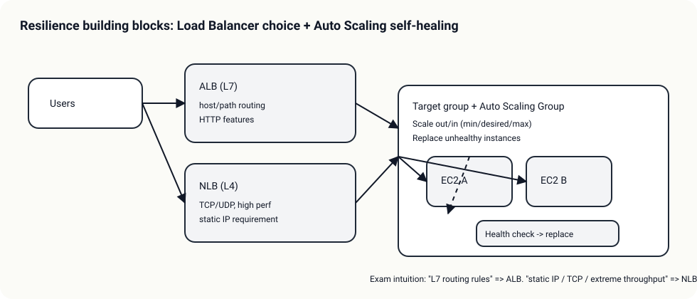

# Day 02 - ELB + Auto Scaling + health checks (Resilience: ELB + Auto Scaling)

## Outcomes

- ALB vs NLB 선택 기준(L7 라우팅 vs L4 성능/프로토콜)을 설명한다.
- Auto Scaling으로 “수평 확장 + 자가 치유”를 구현하는 핵심 구성요소(launch template, target group, health check)를 연결한다.
- 헬스체크 실패가 어떤 복구(인스턴스 교체/타겟 제외)로 이어지는지 설명한다.

## Services In Scope

- ELB (ALB/NLB)
- EC2 Auto Scaling
- Target group health checks

## Timebox (4h)

- Theory + mini-action: 4h

## Reading (서비스별 theory)

- [ALB vs NLB (L7 라우팅 vs L4 성능/프로토콜)](01-alb-vs-nlb.md)
- [Auto Scaling (확장 + 자가 치유)](02-auto-scaling.md)

## Core Concepts

- “가용성”은 대개 한 서비스로 끝나지 않는다
  - 진입점: Load Balancer (헬스체크/라우팅)
  - 복구/확장: Auto Scaling (교체/스케일)
  - 상태 분리: stateless + 외부 저장소(DB/캐시)
- 시험에서 가장 많이 섞이는 축 2개
  - L7 기능 필요 여부(라우팅 규칙/HTTP): ALB
  - L4/정적 IP/초고성능: NLB

## Exam Traps (확장)

- “L7 기능이 필요한데 NLB를 선택”하는 오답
- “단일 AZ ASG”로 HA를 달성할 수 있다고 착각
- 보안 그룹/타겟 그룹 포트 불일치로 헬스체크 실패(실습에서도 자주)
- 더 많은 연계/고급 함정: `../../exam-trap-bank.md`

## Exam-Style Design Questions

- “HTTP path 기반 라우팅” 요구가 있을 때 정답 후보는?
- “초저지연 TCP” 요구가 있을 때 ALB가 아니라 NLB가 되는 신호는?
- Auto Scaling과 ELB를 조합할 때 헬스체크는 어디서/무엇을 기준으로 하는가?

## TL;DR (한 줄 정리)

- “스파이크 + 자동 복구”는 **ELB + ASG + health check**로 풀고, 라우팅/프로토콜 신호로 **ALB vs NLB**를 고른다.
