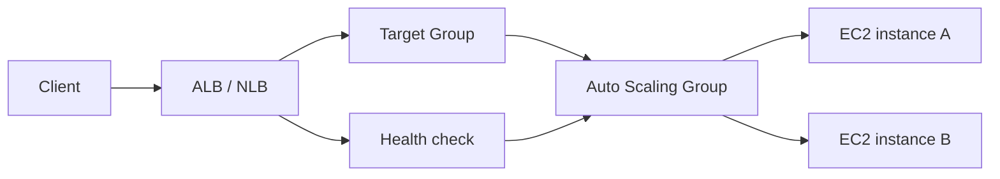

# Day 02 - ELB + Auto Scaling + health checks (Resilience: ELB + Auto Scaling)

## Quick Links

- [오늘의 이야기](#오늘의-이야기)
- [Timeline](#timeline-오늘-학습-타임라인)
- [Flow](#flow-서비스-연결-흐름)
- [Reading](#reading-서비스별-theory)
- [Quiz](#quiz)
- [References](../../references/README.md)

## 오늘의 이야기

운영을 하다 보면 이런 말을 자주 듣습니다. “어제부터 가끔씩 502가 떠요. 근데 서버는 살아있대요.” 이때 중요한 건 “서버가 켜져 있냐”가 아니라 “요청이 정상으로 처리되냐”예요. 그래서 오늘은 **health check**를 기준으로 자가 치유를 설계합니다. 먼저, 트래픽 앞단에서 어디까지 이해하고 라우팅할 건지 정해야 하죠. L7에서 경로/헤더 기반으로 똑똑하게 나누려면 ALB, L4에서 초고성능/특정 프로토콜로 밀어붙이려면 NLB가 자연스럽습니다. “HTTP 경로로 라우팅” 같은 문장이 나오면 ALB 쪽으로, “고정 IP/초고성능/TCP” 같은 신호가 나오면 NLB 쪽으로 생각이 움직여야 해요.

그리고 뒤쪽은 Auto Scaling이 맡습니다. 인스턴스가 죽으면 갈아 끼우고, 트래픽이 늘면 늘리고, 줄면 줄이는 게 핵심이죠. 여기서 함정은 “스케일만 하면 끝”이라고 생각하는 겁니다. 실제로는 **로드밸런서의 health check와 ASG의 건강 상태 판단**이 함께 맞물려야 진짜로 자가 치유가 됩니다. 오늘의 결론은 이렇게 정리하면 쉬워요. **ELB는 ‘분산+건강 확인’, Auto Scaling은 ‘교체+확장’**. 둘이 붙으면, 장애는 ‘발생’하지만 서비스는 ‘유지’됩니다.

또 한 가지, 실무에서 자주 나오는 질문이 “그럼 NLB가 더 빠르니까 무조건 NLB?”입니다. 근데 L7 라우팅(경로/호스트 기반)이나 HTTP 레벨에서의 기능이 필요하면 ALB가 훨씬 자연스럽고, 반대로 TCP/UDP 레벨에서 고정 IP나 초고성능이 요구되면 NLB가 맞습니다. 시험도 이 신호를 그대로 씁니다. “경로 기반 라우팅”이 보이면 ALB, “초고성능 L4/고정 IP”가 보이면 NLB. 그리고 Auto Scaling은 단순히 ‘늘리기’가 아니라, 정상 인스턴스만 트래픽을 받게 하는 health check 흐름까지 포함해서 봐야 오늘 Day가 완성됩니다.

이 흐름을 실제 운영에 대입하면, ELB는 Target Group 단위로 건강을 보고, ASG는 그 결과를 바탕으로 교체/확장을 합니다. 그래서 “헬스 체크 실패 시 자동 교체” 같은 문장이 나오면 ELB/ASG 조합이 강해지고, “특정 경로만 다른 서비스로” 같은 문장이 나오면 ALB 쪽이 힘을 얻습니다. 오늘은 이런 문장들을 빠르게 소거하면서, ‘자가 치유’가 어떻게 만들어지는지 그림으로 정리합니다.

## Timeline (오늘 학습 타임라인)

```mermaid
gantt
  title Learning Timeline
  dateFormat  HH:mm
  axisFormat  %H:%M
  section Day
  워밍업 - 문장 신호 - ALB vs NLB :t1, 00:00, 10m
  Reading :t2, after t1, 110m
  미니 정리 - health check 흐름 :t3, after t2, 30m
  Trap drill - 스케일/치유 혼동 :t4, after t3, 60m
  Quiz :t5, after t4, 30m
```

## Flow (서비스 연결 흐름)

## Reading (서비스별 theory)

- [ALB vs NLB (L7 라우팅 vs L4 성능/프로토콜)](01-alb-vs-nlb.md)
- [Auto Scaling (확장 + 자가 치유)](02-auto-scaling.md)

## Quiz

- [Day 02 Quiz](03-quiz.md)

## Back

- `../README.md`
