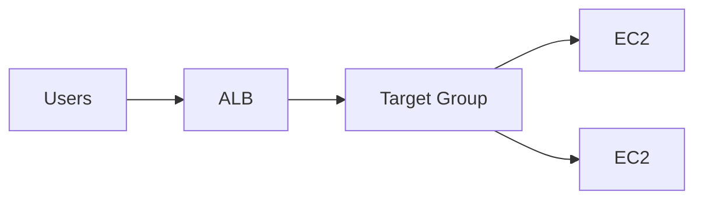

# ALB vs NLB (시험형 구분)

| Topic | ALB | NLB |
|---|---|---|
| Layer | L7 | L4 |
| Routing | host/path 기반 | 주로 포트/프로토콜 |
| Use case | 웹/API, 라우팅 규칙 | TCP/UDP, 고성능, 고정 IP 요구(케이스) |

## Exam must-know (포인트 + Why + 대안)

- Key point: “host/path 라우팅, HTTP 헤더, WAF 연동” 문장이 있으면 ALB가 정답 후보로 올라간다.
- Why: ALB는 L7에서 요청 내용을 해석해 규칙 기반 라우팅을 제공한다.
- Alternative: “정적 IP, TCP/UDP, 매우 높은 처리량”이 요구면 NLB가 자연스럽다.

## TL;DR (한 줄 정리)

- “HTTP 라우팅 규칙”이면 **ALB**, “TCP/UDP/고성능/고정 IP”이면 **NLB**가 신호다.

## Back

- `../01-theory.md`
