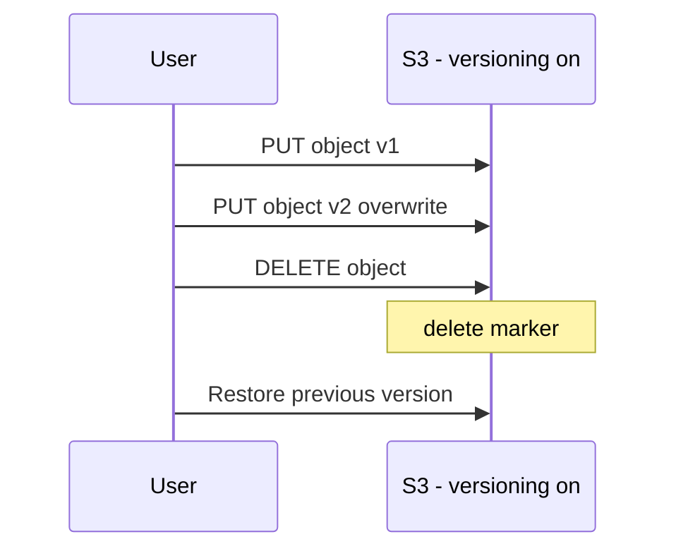

# S3 Versioning (실수 복구의 기본기)

## 소개 (이게 뭔가요?)

- S3 Versioning은 객체의 이전 버전을 보존해서 “삭제/덮어쓰기 실수”를 되돌릴 수 있게 한다.

## 고객 사례 (스토리, 600~1000자)

배치 작업이 오래된 파일을 정리하다가, 필요한 객체까지 같이 삭제했다. 팀은 “S3에 있으니 안전하다”고 생각했지만, 안전은 ‘내구성’이지 ‘실수 복구’가 아니다. 삭제는 너무 쉽고, 한 번 누르면 끝이다. 복구를 위해 백업 ZIP을 찾고, 복원 작업을 하느라 반나절이 날아간다. 요구사항 문장도 똑같다. “accidental deletion/overwrite를 막아야 한다”는 문장이 등장한다.

이때 S3 Versioning은 가장 직접적인 선택지다. delete는 실제 삭제가 아니라 delete marker가 붙는 모델이라, 이전 버전을 되돌릴 수 있다. 물론 더 강한 요구(규제/WORM/변경 불가)가 있으면 Object Lock 같은 옵션으로 넘어가야 하지만, ‘실수 복구’라는 축에서는 Versioning이 기본기다.

운영 관점에서 좋은 점은 “복구가 가능한 상태”를 기본값으로 만든다는 것이다. 사람이 실수할 수 있다는 전제를 깔고, 실수의 비용(복구 시간/데이터 손실)을 줄인다. 그래서 문제 문장에 ‘accidental’ 같은 단어가 보이면, 복제/DR 같은 큰 얘기보다 Versioning부터 떠올리는 게 맞다.

지금 문제는 ‘재해(리전 장애)’인가요, 아니면 ‘실수(삭제/덮어쓰기)’인가요?

## Impact 범위 (어디에 영향을 주나?)

- Reliability: 운영 실수 복구(롤백) 메커니즘
- Operations: 복구 절차를 단순화한다

## Exam Guide (Badges)

Exam guide mapping (details)

- Domain: Domain 2: Design Resilient Architectures
- Task focus: “실수 복구/삭제 복구” 요구에서 Versioning 선택

## Why This Matters (시험/실무에서 걸리는 지점)

- “accidental deletion/overwrite”는 Versioning 신호다.

## Core Concepts

- What it gives you
  - 덮어쓰기/삭제가 발생해도 이전 버전을 되돌릴 수 있음
- 시험형 힌트
  - “accidental deletion/overwrite”가 문장에 있으면 versioning이 정답 후보

## Deep Dive

### Versioning의 “진짜 동작” (시험 포인트)

Versioning은 “백업을 만든다”기보다 **객체의 히스토리를 남기는 스위치**다. 그래서 시험에서 자주 나오는 디테일이 있다.

- **Overwrite(덮어쓰기)**: 기존 객체를 ‘대체’하는 게 아니라 **새 버전이 하나 더 생긴다**.
- **Delete(삭제)**: 실제로 바로 지우지 않고 **delete marker**를 붙여 “최신 버전이 삭제된 것처럼 보이게” 만든다.
- **Suspend(중지)**: 이전 버전이 사라지지 않는다. *Versioning ON/OFF*를 단순 토글로 이해하면 함정에 빠진다.

### 언제 Versioning이 정답이고, 언제 아닌가

| 요구(문장 신호) | 1순위 후보 | 이유 | 같이 따라오는 체크포인트 |
|---|---|---|---|
| “실수로 삭제/덮어쓰기 복구” | **S3 Versioning** | 객체 히스토리 기반 복구 | 이전 버전/마커 정리(비용) |
| “규제/WORM/변경 불가(불변성)” | Object Lock | ‘지울 수 없음’ 자체가 목적 | Governance/Compliance 모드 |
| “다른 리전에 사본도 필요” | Replication(SRR/CRR) | 지리적 분리/DR | **Versioning 전제** |

### 운영 Best Practices

- Versioning을 켜면 “복구 가능성”은 올라가지만, **이전 버전이 계속 쌓여 비용이 늘 수 있다**. 그래서 일반적으로 **Lifecycle**로 오래된 버전을 정리(또는 아카이브)하는 전략을 같이 둔다.
- “삭제를 강하게 통제”해야 하면 **MFA Delete** 같은 추가 통제를 검토하지만, 운영 복잡도가 올라간다는 점(특히 계정/권한 운영)도 같이 고려한다.

### 핵심 정리 (Deep Dive)

- “accidental deletion/overwrite” 신호가 보이면 **Versioning**이 기본 답이다.
- “불변성(지워지면 안 됨)”은 Versioning이 아니라 **Object Lock** 신호다.
- “다른 리전 사본”은 Replication이지만, **Versioning이 전제**로 따라온다.

## Exam must-know (포인트 + Why + 대안)

- Key point: “실수로 삭제/덮어쓰기”를 복구해야 한다면 S3 Versioning이 가장 직접적인 해법이다.
- Why: delete는 실제 삭제가 아니라 delete marker가 붙는 모델이라, 이전 버전을 복구할 수 있다.
- Alternative: 더 강한 요구(감사/승인/장기 보관/immutability)가 있으면 Object Lock/보관 정책까지 같이 검토한다.

## Quick Comparison Table

| Need | Best choice |
|---|---|
| 실수 복구(삭제/덮어쓰기) | S3 Versioning |

## Exam Traps (확장)

- 더 많은 연계/고급 함정: `../../exam-trap-bank.md`
- “실수 복구”인데 versioning 언급이 없는 답안

## Exam Trap Drill (O/X, 1~3분)

- “실수로 객체가 삭제됐다” → 무엇이 1순위?

## TL;DR (한 줄 정리)

- “실수로 삭제/덮어쓰기 복구”는 S3 Versioning이 기본 정답 후보다.

## References

- References index: `../../references/README.md`
- Exam guide (SAA-C03): `../../references/exam-guide.md`
- Glossary: `../../references/glossary.md`
- AWS services list: `../../references/aws-services.md`
- Exam keypoints: `../../exam-keypoints.md`
- Exam trap bank: `../../exam-trap-bank.md`

## Back

- `./README.md`
