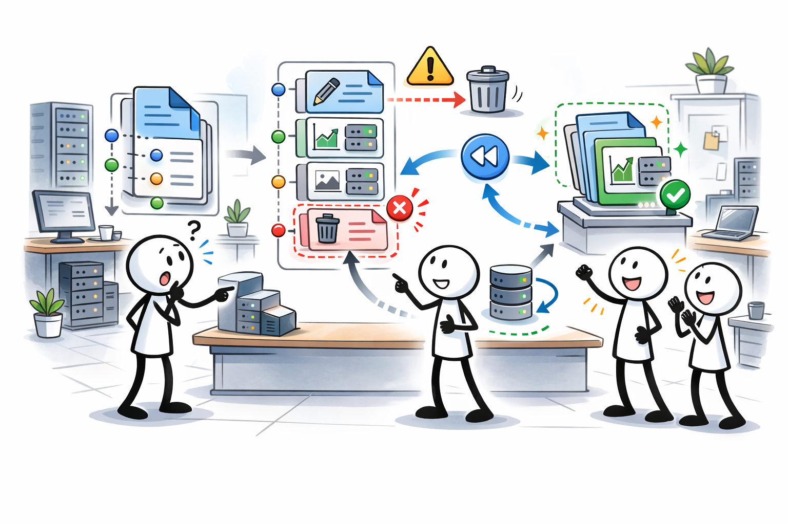
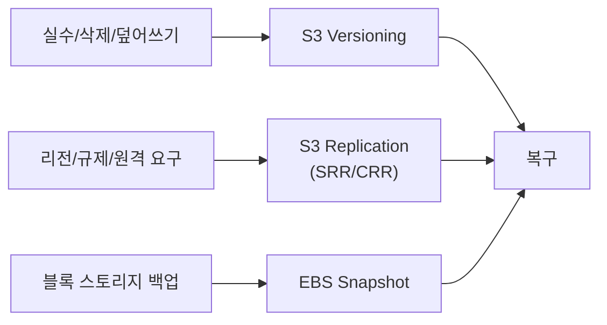

# Day 03 - Storage resilience (Resilience: Storage backup/replication)

## Quick Links

- [오늘의 이야기](#오늘의-이야기)
- [Timeline](#timeline-오늘-학습-타임라인)
- [Flow](#flow-서비스-연결-흐름)
- [Reading](#reading-서비스별-theory)
- [Quiz](#quiz)
- [References](../../references/README.md)

## 오늘의 이야기

실무에서 “데이터 복구”라고 하면 사실 두 가지가 섞여 있습니다. 하나는 사람이 실수로 지운 데이터(실수 복구)이고, 다른 하나는 장애나 재해가 났을 때 살아나는 것(DR)이죠. 오늘은 이 차이를 먼저 잡습니다. S3에서 “덮어쓰기/삭제를 되돌리고 싶다”는 문장이라면 **S3 Versioning**이 먼저 떠야 합니다. 이건 ‘사람 실수’에 강한 기본기예요. 반면 “다른 버킷/다른 리전에도 같은 데이터를 유지해야 한다” 같은 요구가 나오면 이야기가 달라집니다. 그때는 **S3 Replication(SRR/CRR)**로 ‘다른 곳에도 같은 데이터’를 갖게 만들죠. 여기서 자주 나오는 전제 조건(Versioning ON 같은 것)을 놓치면, 시험에서도 실무에서도 설계가 무너집니다.

블록 스토리지 쪽은 또 다릅니다. 서버 디스크(EBS)의 복구는 파일 복사보다 **EBS Snapshot**이 기본 단위가 되죠. “백업/복제/복구”를 한 문장으로 묻는 문제에서는, 결국 어떤 계층의 스토리지를 다루는지(S3냐 EBS냐)부터 갈라야 정답이 빨라집니다. 그리고 공유 파일 시스템(EFS)은 여러 인스턴스가 같이 쓰는 만큼, 복구/가용성의 관점을 다르게 잡아야 하고요. 오늘의 결론은 이렇게입니다. **실수 복구는 Versioning/PITR 같은 ‘롤백 기능’, DR은 Replication/스냅샷 같은 ‘다른 곳에 남기는 설계’**로 나눠서 푼다.

특히 S3 Replication은 “복제 켜면 끝”이 아니라 전제 조건과 운영 포인트가 같이 따라옵니다. 소스/대상 버킷의 설정, 어떤 오브젝트를 대상으로 할지, 그리고 복제 목적(SRR/CRR)이 ‘규제/리전 DR/원격 협업’ 중 어디인지까지 문장으로 잡아야 해요. EBS Snapshot도 마찬가지로, 단순 백업뿐 아니라 복제/복구의 출발점이 되기 때문에, “장애 시 빠르게 복원” 같은 문장이 나오면 스냅샷 기반 복구가 자연스럽게 떠올라야 합니다. 오늘 Day는 S3와 EBS를 같이 놓고, 데이터가 ‘어디에’ 있고 ‘어떤 방식으로’ 되돌릴지까지 연결해보는 시간입니다.

## Timeline (오늘 학습 타임라인)

```mermaid
gantt
  title Learning Timeline
  dateFormat  HH:mm
  axisFormat  %H:%M
  section Day
  워밍업 - 실수 복구 vs DR :t1, 00:00, 10m
  Reading :t2, after t1, 120m
  미니 정리 - 전제조건 체크 :t3, after t2, 30m
  Trap drill - Versioning/Replication 혼동 :t4, after t3, 50m
  Quiz :t5, after t4, 30m
```

## Flow (서비스 연결 흐름)

## Reading (서비스별 theory)

- [S3 Versioning (실수 복구의 기본기)](01-s3-versioning.md)
- [S3 Replication (SRR/CRR: 다른 곳에도 같은 데이터)](02-s3-replication.md)
- [EBS Snapshot (블록 스토리지 백업의 기본 단위)](03-ebs-snapshot.md)

## Quiz

- [Day 03 Quiz](04-quiz.md)

## Back

- `../README.md`
