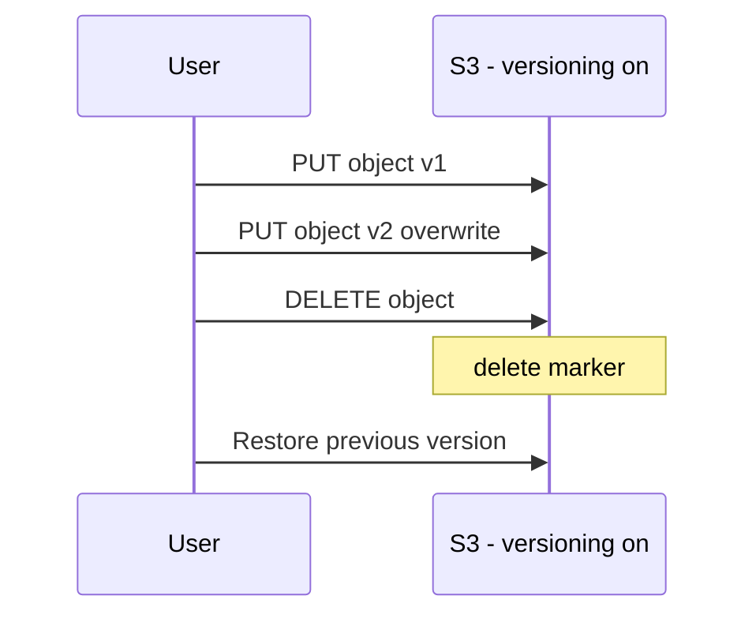

# S3 Versioning: “실수 복구”의 기본기

- What it gives you
  - 덮어쓰기/삭제가 발생해도 이전 버전을 되돌릴 수 있음
- 시험형 힌트
  - “accidental deletion/overwrite”가 문장에 있으면 versioning이 정답 후보

## Exam must-know (포인트 + Why + 대안)

- Key point: “실수로 삭제/덮어쓰기”를 복구해야 한다면 S3 Versioning이 가장 직접적인 해법이다.
- Why: delete는 실제 삭제가 아니라 delete marker가 붙는 모델이라, 이전 버전을 복구할 수 있다.
- Alternative: 더 강한 요구(감사/승인/장기 보관/immutability)가 있으면 Object Lock/보관 정책까지 같이 검토한다(문장에 WORM/규제 힌트가 있으면 신호).

## TL;DR (한 줄 정리)

- “실수로 삭제/덮어쓰기 복구”는 S3 Versioning이 기본 정답 후보다.

## Back

- `../01-theory.md`
