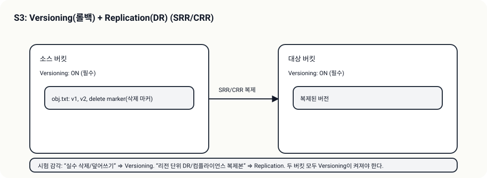

# S3 Replication (SRR/CRR: 다른 곳에도 같은 데이터)

## 소개 (이게 뭔가요?)

- Replication은 “데이터를 다른 버킷/리전에도 자동으로 복제”해서 DR/규제 요구를 만족시키는 기능이다.

## 고객 사례 (스토리, 600~1000자)

새 고객이 요구했다. “데이터는 다른 리전에도 복제돼야 합니다. 리전 장애가 나도 서비스는 계속돼야 해요.” 팀은 백업은 하고 있었지만, 백업은 ‘복구’를 전제로 한다. 복제는 ‘항상 다른 곳에도 존재’하게 만든다. 그래서 RTO를 줄이고, 규제 요구(지리적 분리)를 만족시킬 수 있다.

여기서 함정이 있다. 복제는 전제 조건이 있다. 소스와 대상 버킷 모두 Versioning이 켜져 있어야 한다. 시험은 versioning을 언급하지 않고 “복제를 설정했다”는 선택지를 내서 낚는다. 그리고 요구가 단순히 “백업” 수준이라면, 복제는 과할 수 있다. 비용과 복잡도가 올라가기 때문이다. 결국 “다른 곳에도 있어야 한다(리전 DR/규제)” 신호가 있으면 replication, 그렇지 않으면 backup/restore가 더 자연스럽다.

또 하나의 감각은 “복제 = 항상 동기화”가 아니라는 점이다. 대부분 비동기 모델이라 지연이 생길 수 있고, 그 지연을 RPO 관점에서 받아들일 수 있는지까지가 설계다. 즉, 복제는 ‘켜면 끝’이 아니라, “어떤 장애를 대비하는지”를 먼저 정의해야 한다.

지금 문장에는 “리전 장애 대비/원격 복제”가 들어 있나요, 아니면 “백업”만 있나요?

## Impact 범위 (어디에 영향을 주나?)

- Reliability: 리전 장애/원격 복제 요구 대응
- Cost: 복제는 저장/전송 비용 구조가 달라진다

## Exam Guide (Badges)

Exam guide mapping (details)

- Domain: Domain 2: Design Resilient Architectures
- Task focus: “원격 복제/리전 DR/규제” 요구에서 SRR/CRR 선택

## Why This Matters (시험/실무에서 걸리는 지점)

- “복제” 문제는 거의 항상 Versioning 전제 조건이 같이 나온다.

## VAKOG Anchors

- V(Visual): 복제 전제 조건(versioning)을 한 줄로 외운다.
- A(Auditory): “CRR/SRR은 versioning이 필수”를 말로 고정한다.
- O(Olfactory, smell test): 복제인데 versioning 언급 없는 답은 냄새가 난다.
- G(Gustatory, taste test): 문장 하나 보고 replication vs backup을 고른다.

## Core Concepts

- Preconditions(핵심)
  - 소스/대상 버킷 모두 versioning이 켜져 있어야 한다.
- When to use
  - DR/규제/리전 장애 대비/근접 복제 요구
- Traps
  - versioning을 안 켠 채 복제를 “설정했다”는 선택지

## Deep Dive

## Exam must-know (포인트 + Why + 대안)

- Key point: “리전 장애 대비/규제 준수/원격 복제” 문장이 있으면 CRR/SRR이 정답 후보가 된다.
- Why: 복제는 ‘데이터가 다른 곳에도 존재’해야 의미가 있으며, 버전 기반 복제가 전제라 versioning이 필수다.
- Alternative: 단순 백업 요구면(복제까지는 불필요) Backup/Restore 전략이 더 비용 효율적일 수 있다.

## Quick Comparison Table

| Need | Best choice |
|---|---|
| 원격 복제/리전 DR/규제 | SRR/CRR |
| 단순 백업 | snapshot/backup |

## Exam Traps (5-8)

- 복제를 원하는데 versioning을 언급하지 않는 답안

## Taste Test (1~3분)

- “다른 리전에 복제, 규제 준수” → 무엇이 필수 전제?

## TL;DR (한 줄 정리)

- “원격 복제/DR/규제” 신호가 있으면 SRR/CRR(+ Versioning 전제)부터 본다.

## Back

- `../01-theory.md`
