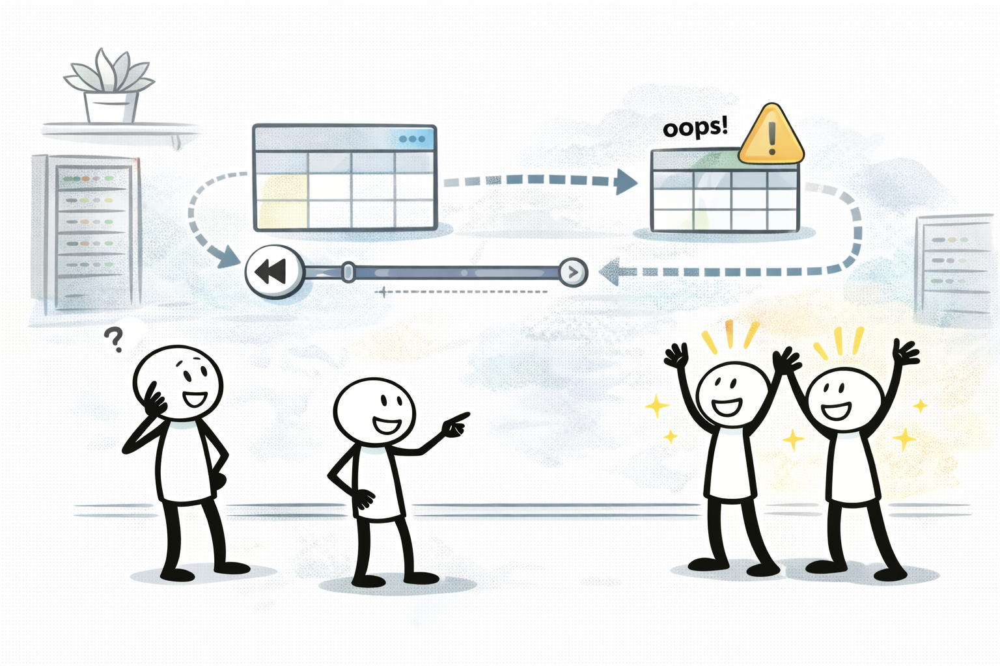

# DynamoDB Resilience + PITR (실수 롤백)

## 소개 (이게 뭔가요?)

- DynamoDB는 관리형 NoSQL로 AZ 내구가 기본 전제라는 문장이 자주 나온다.
- “실수로 잘못 업데이트/삭제” 같은 롤백 요구는 PITR이 신호다.

## 고객 사례 (스토리, 600~1000자)

운영 중에 배치가 잘못 돌았다. 특정 파티션 키의 값이 전부 덮어써졌다. 장애는 아니지만 데이터가 망가졌다. 팀은 “몇 시간 전 상태로만 되돌릴 수 있으면 된다”고 한다. 이건 리전 DR이 아니라 ‘실수 복구’다. RDS라면 백업 복원이나 PITR을 떠올릴 수 있는데, DynamoDB에서도 비슷한 요구가 나온다.

이때 DynamoDB PITR(Point-in-time recovery)이 자연스럽다. 특정 시점으로 복구할 수 있는 롤백 메커니즘이라 “운영 실수” 유형에 직접 대응한다. 시험도 “실수로 업데이트/삭제” 같은 문장을 넣어 PITR을 고르게 만든다. 반대로 규제/장기 보관/감사가 핵심이면 백업 보관 정책이나 S3 아카이브 같은 더 큰 설계를 함께 요구할 수 있다. 결국 DynamoDB 문제도 “무슨 종류의 복구인가(실수 vs 재해)”를 먼저 분리하면 정답이 보인다.

그리고 실무적으로는 “복구를 얼마나 자주 해야 하느냐”도 중요하다. 한 번의 실수로 끝나는 사고도 있지만, 반복되는 운영 작업에서 같은 유형의 실수가 다시 발생할 수 있다. 그래서 PITR 같은 ‘기능 스위치’가 있는 서비스는, 요구사항이 맞는 순간 설계가 훨씬 단순해진다.

지금 요구는 “리전 DR”인가요, “실수 롤백”인가요?

## Impact 범위 (어디에 영향을 주나?)

- Reliability: 실수 롤백(시점 복구) 요구 대응
- Operations: 복구 절차/근거를 단순화

## Exam Guide (Badges)

## Why This Matters (시험/실무에서 걸리는 지점)

- “실수 복구/롤백” 문장이 보이면 PITR이 바로 후보로 올라간다.

## Core Concepts

- 관리형 서비스로 AZ 내구가 기본 전제(시험 문장에 자주 등장)
- 백업/복구 관점 옵션
  - On-demand backup(수동)
  - PITR(Point-in-time recovery): 시점 복구(요구사항에 “실수 복구/롤백”이 있으면 힌트)

## Deep Dive

### “내구/가용성” vs “실수 복구”를 먼저 분리하기

DynamoDB는 관리형 서비스라 “AZ 내구가 기본”이라는 문장이 자주 붙지만, 시험에서 진짜로 묻는 건 보통 아래 둘 중 하나다.

- **실수 복구(운영 실수)**: 잘못된 배치/코드로 `삭제/덮어쓰기`가 발생했다 → *시점 복구(롤백)*가 필요하다.
- **재해/리전 문제(DR)**: 리전 장애에도 서비스/데이터가 필요하다 → *다중 리전 전략*이 필요하다.

이 둘을 섞으면 “복제/DR”을 고르는 오답으로 빠지는 경우가 많다.

### PITR vs On-demand Backup: 언제 무엇을 쓰나

| 요구(문장 신호) | 1순위 후보 | 포인트 |
|---|---|---|
| “몇 시간 전으로만 되돌리면 된다”, “실수로 망가졌다” | **PITR** | 운영 실수 롤백에 직결 |
| “특정 시점 스냅샷을 남겨두고 싶다”, “배포 전 백업” | On-demand Backup | 스냅샷 기반(운영 프로세스) |

### 운영 Best Practices (시험에도 자주 등장)

- 실수 복구는 “기능을 켜는 것”으로 끝나지 않는다. 복구 절차(복구 지점 선택, 테이블 복원 후 스위치)까지 **운영 루틴**으로 만들어야 한다.
- “특정 키만 느리고 스로틀링” 같은 신호가 보이면, 복구(PITR) 문제가 아니라 **핫 파티션/용량/키 설계** 문제일 수 있다(이때는 키 분산, 지수 백오프, 캐시(DAX/ElastiCache) 같은 축으로 푼다).

### 핵심 정리 (Deep Dive)

- “실수로 잘못 업데이트/삭제” → DynamoDB는 **PITR**이 가장 직접적이다.
- “리전 DR/글로벌” → PITR이 아니라 **다중 리전(예: Global Tables) 축**을 떠올린다.

## Exam must-know (포인트 + Why + 대안)

- Key point: “실수로 데이터가 잘못 업데이트/삭제” 힌트가 있으면 DynamoDB PITR이 정답 후보로 올라간다.
- Why: PITR은 특정 시점으로 복구할 수 있는 롤백 메커니즘이며 ‘운영 실수’ 유형에 직접 대응한다.
- Alternative: “규제/장기 보관/감사” 요구가 핵심이면 백업 보관 정책/아카이브(S3 등)까지 포함한 설계를 선택한다.

## TL;DR (한 줄 정리)

- “실수 복구/롤백” 신호가 있으면 DynamoDB는 **PITR**이 정답 후보로 올라간다.

## References

- References index: `../../references/README.md`
- Exam guide (SAA-C03): `../../references/exam-guide.md`
- Glossary: `../../references/glossary.md`
- AWS services list: `../../references/aws-services.md`
- Exam keypoints: `../../exam-keypoints.md`
- Exam trap bank: `../../exam-trap-bank.md`

## Back

- `./README.md`
