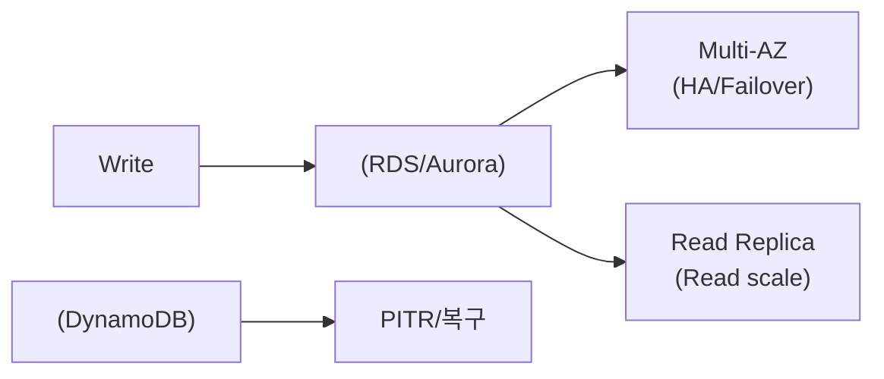

# Day 04 - Database resilience (Resilience: Database)

## Quick Links

- [오늘의 이야기](#오늘의-이야기)
- [Timeline](#timeline-오늘-학습-타임라인)
- [Flow](#flow-서비스-연결-흐름)
- [Reading](#reading-서비스별-theory)
- [Quiz](#quiz)
- [References](../../references/README.md)

## 오늘의 이야기

DB 관련 장애 공지를 보면 표현이 비슷해서 더 헷갈립니다. “장애가 나도 계속 쓰고 싶다”, “읽기가 느리다”, “실수로 지웠다”. 그런데 정답은 표현이 아니라 **의도(HA/확장/복구)**를 분리하면 바로 보이기 시작해요. RDS/Aurora에서 “장애가 나도 자동으로 넘어가야 한다”는 신호는 **Multi-AZ** 쪽입니다. 반대로 “읽기가 많아서 읽기 성능을 늘리고 싶다”는 문장은 **Read Replica**가 더 자연스럽죠. 둘 다 ‘여러 개’처럼 보이지만, 하나는 가용성(HA)이고 하나는 읽기 확장이라는 축이 다릅니다.

NoSQL 쪽도 마찬가지예요. DynamoDB에서 “실수로 데이터가 삭제/수정됐다”는 요구는 결국 롤백 능력으로 귀결되고, 그래서 **PITR 같은 복구 옵션**이 중요해집니다. 오늘은 그래서 “문장 하나”를 보면 먼저 질문을 던집니다. 지금 필요한 건 장애 조치인가(Multi-AZ), 읽기 확장인가(Read Replica), 아니면 시간 되돌리기인가(PITR)라고요. 이 기준이 서면, DB 문제는 ‘서비스 이름 암기’가 아니라 ‘요구를 축으로 번역’하는 문제가 됩니다. 실무에서도 회의에서 “그래서 HA야, 스케일이야?” 한 마디로 정리가 되거든요.

여기서 한 번 더 들어가면, “멀티 AZ니까 읽기도 빨라지겠지” 같은 착시가 진짜 자주 나옵니다. Multi-AZ는 가용성을 위한 복제/장애 조치이고, 읽기 성능을 키우려면 Read Replica(또는 Aurora의 읽기 확장 패턴) 같은 축으로 생각해야 합니다. DynamoDB도 “리전 DR”과 “실수 복구”가 섞여 나오면 더 헷갈리는데, 오늘은 우선 PITR처럼 ‘되돌리기’ 신호를 정확히 잡는 데 집중합니다. 결국 DB 문제는 대부분 문장을 세 토막으로 자르면 빨라집니다. “장애에도 계속?”(HA) / “읽기가 많아?”(읽기 확장) / “되돌리고 싶어?”(복구).

실무에서는 이걸 SLA로 번역합니다. “몇 분 안에 자동 복구”면 Multi-AZ 쪽, “읽기 트래픽이 쏠린다”면 읽기 확장 쪽, “실수로 지운 걸 되돌려야 한다”면 PITR/백업 쪽으로요. 오늘 Day는 그 번역을 반복해서, 문제 문장이 길어져도 핵심 신호만 남기고 정답을 고를 수 있게 만드는 데 초점을 둡니다.

## Timeline (오늘 학습 타임라인)

```mermaid
gantt
  title Learning Timeline
  dateFormat  HH:mm
  axisFormat  %H:%M
  section Day
  워밍업 - HA vs 확장 vs 복구 :t1, 00:00, 10m
  Reading :t2, after t1, 110m
  미니 정리 - Multi-AZ/Replica :t3, after t2, 30m
  Trap drill - 축 혼동 :t4, after t3, 60m
  Quiz :t5, after t4, 30m
```

## Flow (서비스 연결 흐름)

## Reading (서비스별 theory)

- [RDS/Aurora: Multi-AZ vs Read Replica](01-rds-aurora-multi-az-vs-rr.md)
- [DynamoDB Resilience + PITR (실수 롤백)](02-dynamodb-resilience.md)

## Quiz

- [Day 04 Quiz](03-quiz.md)

## Back

- `../README.md`
