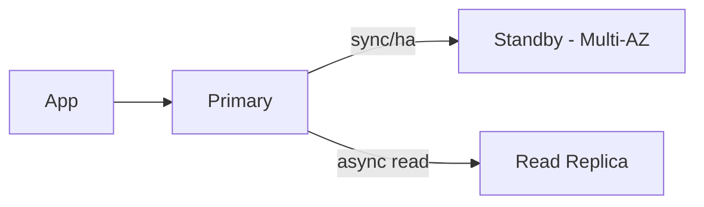

# RDS/Aurora: Multi-AZ vs Read Replica

## 소개 (이게 뭔가요?)

- DB 문제는 “가용성(자동 장애 조치)”과 “읽기 확장”을 분리해서 고른다.

## 고객 사례 (스토리, 600~1000자)

DB가 느려지자 팀은 “읽기를 늘리자”고 했다. 그런데 장애가 한 번 나고 나서 운영팀은 “자동으로 넘어가야 한다”고 요구한다. 둘 다 중요하지만, 같은 기능으로 해결하려 하면 오답이 된다. Read replica는 읽기 성능을 늘리는 도구이지, 자동 장애 조치(HA)의 standby가 아니다. 반대로 Multi-AZ는 자동 failover가 목적이지, 읽기 확장 도구가 아니다.

시험도 이 혼동을 노린다. 문장에 “failover”, “자동 장애 조치”, “가용성”이 있으면 Multi-AZ가 신호다. “read-heavy”, “읽기 성능”, “읽기 트래픽”이 핵심이면 Read replica가 신호다. 결국 먼저 질문해야 한다. “지금 복구해야 하는 건 속도인가, 연속성인가?”

여기서 한 번 더: Read replica는 복제 지연(lag)이 생길 수 있고, 보통 자동 엔드포인트 전환을 ‘HA’처럼 제공하지 않는다. 그래서 “몇 분 다운도 안 된다” 같은 문장에서는 replica 추가만으로는 정답이 되기 어렵다. 반대로 “읽기만 느리다”에서 Multi-AZ만 붙이는 답도 과할 수 있다. 이 미묘한 차이를 요구사항 문장으로 구분하는 게 SAA 포인트다.

지금 요구는 “읽기 성능”인가요, 아니면 “장애 시 자동 전환”인가요?

## Impact 범위 (어디에 영향을 주나?)

- Reliability: Multi-AZ(자동 failover)
- Performance: Read replica(읽기 분산)

## Exam Guide (Badges)

## Why This Matters (시험/실무에서 걸리는 지점)

- “Read replica로 HA”는 대표 함정이다.

## VAKOG Anchors

- V(Visual): 아래 표 1장으로 목적을 고정한다.
- A(Auditory): “Multi-AZ=failover, RR=read scaling”을 말로 고정한다.
- O(Olfactory, smell test): failover 요구인데 RR만 고르는 답은 냄새가 난다.
- G(Gustatory, taste test): 문장 하나 보고 둘 중 하나를 고른다.

## Core Concepts

| Goal | Best feature | Why | Common trap |
|---|---|---|---|
| HA/자동 장애 조치 | Multi-AZ | failover 중심 | Read replica로 HA 해결하려 함 |
| 읽기 확장 | Read replica | read scaling | Multi-AZ가 읽기 확장이라고 착각 |

## Deep Dive

## Exam must-know (포인트 + Why + 대안)

- Key point: Read replica는 “읽기 확장”이고, HA의 standby로 착각하면 오답으로 빠진다.
- Why: 복제는 보통 비동기이며(지연 가능), 자동 failover/엔드포인트 전환은 Multi-AZ의 역할이다.
- Alternative: “글로벌 읽기/리전 DR” 요구가 강하면 Aurora Global Database 같은 다중 리전 옵션을 함께 검토한다.

## TL;DR (한 줄 정리)

- “failover”면 **Multi-AZ**, “read-heavy”면 **Read replica**다.

## Back

- `../01-theory.md`
