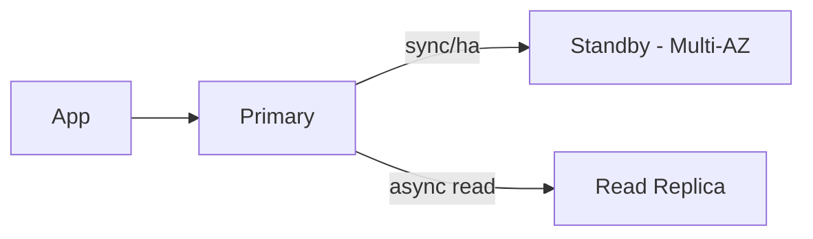

# RDS/Aurora: Multi-AZ vs Read Replica (시험 단골)

| Goal | Best feature | Why | Common trap |
|---|---|---|---|
| HA/자동 장애 조치 | Multi-AZ | failover 중심 | Read replica로 HA 해결하려 함 |
| 읽기 확장 | Read replica | read scaling | Multi-AZ가 읽기 확장이라고 착각 |

## Exam must-know (포인트 + Why + 대안)

- Key point: Read replica는 “읽기 확장”이고, HA의 standby로 착각하면 오답으로 빠진다.
- Why: 복제는 보통 비동기이며(지연 가능), 자동 failover/엔드포인트 전환은 Multi-AZ의 역할이다.
- Alternative: “글로벌 읽기/리전 DR” 요구가 강하면 Aurora Global Database 같은 다중 리전 옵션(요구사항/비용)을 함께 검토한다.

## TL;DR (한 줄 정리)

- “failover”면 **Multi-AZ**, “read-heavy”면 **Read replica**다.

## Back

- `../01-theory.md`
