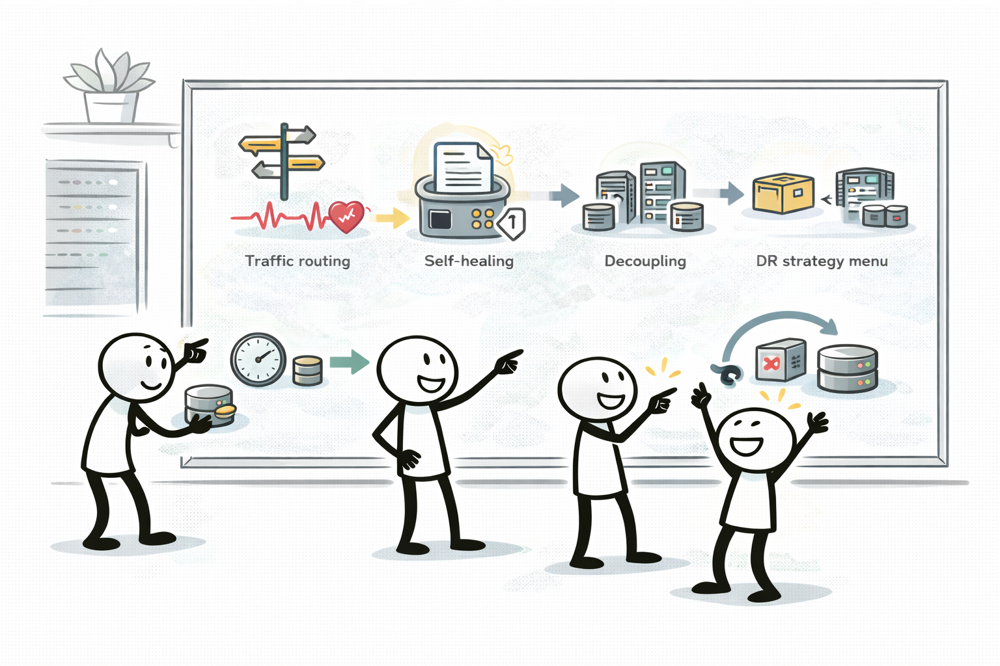
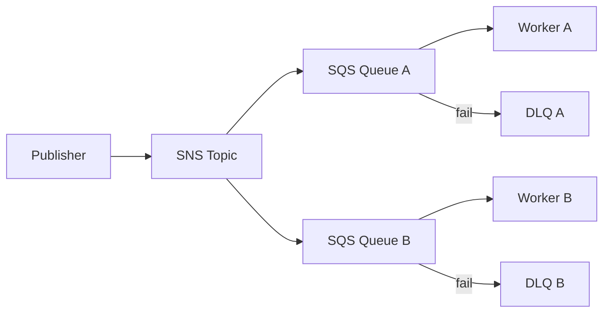

# Special Lecture + Week Summary (Domain 2)

## 소개 (이게 뭔가요?)

- Week 2(Domain 2)에서 자주 섞이는 “복원력 패턴”을 선택 기준/함정/대안으로 한 번에 회수한다.
- RPO/RTO, 라우팅/로드밸런싱, 디커플링(메시징), DB/스토리지 복구를 시험형 문장으로 연결한다.

## 고객 사례 (스토리)

주문 처리 시스템이 자주 불안정했다. 주문은 들어오는데 결제 API가 간헐적으로 실패하고, 실패를 재시도하다가 중복 주문이 생겼다. 트래픽이 몰리는 날엔 웹 서버를 더 늘려도 “뒤에 있는 의존성”이 버티지 못해 전체가 흔들린다. 팀은 “장애가 나도 주문은 잃지 말아야 하고, 복구 후에도 일관성이 있어야 한다”고 한다. 동시에 경영진은 “다음 분기엔 리전 장애 시나리오도 준비하라(RPO/RTO)”고 요구한다.

즉, 시스템이 “실패해도 다시 처리될 수 있는가”를 증명해야 했다. 여기서 큐/재시도/DLQ 같은 운영 규칙이 설계의 일부가 된다.

이때 핵심은 한 서비스가 아니라 조합이다. 앞단은 Route 53/ELB로 헬스체크 기반 분산과 전환을 만들고, 처리 단계는 SQS로 버퍼링해서 스파이크를 흡수한다(재시도/백오프/DLQ까지 포함). 이벤트 알림(팬아웃)이 목적이면 SNS, 규칙 기반 라우팅/통합이면 EventBridge가 더 자연스럽다. 데이터 계층은 Multi-AZ로 자동 failover를 확보하고, “실수 복구”는 S3 versioning이나 DynamoDB PITR처럼 롤백 기능을 붙인다. 즉, 복원력은 ‘기능’이 아니라 “실패를 가정한 흐름”을 설계하는 작업이다.

지금 시스템에서 가장 먼저 ‘버퍼(큐)’가 필요한 구간은 어디일까요?

## Impact 범위 (어디에 영향을 주나?)

- Reliability: 장애/스파이크/의존성 실패를 흡수하는 전체 설계
- Operations: 재시도/백오프/DLQ 같은 운영 규칙이 품질을 좌우
- Cost: Active/Active, 과도한 복제/중복 구성은 비용을 크게 올린다

## Exam Guide (Badges)

Exam guide mapping (details)

- Domain: Domain 2: Design Resilient Architectures
- Task focus:
  - 2.1 Design scalable and loosely coupled architectures
  - 2.2 Design highly available and/or fault-tolerant architectures

## Week 2 Decision Rules

- “스파이크/부하 변동”은 ASG/큐/서버리스로 흡수한다.
- “느슨한 결합”은 메시징(SQS/SNS/EventBridge) + idempotency + 재시도/백오프가 같이 나온다.
- DB는 “가용성”과 “읽기 확장”을 분리해서 생각한다.

## Core Concepts

- Domain 2는 “복원력(Resilience)”을 요구사항(RPO/RTO, failover, spike)과 메커니즘(분산/헬스체크/재시도)으로 매칭하는 도메인이다.

## Confusing Similar Cases

| Scenario | Best choice | Why | Common wrong choice | Why it's wrong |
|---|---|---|---|---|
| 내구 큐/재시도 | SQS | pull 기반, DLQ, 가시성 | SNS | push/팬아웃, 버퍼링 목적 아님 |
| 이벤트 버스/라우팅 | EventBridge | 규칙 기반 라우팅/통합 | SQS | 라우팅/필터링 제한 |
| L7 기능 필요 | ALB | host/path 라우팅 | NLB | L4 중심 |
| DB HA | RDS Multi-AZ | 자동 failover | Read replica | 주로 읽기 확장/비동기 |

## Exam-Heavy Patterns

### Pattern: Fan-out + DLQ + retry

- 메시지 중복은 정상(적어도 한 번 전달). 처리측에서 idempotency로 방어.
- DLQ는 장애 격리와 재처리 경로를 만든다.

### Pattern: RPO/RTO 기반 DR 선택

- Backup/Restore: 비용 낮음, RTO 큼
- Pilot light: 핵심만 상시, 나머지 복구
- Warm standby: 축소된 운영 환경 유지
- Multi-site active/active: 비용 큼, RTO 작음

## Exam must-know (요약)

- Key point: “스파이크/느슨한 결합/자가 치유/DR(RPO/RTO)” 키워드는 Domain 2 대표 신호다.
- Why: Domain 2는 장애를 전제로 설계를 선택하는 도메인이며, 요구사항 문장에 있는 신호를 “메커니즘(ASG, queue, DR 전략)”으로 매칭하는지를 본다.
- Alternative: “성능”이 주 요구면(Domain 3) 캐시/엣지/데이터 계층 최적화로 넘어가고, “비용”이 주 요구면(Domain 4) 티어링/구매 옵션/전송 비용으로 넘어간다.

## Reference Pack

- `aws-saa/special-lectures/domain02-resilient-top-services.md`

## TL;DR (한 줄 정리)

- Domain 2는 **라우팅/헬스체크 + 자가 치유(ASG) + 디커플링(메시징) + DR(RPO/RTO)**를 요구 신호에 맞춰 조합하는 도메인이다.

## References

- References index: `../../references/README.md`
- Exam guide (SAA-C03): `../../references/exam-guide.md`
- Glossary: `../../references/glossary.md`
- AWS services list: `../../references/aws-services.md`
- Exam keypoints: `../../exam-keypoints.md`
- Exam trap bank: `../../exam-trap-bank.md`
