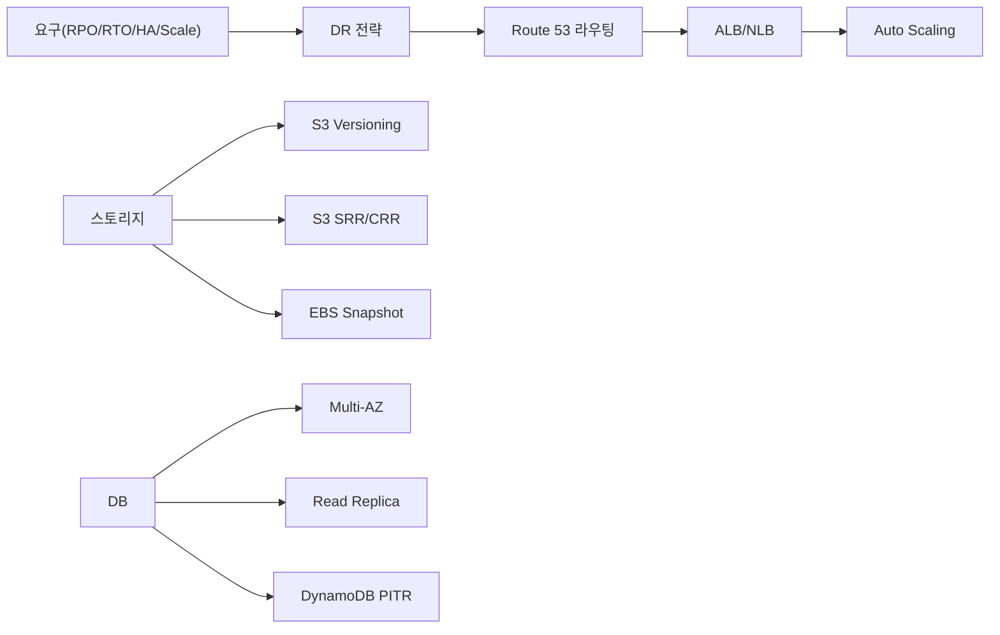

# Day 05 - Special Lecture + Week Summary (Domain 2)

## Quick Links

- [오늘의 이야기](#오늘의-이야기)
- [Timeline](#timeline-오늘-학습-타임라인)
- [Flow](#flow-서비스-연결-흐름)
- [Reading](#reading)
- [Quiz](#quiz)
- [References](../../references/README.md)

## 오늘의 이야기

이번 주(Domain 2)는 한 문장으로 말하면 “장애가 나도 설계대로 버티는 법”이었습니다. 그런데 정리하는 날이 되면 서비스 이름만 잔뜩 떠오르고, 정작 케이스에서 뭘 고를지 흐려질 때가 있어요. 그래서 오늘은 Top 서비스들을 ‘기능’이 아니라 **신호(요구 문장)**로 다시 묶습니다. DR에서는 RPO/RTO가 먼저고, 그 다음이 Route 53 라우팅입니다. 트래픽 앞단에서는 ALB/NLB가 “어디까지 라우팅을 이해하나”를 결정하고, Auto Scaling은 “죽으면 갈아 끼우고, 늘면 늘린다”를 책임집니다. 스토리지에서는 S3 Versioning이 실수 복구를, SRR/CRR이 원격/규제/리전 DR을, EBS Snapshot이 블록 스토리지의 기본 백업을 담당하죠. DB는 Multi-AZ(HA)와 Read Replica(읽기 확장)를 섞지 않는 게 핵심이고, DynamoDB는 PITR처럼 ‘되돌리기’ 요구를 바로 잡아야 합니다.

오늘 목표는 암기 대신, 문제를 보면 “이건 Failover야, 이건 Weighted야”처럼 즉시 소거되는 상태로 만드는 거예요. 정답은 보통 “서비스 하나”가 아니라 “조합”으로 나오니까요. Route 53 + 헬스체크 + ELB/ASG, Replication + Versioning, Multi-AZ + 백업 같은 식으로요. 이 흐름이 말로 설명되면, Domain 2는 훨씬 단단해집니다.

오늘은 그래서 pack을 읽을 때도 “서비스별 노트”가 아니라 “상황별 선택”으로 봅니다. 예를 들어 “장애 시 자동 전환”이면 Route 53 Failover와 헬스 체크를 떠올리고, “피크에만 늘었다 줄었다”면 ELB + Auto Scaling의 자가 치유 흐름을 떠올립니다. “원격/규제”면 S3 CRR을, “실수 복구”면 Versioning을, “블록 스토리지 백업”이면 EBS Snapshot을, “DB 고가용성”이면 Multi-AZ를 잡는 식이죠. 결국 Domain 2는 ‘정답 후보를 고르는 기준’을 몸에 붙이는 주차이고, 오늘은 그 기준을 회수하는 날입니다.

## Timeline (오늘 학습 타임라인)

```mermaid
gantt
  title Learning Timeline
  dateFormat  HH:mm
  axisFormat  %H:%M
  section Day
  워밍업 - 이번 주 신호 10개 :t1, 00:00, 15m
  Special lecture pack :t2, after t1, 180m
  케이스 워크스루 :t3, after t2, 30m
  Quiz :t4, after t3, 15m
```

## Flow (서비스 연결 흐름)

## Reading

- Pack: `aws-saa/special-lectures/domain02-resilient-top-services.md`

## Quiz

- [Day 05 Quiz](02-quiz.md)

## Back

- `../README.md`
