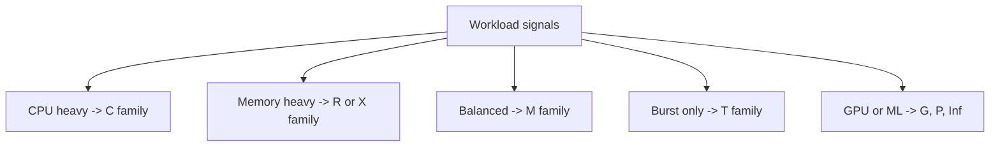
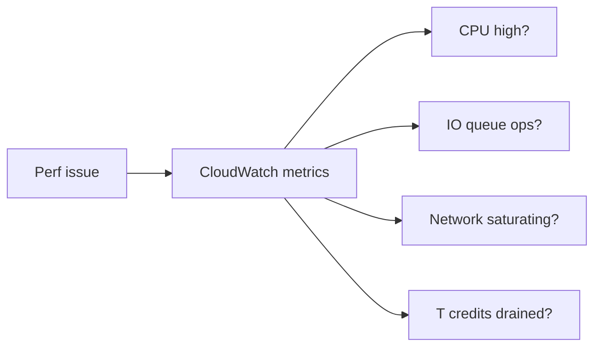

# Theory

## Exam Guide Mapping

- Domain: Domain 3: Design High-Performing Architectures
- Task focus:
  - 3.2 Design high-performing and elastic compute solutions

## Core Concepts

- 성능 요구를 “숫자”로 바꾸는 습관
  - Latency: p95/p99가 중요(평균만 보면 함정)
  - Throughput: req/s, MB/s, IOPS
  - Concurrency: 동시 사용자/동시 실행(예: Lambda concurrency)
  - Predictability: 변동/스파이크에 대한 안정성
- 병목은 4가지 중 하나로 수렴하는 경우가 많다
  - CPU
  - Memory
  - Network
  - Storage I/O

## Deep Dive

### EC2 Instance Family Selection (시험형 프레임)

- Compute optimized(C): CPU 중심(지속 고CPU)
- Memory optimized(R/X): 메모리/인메모리 캐시/DB
- General purpose(M/T): 균형형
- Accelerated(G/Inf/P): GPU/ML/그래픽(문장에 명확한 신호가 있으면)

#### Exam must-know (포인트 + Why + 대안)

- Key point: 요구사항 신호(지속 CPU, 메모리 캐시/인메모리, GPU, burst)를 “패밀리 선택”으로 매핑하는 문제가 자주 나온다.
- Why: 성능/비용은 인스턴스 자원 비율과 네트워크/EBS 대역폭에도 묶여 있어, 무작정 큰 인스턴스를 고르는 답은 함정이 될 수 있다.
- Alternative: “동시성/수평 확장” 요구가 강하면 더 큰 1대가 아니라 ASG/분산 처리로 푸는 답이 더 안전하다.

### Burstable(T) 계열: 크레딧 함정

- 장점
  - 평소엔 낮은 비용, 순간 burst에 강함
- 오답 신호(시험에서 중요)
  - “지속적으로 높은 CPU 사용”이 요구
  - “일관된 성능”이 요구(예측 가능성)
- 힌트 문장
  - “CPU credit이 소진된다”, “성능이 갑자기 떨어진다” 같은 서술

#### Exam must-know (포인트 + Why + 대안)

- Key point: “지속 고CPU/일관된 성능” 신호가 있으면 T 계열은 오답 후보가 된다.
- Why: T는 크레딧 모델이라 장시간 고부하에서 크레딧이 소진되면 스로틀링으로 성능이 떨어질 수 있다(예측 가능성 저하).
- Alternative: 지속 워크로드면 C/M 계열로 옮기거나, 캐시/DB/스토리지 병목을 먼저 제거한다.

### CloudWatch로 1차 진단하기

- CPUUtilization만 보지 말고 “추가 지표”를 같이 고려한다
  - T 계열: CPUCreditBalance and CPUCreditUsage
  - EBS: VolumeReadOps/WriteOps/QueueLength
  - Network: NetworkIn/Out

## Exam Traps

- “성능 문제 = 무조건 더 큰 인스턴스”로 답하는 선택지(병목이 스토리지/DB/네트워크일 수 있음)
- burstable을 “지속 워크로드”에 쓰는 선택지(크레딧 함정)
- 단일 지표만 보고 결론 내리게 유도(보조 지표가 힌트로 등장)
