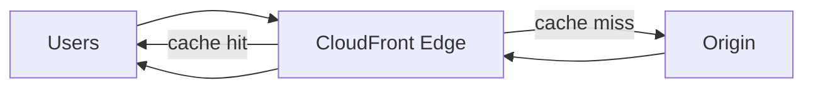

# Theory

## Exam Guide Mapping

- Domain: Domain 3: Design High-Performing Architectures
- Task focus:
  - 3.4 Determine high-performing and/or scalable network architectures

## Deep Dive

### CloudFront: “캐시”로 지연과 오리진 부하를 줄인다

- When to use
  - 정적 콘텐츠/미디어/다운로드
  - API 캐싱(가능한 경우)
  - 전 세계 분산 사용자
- Core knobs(시험에 나오는 조절점)
  - TTL(Cache-Control) / invalidation
  - 캐시 키: 쿼리 스트링/헤더/쿠키를 포함할지
  - 압축(compression)

### 캐시 키와 히트율(Choose-this-not-that)

- 캐시 키를 “세분화”하면
  - 장점: 사용자/세션별 정확한 응답
  - 단점: 객체 변종이 늘어 히트율↓, 오리진 부하↑
- 시험형 힌트
  - “쿼리 스트링이 다양하다/개인화” 문장 -> 캐시 키 설계가 핵심

### Global Accelerator vs CloudFront (개념 비교)

- CloudFront: L7 콘텐츠 캐시 + 엣지
- Global Accelerator: Anycast 기반 네트워크 경로 최적화(캐시 목적 아님)

## Exam Traps

- 캐시가 가능한 상황에서 “원본만 스케일업”을 고르는 오답
- invalidation을 남발하는 선택지(비용/운영 트레이드오프)
- GA를 캐시 서비스로 착각하는 선택지

