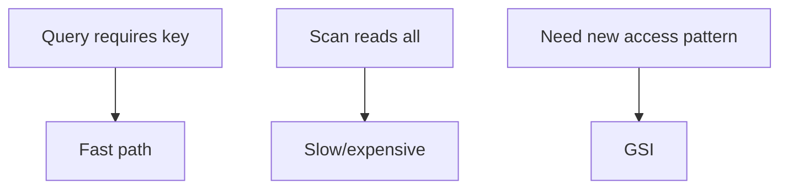

# Theory

## Exam Guide Mapping

- Domain: Domain 3: Design High-Performing Architectures
- Task focus:
  - 3.3 Determine high-performing database solutions

## Deep Dive

### 캐시가 성능 문제를 “단번에” 바꾸는 이유

- 반복 조회(읽기)에서 DB 호출 수를 줄이면
  - 지연시간 감소
  - DB 부하 감소
  - 비용 감소(요금 모델에 따라)
- 하지만 캐시는 트레이드오프가 있다
  - 일관성/캐시 무효화
  - 캐시 히트율이 낮으면 효과가 없음

```mermaid
flowchart LR
  App[App] --> Cache[Cache (ElastiCache/DAX)]
  Cache -->|hit| App
  Cache -->|miss| DB[(DB)]
  DB --> Cache --> App
```

### DynamoDB 성능: 키 설계가 곧 성능

- 파티션 키가 균등 분산되면 확장이 잘 된다
- 핫 파티션 신호
  - 특정 키에 트래픽 집중
  - throttling/지연(문장에 “특정 사용자/특정 키” 힌트)
- GSI(Global Secondary Index)
  - “다른 액세스 패턴”을 추가(예: status로 조회)
  - 시험에서는 “Query vs Scan”과 함께 출제



### Aurora/RDS 성능 패턴(개념)

- 읽기 확장: Read replica(또는 Aurora의 read endpoint 개념)
- 연결 수/풀링, 인덱스, 쿼리 튜닝이 힌트로 등장할 수 있음(서비스 선택 문제로 출제)

## Exam Traps

- DynamoDB 성능 이슈를 무조건 “DAX 추가”로 해결하는 오답(키 설계가 근본일 수 있음)
- Query가 가능한데 Scan을 고르는 오답
- 캐시를 “모든 문제의 답”으로 고르는 오답(일관성 요구가 강하면 신중)

