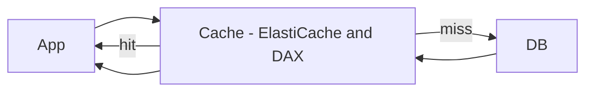
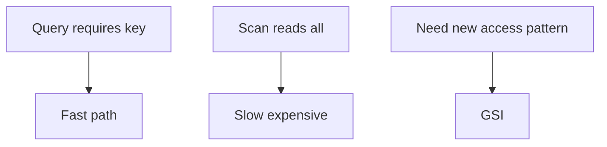

# Theory

## Exam Guide Mapping

- Domain: Domain 3: Design High-Performing Architectures
- Task focus:
  - 3.3 Determine high-performing database solutions

## Core Concepts

- DB 성능 문제는 보통 3단계로 푼다
  - 1) 캐시로 반복 조회를 줄일 수 있는가(ElastiCache/DAX)
  - 2) 액세스 패턴이 맞는가(Query vs Scan, 키 설계, 인덱스)
  - 3) 읽기 확장/리플리카/샤딩 같은 구조 변경이 필요한가

## Deep Dive

### 캐시가 성능 문제를 “단번에” 바꾸는 이유

- 반복 조회(읽기)에서 DB 호출 수를 줄이면
  - 지연시간 감소
  - DB 부하 감소
  - 비용 감소(요금 모델에 따라)
- 하지만 캐시는 트레이드오프가 있다
  - 일관성/캐시 무효화
  - 캐시 히트율이 낮으면 효과가 없음

#### Exam must-know (포인트 + Why + 대안)

- Key point: “반복 읽기/읽기 지연” 문장에서는 캐시가 가장 큰 레버리지로 자주 등장한다.
- Why: DB 호출을 줄이면 지연과 부하가 동시에 줄어든다. 다만 캐시 무효화/일관성 트레이드오프가 있어 요구사항을 확인해야 한다.
- Alternative: “강한 일관성/항상 최신” 요구가 강하면 캐시보다 인덱스/쿼리 튜닝/읽기 확장 같은 답이 더 맞을 수 있다.

### DynamoDB 성능: 키 설계가 곧 성능

- 파티션 키가 균등 분산되면 확장이 잘 된다
- 핫 파티션 신호
  - 특정 키에 트래픽 집중
  - throttling/지연(문장에 “특정 사용자/특정 키” 힌트)
- GSI(Global Secondary Index)
  - “다른 액세스 패턴”을 추가(예: status로 조회)
  - 시험에서는 “Query vs Scan”과 함께 출제

#### Exam must-know (포인트 + Why + 대안)

- Key point: Query가 가능한 상황에서 Scan은 거의 오답 후보가 된다(비용/지연/확장성).
- Why: Scan은 전체 테이블을 읽기 때문에 데이터가 커질수록 지연과 비용이 폭증한다. DynamoDB는 키 기반 조회(=Query)가 빠른 경로다.
- Alternative: 필요한 액세스 패턴이 키로 안 나오면 GSI를 추가하는 방향이 정답 후보가 된다.

### Aurora/RDS 성능 패턴(개념)

- 읽기 확장: Read replica(또는 Aurora의 read endpoint 개념)
- 연결 수/풀링, 인덱스, 쿼리 튜닝이 힌트로 등장할 수 있음(서비스 선택 문제로 출제)

## Exam Traps

- DynamoDB 성능 이슈를 무조건 “DAX 추가”로 해결하는 오답(키 설계가 근본일 수 있음)
- Query가 가능한데 Scan을 고르는 오답
- 캐시를 “모든 문제의 답”으로 고르는 오답(일관성 요구가 강하면 신중)
