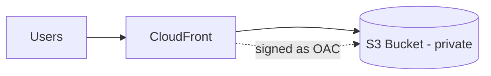

# Special Lecture + Week Summary (Domain 3)

## Exam Guide Mapping

- Domain: Domain 3: Design High-Performing Architectures
- Task focus:
  - 3.1 Storage
  - 3.2 Compute
  - 3.3 Database
  - 3.4 Network
  - 3.5 Data ingestion/transformation

## Week 3 Diagnosis Order (시험에서 통하는 순서)

1. 캐시(CloudFront/ElastiCache)로 불필요한 호출을 줄일 수 있는가
2. DB/키/인덱스/파티션이 병목인가
3. 스토리지 IOPS/throughput이 부족한가(EBS/EFS)
4. 컴퓨트가 부족한가(EC2/Lambda concurrency)
5. 네트워크 경로/엣지/리전 선택이 문제인가

## Confusing Similar Cases

| Scenario | Best choice | Why | Common wrong choice | Why it's wrong |
|---|---|---|---|---|
| 글로벌 정적 콘텐츠 | CloudFront | 캐시/엣지 | 단일 리전 S3만 | RTT/지연 증가 |
| 고정 IP 가속(개념) | Global Accelerator | Anycast | CloudFront | L7 캐시 목적과 다름 |
| DynamoDB 지연 | 키 설계/GSI | 핫 파티션 회피 | 무조건 DAX | 근본 키 설계 문제는 남음 |
| DB 읽기 성능 | 캐시/인덱스 | 반복 조회 최적화 | 스케일업만 | 비용 증가/한계 |

## Exam-Heavy Pattern: CloudFront + Private S3 (OAC)

- S3는 퍼블릭이 아니고, CloudFront만 접근하도록 bucket policy를 제한한다.
- 캐시 키/TTL/무효화(invalidation)가 선택지로 등장한다.

## Reference Pack

- `aws-saa/special-lectures/domain03-high-performing-top-services.md`

