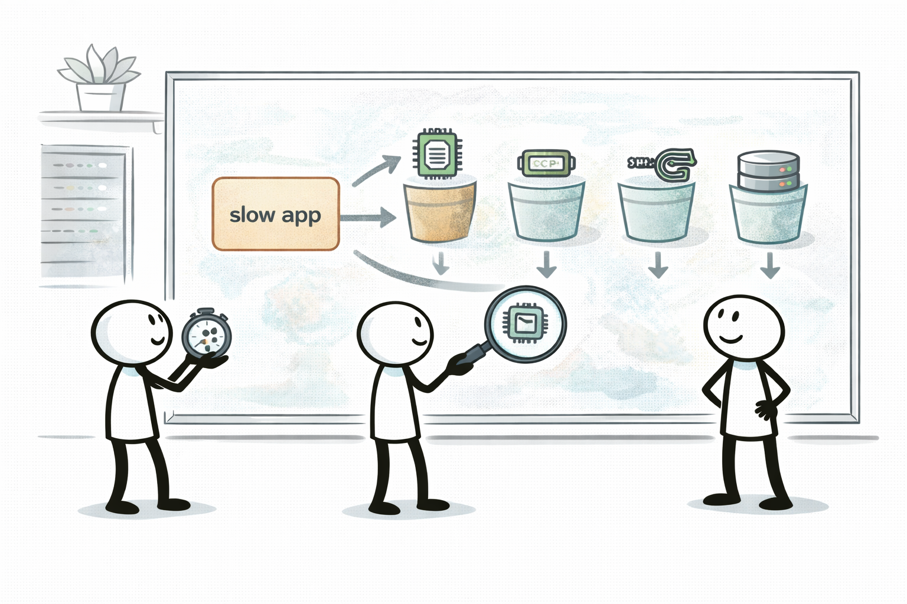
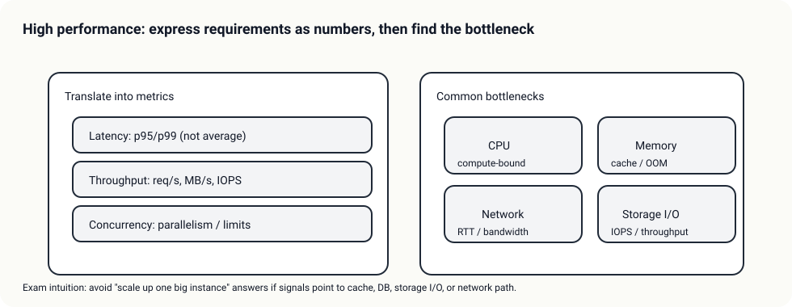

# Day 01 - Theory Index (성능 생각법 + EC2 사이징)

> 이 문서는 Day 이론 “인덱스”다. 상세 이론은 Day 폴더 바로 아래 `01-*.md` 서비스별 문서로 분리한다.

## 소개 (이게 뭔가요?)

- Domain 3는 “빠르게 만들기”가 아니라, **요구 문장을 숫자(지표)로 번역**하고 **병목 축을 먼저 잡는 설계**를 묻는다.
- Day 01은 그 출발점으로, “컴퓨트가 병목인가?”를 EC2 선택 + CloudWatch 지표로 1차 진단하는 흐름을 만든다.

## 고객 사례 (스토리)

신규 API가 런칭하고 나서부터 “가끔 느리다”는 제보가 계속 들어온다. 로그를 보면 에러는 거의 없는데, p95 지연시간이 어느 날은 200ms, 어느 날은 2초로 튄다. 팀은 당장 인스턴스를 키우자고 하지만, 비용이 이미 예산을 넘기기 시작했다. 게다가 운영 담당이 1명이라, 원인도 모른 채 “스펙 업”만 반복하는 방식은 오래 못 간다.

여기서 전환점은 “느리다”를 숫자로 바꾸는 거다. 평균 응답시간이 아니라 p95/p99를 보고, 처리량(req/s), 동시성(동시 요청), 그리고 “일관성(예측 가능성)”을 같이 본다. 그리고 병목은 결국 CPU/메모리/네트워크/스토리지 I/O 중 어디인가로 수렴한다는 걸 전제로 진단 순서를 잡는다.

Day 01에서는 이 과정을 가장 단순하게 연습한다. EC2 인스턴스를 고를 때는 “CPU가 진짜 필요한가, 메모리가 필요한가, 그냥 균형형이면 되는가”를 문장 신호로 매칭한다. 그리고 CloudWatch 지표로 “CPU가 높은데도 느린 건지, T 계열 크레딧이 떨어져 스로틀링된 건지”를 빠르게 확인한다. 이렇게 하면 ‘감’이 아니라 근거로 성능 이야기를 할 수 있다.

지금 문제 문장에 “지속적인 고CPU” 신호가 있나요, 아니면 “간헐적 스파이크” 신호가 더 강한가요?

## Impact 범위 (어디에 영향을 주나?)

- Performance: 병목 축을 잡으면 튜닝 방향이 선명해진다.
- Cost: “무작정 큰 인스턴스”를 피하고, 필요한 축에만 비용을 쓴다.
- Operations: 지표 기반 진단 루틴이 있으면 대응이 빨라진다.

## Exam Guide (Badges)

Exam guide mapping (details)

- Domain: Domain 3: Design High-Performing Architectures
- Task focus:
  - 3.2 Design high-performing and elastic compute solutions

## Why This Matters (시험/실무에서 걸리는 지점)

- “성능=인스턴스 업그레이드”로 끝내는 답은 함정이 되기 쉽다. 먼저 병목 축을 맞춰야 한다.

## Core Concepts

- 지표로 번역
  - 지연시간(latency): p95/p99 (평균만 보면 함정)
  - 처리량(throughput): req/s, MB/s, IOPS
  - 동시성(concurrency): 동시 요청/동시 실행
  - 일관성(predictability): 스파이크 이후에도 유지되는가
- 병목은 4가지 축으로 수렴
  - CPU / 메모리 / 네트워크 / 스토리지 I/O

## Service Theories (서비스별로 읽기)

- [EC2 인스턴스 패밀리 선택 + Burstable(T) 함정](01-ec2.md)
- [CloudWatch로 성능 병목 1차 진단하기](02-cloudwatch.md)

## Exam must-know (요약)

- Key point: “지속적 고CPU/일관 성능”이면 T 계열은 함정이 되기 쉽고, “병목 신호(네트워크/스토리지/DB)”가 있으면 scale up만 하는 답은 위험하다.
- Why: Domain 3는 “요구 신호 → 지표/병목 → 서비스 선택” 매칭을 본다.
- Alternative: 수평 확장/스파이크 흡수 요구가 강하면 ASG/캐시/큐로 설계를 바꾸는 답이 더 자연스럽다.

## Exam Traps

- 성능 문제 = 무조건 더 큰 인스턴스(scale up)로 끝내는 선택지.
- T 계열을 “지속 고부하” 워크로드에 쓰는 선택지(크레딧 소진/스로틀링).
- CPUUtilization 하나만 보고 결론 내리게 유도하는 선택지(추가 지표로 교차 확인).

## TL;DR (한 줄 정리)

- 성능 문제는 먼저 **지표(p95/p99/처리량/동시성)로 번역**하고, **병목 축(CPU/메모리/네트워크/스토리지 I/O)**을 맞춘 뒤 서비스 선택으로 들어간다.
