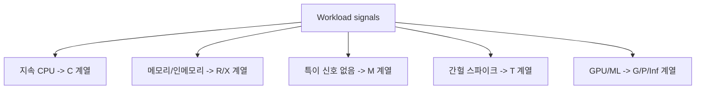

# EC2 인스턴스 패밀리 선택 + Burstable(T) 함정

## 소개 (이게 뭔가요?)

- EC2 성능 문제는 “더 큰 인스턴스”가 아니라 **워크로드 신호에 맞는 패밀리/타입을 고르는 문제**로 자주 출제된다.

## 고객 사례 (스토리, 600~1000자)

팀이 운영하는 배치 API는 평소엔 잘 돌지만, 매일 오전 10시쯤만 되면 처리 시간이 급격히 늘어난다. 개발자는 “순간 트래픽이니까 t3 계열이면 싸고 좋겠지”라고 생각해 t3.small을 여러 대로 늘린다. 그런데 며칠 뒤부터는 같은 시간대에 더 심하게 느려지고, 심지어 CPU 사용률이 높지 않은데도 응답이 끊기는 구간이 생긴다. 원인을 찾으려 해도 담당 인력이 1명이라, 일단 인스턴스를 더 올리는 식으로만 대응하게 된다.

CloudWatch를 켜보니 힌트가 보인다. CPUUtilization은 애매한데, CPUCreditBalance가 특정 시점부터 바닥을 치고, 그때부터 지연이 확 튄다. 즉 “인스턴스를 더 올리면 된다”가 아니라 “T 계열을 지속 부하에 쓰고 있다”가 문제의 핵심이었다.

여기서 핵심은 “지속 부하냐, 순간 부하냐”다. T 계열은 burst(잠깐 치고 올라가는 부하)에 강하지만, **지속적으로 CPU를 쓰면 CPU credit이 소진**될 수 있다. 그러면 평균은 그럴듯해도, 특정 시간대에 p95/p99 지연시간이 무너진다. 반대로 “지속적인 고CPU” 신호가 명확하면 C 계열(Compute optimized) 같은 선택지가 자연스럽다. 메모리 캐시/인메모리 DB 힌트가 있으면 R/X 계열로 방향이 바뀐다.

추가로, 시험은 가끔 ENA(네트워크 가속), EBS-optimized, placement 같은 “성능 옵션” 힌트를 끼워 넣기도 한다. 이 경우에도 접근은 같다. 먼저 병목 축이 CPU인지(패밀리), 네트워크/스토리지 대역폭인지(옵션/타입)부터 분리해서 본다.

결국 EC2는 “이 인스턴스가 더 비싸냐”가 아니라 “이 문장 신호가 어떤 패밀리를 가리키냐”가 정답을 가른다. 지금 시나리오 문장에서 “지속적 고CPU”와 “일관된 성능”이 보이나요?

## Impact 범위 (어디에 영향을 주나?)

- Performance: 패밀리 선택이 지연시간/처리량 상한을 좌우한다.
- Cost: T 계열의 저비용은 ‘조건부’다(지속 부하에서 역효과 가능).
- Operations: 선택이 맞으면 모니터링/스케일링 운영이 단순해진다.

## Exam Guide (Badges)

Exam guide mapping (details)

- Domain: Domain 3: Design High-Performing Architectures
- Objectives: “고성능/탄력적인 컴퓨트”를 패밀리 선택과 스케일링으로 풀 수 있는지

## Why This Matters (시험/실무에서 걸리는 지점)

- 시험은 “T 계열”을 은근히 끼워 넣어, **지속 부하 vs burst**를 구분하는지 본다.

## VAKOG Anchors

- V(Visual): 아래 결정 트리로 “신호→패밀리”를 고정한다.
- A(Auditory): “지속 CPU=C, 메모리 힌트=R/X, 균형=M, 잠깐만=T”를 말로 붙인다.
- O(Olfactory, smell test): “지속 고CPU인데 T 계열”은 냄새가 난다.
- G(Gustatory, taste test): 문장 1개 보고 패밀리를 고른다.

## Core Concepts

- 패밀리 매칭(시험형)
  - C: 지속 고CPU, 지연시간이 CPU에 민감
  - R/X: 메모리/인메모리 캐시/DB 힌트
  - M: 균형형(특별한 신호가 없을 때)
  - T: burst(간헐적 스파이크), 지속 부하엔 함정
  - G/P/Inf: GPU/그래픽/ML 신호가 명확할 때

## Deep Dive

### Burstable(T) 계열의 “크레딧” 함정

- When to use
  - 평소엔 낮고 가끔만 CPU가 치고 올라가는 워크로드
- When not to use
  - “지속적으로 높은 CPU”, “일관된 성능” 요구가 강한 워크로드
- Exam must-know
  - Key point: T 계열은 “지속 부하” 문장에서 오답 후보가 된다.
  - Why: CPU credit이 소진되면 스로틀링으로 p95/p99 지연시간이 무너질 수 있다.
  - Alternative: C/M 계열로 옮기고, 수평 확장 요구가 강하면 ASG로 푼다.

## Quick Comparison Table

| Signal | Best family | Notes |
|---|---|---|
| 지속 고CPU | C | 지연/처리량이 CPU에 민감 |
| 메모리/캐시/인메모리 | R/X | OOM/GC/캐시 적중률 힌트 |
| 균형형 | M | 특별한 신호가 없을 때 |
| 간헐 스파이크 | T | 크레딧 소진 문장 주의 |

## Exam Traps (5-8)

- “지속적 고CPU”인데 T 계열을 고르는 선택지
- “성능 문제=무조건 더 큰 1대”로 끝내는 선택지(수평 확장/병목 분리 요구가 있으면 위험)
- “메모리 캐시/인메모리” 신호가 있는데 C 계열로만 미는 선택지

## Taste Test (1~3분)

- “주기적으로 CPU가 20분 이상 90%를 유지한다” → T 계열이 자연스러울까요, C 계열이 자연스러울까요?

## TL;DR (한 줄 정리)

- “지속 고CPU/일관 성능”이면 **C/M 계열**, “간헐 스파이크”면 **T 계열**이 후보지만, **T는 크레딧 소진 함정**을 반드시 확인한다.

## Back

- `./00-theory-index.md`
