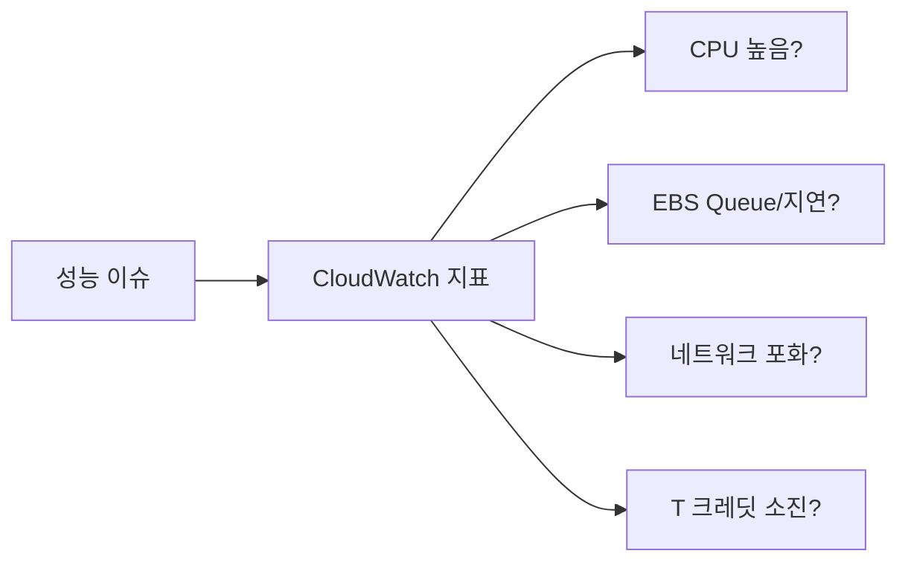

# CloudWatch로 성능 병목 1차 진단하기

## 소개 (이게 뭔가요?)

- CloudWatch는 AWS 리소스의 지표/로그/알람을 모으는 기본 관측(Observability) 계층이고, 시험에서는 “무엇을 먼저 확인할지”를 자주 묻는다.

## 고객 사례 (스토리, 600~1000자)

서비스가 느려졌다는 신고가 들어오면, 팀은 보통 CPU 그래프부터 연다. 실제로 CPUUtilization이 높으면 원인이 단순한 편이라 “인스턴스 스펙 업”으로 끝날 때도 있다. 문제는 CPU가 낮은데도 느린 케이스다. 이때 경험이 부족하면 “그럼 더 큰 인스턴스면 되겠지”로 가고, 비용만 늘어난다.

한 번은 배치 작업이 시작될 때마다 지연이 튀었는데, CPU는 30% 수준이었다. CloudWatch를 더 보니 EBS VolumeQueueLength가 올라가고, VolumeWriteBytes가 꾸준히 늘었다. 즉 병목은 CPU가 아니라 디스크 I/O였다. 또 다른 날엔 T 계열 인스턴스에서 CPU는 70%대로 유지되다가, CPUCreditBalance가 바닥나면서 지연이 급격히 악화됐다. “CPU가 높다”가 아니라 “크레딧이 소진돼 스로틀링된다”가 정답 신호였던 셈이다.

또 중요한 포인트는 “지표 1개”가 아니라 “세트”로 보는 습관이다. CPU가 높으면 네트워크도 같이 포화인지(NetworkIn/Out), 디스크 큐가 같이 늘었는지(QueueLength), 크레딧이 같이 떨어졌는지(CPUCreditBalance)를 같이 본다. 이렇게 보면 “원인처럼 보이는 현상”과 “진짜 병목”을 분리하기가 훨씬 쉬워진다.

결국 CloudWatch는 정답을 ‘맞히는’ 도구가 아니라, 병목 축을 ‘좁혀가는’ 도구다. CPU만 보지 말고, 스토리지/네트워크/크레딧 지표로 교차 확인하면 “정말 컴퓨트가 문제인지”를 빠르게 가를 수 있다. 지금 문제에서 힌트는 CPU 그래프일까요, 아니면 I/O/크레딧 같은 보조 지표일까요?

## Impact 범위 (어디에 영향을 주나?)

- Operations: 진단 속도/알람 품질이 운영 난이도를 좌우한다.
- Performance: 병목 축을 잘못 잡는 실수를 줄인다.
- Cost: 불필요한 스펙 업/과한 확장을 막는다.

## Exam Guide (Badges)

Exam guide mapping (details)

- Domain: Domain 3: Design High-Performing Architectures
- Objectives: 컴퓨트/스토리지/네트워크 병목을 지표로 구분할 수 있는지

## Why This Matters (시험/실무에서 걸리는 지점)

- 시험은 “무엇을 먼저 확인하나”를 통해, 병목 축을 제대로 잡는지 확인한다.

## VAKOG Anchors

- V(Visual): 아래 플로우로 ‘지표 확인 순서’를 본다.
- A(Auditory): “CPU만 보지 말고 I/O/네트워크/크레딧을 같이 본다”를 토크 트랙으로 고정한다.
- O(Olfactory, smell test): CPU만 보고 결론 내리게 유도하는 선택지는 냄새가 난다.
- G(Gustatory, taste test): 지표 2~3개로 병목을 판정한다.

## Core Concepts

- 기본 진단 루틴(시험형)
  - CPU: `CPUUtilization`
  - T 계열: `CPUCreditBalance`, `CPUCreditUsage`
  - EBS: `VolumeReadOps/WriteOps`, `VolumeQueueLength`, `VolumeReadBytes/WriteBytes`
  - Network: `NetworkIn`, `NetworkOut`

## Deep Dive

- Exam must-know
  - Key point: “T 계열 + 성능 저하” 문장이면 CPU credit 관련 지표가 힌트다.
  - Why: CPU 사용률이 높지 않아도 크레딧 소진은 성능을 급격히 떨어뜨릴 수 있다.
  - Alternative: 디스크 큐가 힌트면 EBS 타입/IOPS 조정(gp3/io2)으로 방향이 바뀐다.

## Exam Traps (5-8)

- CPUUtilization 하나만으로 병목을 단정하는 선택지
- T 계열인데 크레딧 지표를 무시하는 선택지
- EBS 병목 신호인데 “네트워크”로만 몰아가는 선택지

## Taste Test (1~3분)

- “CPU는 30%인데, VolumeQueueLength가 크게 올라간다” → 병목은 CPU일까요, 스토리지 I/O일까요?

## TL;DR (한 줄 정리)

- CloudWatch는 **CPU만 보는 게 아니라 크레딧/스토리지/네트워크 지표로 교차 확인**해서 병목 축을 빠르게 좁히는 게 핵심이다.

## Back

- `./00-theory-index.md`
