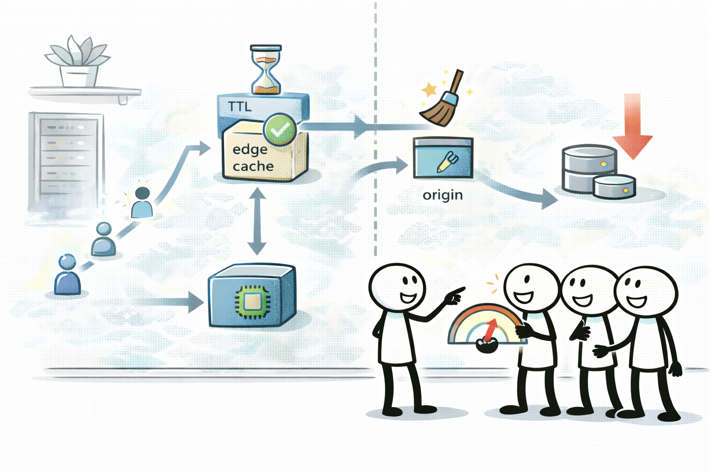
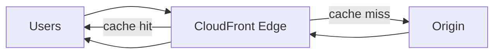

# CloudFront: TTL/캐시 키/무효화로 지연을 줄인다

## 소개 (이게 뭔가요?)

- CloudFront는 CDN(콘텐츠 전송 네트워크)이고, 시험에서는 “캐시를 어디까지 믿고 어떻게 조절할지(TTL/키/무효화)”가 자주 나온다.

## 고객 사례 (스토리, 600~1000자)

프로덕트 팀이 대규모 캠페인을 시작하자, 페이지 로딩이 느리다는 문의가 폭증한다. 서버 CPU는 여유가 있는데도, 해외 사용자일수록 이미지/JS가 늦게 내려오고, S3 오리진 요청 수가 급격히 늘면서 비용도 튄다. 개발팀은 “서버를 더 늘리면 되지 않나?”라고 하지만, 정적 콘텐츠는 서버를 늘리는 게 핵심이 아니다.

여기서 CloudFront가 전환점이 된다. 엣지에서 캐시 히트가 나면 RTT(왕복 지연)를 줄일 수 있고, 오리진 호출 자체가 줄어 오리진 부하/비용도 같이 떨어진다. 문제는 캐시를 ‘아무렇게나’ 쓰면 오히려 망가진다는 점이다. 쿼리 스트링/헤더/쿠키를 캐시 키에 포함하면 개인화 응답은 정확해지지만, 객체 변종이 늘어 히트율이 떨어지고 오리진 부하가 다시 늘어난다. 또 배포 후 즉시 반영이 필요해 invalidation을 남발하면 비용/운영 부담이 커진다.

보안팀이 “S3는 퍼블릭이면 안 된다”고 요구하면 여기서 한 번 더 꼬인다. 이때는 CloudFront가 S3에만 접근하도록 OAC(Origin Access Control)로 묶는 패턴이 자주 등장한다. 시험에서도 “프라이빗 S3 + CloudFront” 조합과 함께 TTL/무효화/키가 같이 출제된다.

정리하면, CloudFront의 핵심은 “CDN 붙이기”가 아니라 **TTL로 신선도를 설계하고, 캐시 키로 히트율을 설계하는 것**이다. 지금 요구는 “바로 반영(신선도)”이 더 강한가요, “오리진 부하/지연 감소(히트율)”이 더 강한가요?

## Impact 범위 (어디에 영향을 주나?)

- Performance: 글로벌 사용자 지연시간 개선(엣지 캐시)
- Cost: 오리진 트래픽/부하 감소로 비용 절감 가능
- Operations: 캐시 키/무효화 정책이 운영 난이도를 좌우

## Exam Guide (Badges)

Exam guide mapping (details)

- Domain: Domain 3: Design High-Performing Architectures
- Objectives: 캐싱으로 지연/부하를 줄이고, 신선도/정확도/히트율 트레이드오프를 설명할 수 있는지

## Why This Matters (시험/실무에서 걸리는 지점)

- “글로벌 사용자 + 정적 콘텐츠”는 CloudFront 대표 신호다. 여기서 TTL/키/무효화로 함정을 판다.

## Core Concepts

- CloudFront 핵심 조절점(시험 포인트)
  - TTL(Cache-Control): 신선도 vs 히트율
  - Invalidation: 즉시 반영 vs 비용/운영
  - Cache key: 쿼리 스트링/헤더/쿠키 포함 여부(개인화 vs 히트율)
  - Compression: 전송 효율

## Deep Dive

### “캐시 키”를 세분화하면 생기는 일

- 장점: 사용자/세션별 응답 정확도↑
- 단점: 변종↑ → 히트율↓ → 오리진 부하↑
- Exam must-know
  - Key point: “쿼리 스트링 다양/개인화” 문장이면 캐시 키 설계가 정답을 가른다.
  - Why: 키가 커질수록 캐시가 사실상 ‘안 되는 것’처럼 동작할 수 있다.
  - Alternative: 개인화가 강하면 캐시 범위를 좁히거나, 정적/공통 리소스만 캐시한다.

### “즉시 반영” 요구를 푸는 두 가지 방식

시험에서는 “배포 후 바로 반영” 문장으로 무효화(invalidation)를 떠올리게 만들지만, 운영 Best Practice는 대개 두 가지 중 하나다.

- **버전 파일명(캐시 버스팅)**: `/app.abc123.js`처럼 파일명을 바꾸면, 캐시는 “새 객체”로 인식해 자연스럽게 갱신된다(무효화 남발을 줄임).
- **무효화(invalidation)**: 정말로 “기존 경로를 즉시 갱신”해야 할 때 선택한다. 다만 비용/운영 부담이 커질 수 있어 남발이 함정이 된다.

### 프라이빗 S3 오리진 보호(OAC) 신호

“S3는 퍼블릭이면 안 된다 + CloudFront로만 내려주자” 같은 문장이 보이면, 단순히 CDN을 붙이는 문제가 아니라 **오리진 접근 통제(OAC)**까지 포함된 패턴인 경우가 많다.

### CloudFront vs Global Accelerator (시험 단골 구분)

- CloudFront: **캐시 가능한 콘텐츠**(정적/반복 읽기)에서 히트율로 오리진 부하/지연을 줄인다.
- Global Accelerator: 캐시가 아니라 **경로 최적화/고정 IP** 신호에서 등장한다.

### 핵심 정리 (Deep Dive)

- CloudFront는 “CDN 설치”가 아니라 **TTL/키/무효화**로 신선도·히트율·비용을 조절하는 문제다.
- “프라이빗 S3 오리진”이 붙으면 **OAC**까지 같이 떠올린다.

## Quick Comparison Table

| Topic | Goal | Tradeoff |
|---|---|---|
| TTL | 신선도/히트율 균형 | TTL↓(신선도↑)면 오리진 부하↑ |
| Invalidation | 즉시 반영 | 비용/운영 부담↑ |
| Cache key | 개인화/정확도 | 변종↑면 히트율↓ |

## Exam Traps (5-8)

- “글로벌 정적 콘텐츠”인데 CloudFront 없이 오리진만 키우는 선택지
- invalidation을 ‘기본’처럼 쓰는 선택지
- 쿼리 스트링/쿠키를 무조건 캐시 키에 포함시키는 선택지(히트율 붕괴)

## Taste Test (1~3분)

- “전 세계 사용자에게 정적 콘텐츠를 빠르게 제공” → CloudFront가 먼저 떠오르나요?

## TL;DR (한 줄 정리)

- CloudFront는 **TTL(신선도) + 캐시 키(히트율) + 무효화(비용/운영)**를 요구 신호에 맞춰 조절하는 문제다.

## Back

- `./00-theory-index.md`
