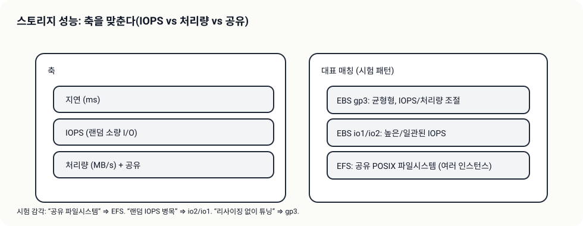

# Day 03 - Theory Index (스토리지 성능: EBS vs EFS)

> 이 문서는 Day 이론 “인덱스”다. 상세 이론은 Day 폴더 바로 아래 `01-*.md` 서비스별 문서로 분리한다.

## 소개 (이게 뭔가요?)

- 스토리지 성능은 “용량”이 아니라 **IOPS/처리량(throughput)/공유 여부**가 정답을 가른다.
- Day 03은 EBS(EBS 타입 선택/튜닝)와 EFS(공유 파일시스템)를 요구 신호로 매칭하는 연습을 한다.

## 고객 사례 (스토리)

서비스가 느려져서 인스턴스를 키웠는데도 체감이 좋아지지 않는다. CPU는 여유가 있고, 네트워크도 널널하다. 그런데 배치가 돌 때마다 응답이 끊기고, DB 작업이 몰리면 더 심해진다. 여기서 팀이 처음 빠지는 함정이 “디스크도 용량만 늘리면 빨라지겠지”라는 생각이다. 실제로는 용량(GiB)이 아니라 IOPS(랜덤 I/O)와 처리량(MB/s)이 병목을 만든다.

또 다른 문제는 “공유”다. 여러 EC2 인스턴스가 같은 파일을 읽고 써야 하는데, EBS는 인스턴스에 붙는 블록 스토리지라 공유 모델이 맞지 않는다. 팀이 rsync로 맞추거나, 한 대를 ‘파일 서버’처럼 쓰기 시작하면 운영이 급격히 어려워진다. 이때 “공유 POSIX 파일시스템” 신호가 보이면 EFS로 전환하는 게 자연스럽다.

게다가 이 선택은 비용에도 직결된다. io2는 “정말로 일관된 고IOPS가 필요할 때”만 쓸 만큼 비용이 올라갈 수 있고, gp3는 “필요한 만큼만 성능을 올려서” 비용 효율을 만들 수 있다. 그래서 시험은 “QueueLength/지연” 같은 힌트로 I/O 병목을 암시하고, “공유 파일” 힌트로 EFS를 암시한다.

즉, Day 03의 요지는 간단하다. “랜덤 IOPS/일관성”이면 io2/io1, “용량은 그대로인데 성능만 튜닝”이면 gp3, “여러 인스턴스가 같은 파일을 공유”면 EFS가 신호다. 지금 시나리오는 ‘성능’ 축인가요, 아니면 ‘공유’ 축인가요?

## Impact 범위 (어디에 영향을 주나?)

- Performance: I/O 병목을 제거하면 지연/처리량이 크게 좋아질 수 있다.
- Cost: gp3 튜닝은 비용 대비 효율이 좋지만, io2는 비용이 급격히 올라갈 수 있다.
- Operations: 공유 요구를 잘못 풀면 운영이 복잡해진다(수동 동기화/단일 파일 서버).

## Exam Guide (Badges)

Exam guide mapping (details)

- Domain: Domain 3: Design High-Performing Architectures
- Task focus:
  - 3.1 Determine high-performing and/or scalable storage solutions

## Core Concepts

- 시험 신호(패턴 매칭)
  - “높은/일관된 IOPS” → EBS io2/io1
  - “용량은 그대로, 성능만 올리고 싶다” → EBS gp3
  - “여러 인스턴스가 같은 파일을 공유한다” → EFS

## Service Theories (서비스별로 읽기)

- [EBS: gp3/io2로 IOPS/처리량을 맞춘다](01-ebs.md)
- [EFS: 여러 인스턴스가 공유하는 파일시스템](02-efs.md)

## Exam Traps

- “공유 파일시스템”인데 EBS를 고르는 선택지(공유 모델이 다르다).
- “IOPS 병목”인데 인스턴스만 키우는 선택지(스토리지 축 튜닝이 정답일 수 있다).

## TL;DR (한 줄 정리)

- 스토리지는 **용량이 아니라 IOPS/처리량/공유**가 신호다: “일관 IOPS”면 io2, “튜닝”이면 gp3, “공유 파일”이면 EFS.
